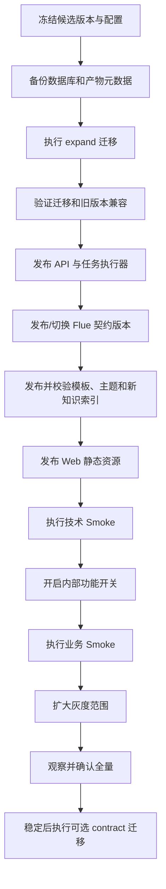

# AI 智能助手发布计划

> 文档状态：发布执行稿  
> 项目需求依据：`docs/需求分析.md` V1.2（2026-07-24）  
> 覆盖需求：AI-001～AI-011、PPT-001～PPT-003、SYS-001～SYS-003、KB-001～KB-002  
> 覆盖任务：AI-TASK-001～AI-TASK-022  
> 说明：本文只定义发布治理、门禁和回滚框架。未确认的业务口径、性能阈值、灰度比例和观察周期不在本文中擅自设定。

## 1. 发布目标

1. 在不破坏现有登录、项目、会议、材料和公共线索池能力的前提下，分阶段交付 AI 智能助手改造。
2. 优先稳定 AI-002 输入发送、AI-004 白屏防护和 AI-005 一期产物区，再引入偏好、任务、产物、来源和快捷任务底座。
3. 通过功能开关和向前兼容迁移，使 Web、API、任务执行器、Flue、数据库和文件存储可以独立发布及回滚。
4. 确保任何用户都不能读取无权限项目、会话、知识片段、任务或产物。
5. 确保长任务在浏览器刷新和服务重启后仍可查询，失败任务可解释、可重试，正式产物可追溯。
6. 发布证据必须覆盖代码版本、配置版本、迁移版本、Flue 契约版本、测试报告、灰度记录和回滚演练。
7. 按 SYS-001 执行优先级：PPT 生成属于 P0，AI 智能助手、项目知识库和常用文档入口属于 P1；本计划不夹带 P2 OA 或其他非核心能力。
8. 模板、主题、标准样本、SOP 和知识索引与代码同样需要生效版本、批准记录、允许范围及安全回切。

## 2. 当前发布基线与阻塞

| 项目 | 当前事实 | 风险 | 发布要求 | 证据路径 |
|---|---|---|---|---|
| 主应用 | React/Vite + Node.js/TypeScript/Express | 前后端与外部 Flue 需要协调发布 | 分离版本并记录兼容矩阵 | `package.json`、`server/src/index.ts` |
| 生产 AI 路由 | 开发态由 Vite 代理 `/ai`，安装文档的 Nginx 示例未证明已代理 `/ai` | 生产请求可能 404 或打到错误服务 | 发布前验证 `/ai/api` 生产路由、超时和流式转发 | `vite.config.ts`、`INSTALL.md` |
| Flue 契约 | 主页面使用 `assistant`，旧服务代码使用 `advisor` | Agent 名称和消息结构漂移 | 冻结 Agent 名称、版本、认证、错误和工具事件契约 | `src/pages/AIAssistantPage.tsx`、`server/src/services/aiService.ts` |
| 配置加载 | `npm run dev`、`npm start` 未在脚本中显式加载 `.env`；`start.sh` 使用 `--env-file` | 不同启动方式读取不同配置 | 统一启动入口和配置校验，不在日志中输出密钥 | `package.json`、`start.sh`、`INSTALL.md` |
| 配置模板 | 安装文档要求复制 `.env.example`，当前仓库未确认存在该文件 | 新环境易漏配或使用错误端口 | 发布包提供脱敏配置模板和环境清单 | `INSTALL.md` |
| 数据迁移 | 当前主要通过启动时手写 DDL 演进 | 无版本、难审计、回滚困难 | 新表和约束使用版本化 expand/contract 迁移 | `server/src/db/migrate.ts`、`server/src/db/schema.ts` |
| 文件访问 | workspace 以共享根为主，`/generated` 还存在静态文件交付路径 | 跨用户/项目越权和 URL 泄露 | 新产物只通过 artifact ID 鉴权读取；旧文件默认隐藏 | `server/src/routes/workspace.ts`、`server/src/index.ts` |
| 任务恢复 | 已有 `ai_tasks` 持久化、按会话恢复/轮询、取消/失败重试和启动恢复；执行仍为进程内 `setImmediate`，没有 `ai_task_runs`、租约、心跳或独立 worker | 多实例重复执行、运行中无法真正中断、重启竞态 | 当前单进程能力只作受控基线；正式长任务发布前补运行记录、多实例互斥和故障演练 | `src/pages/AIAssistantPage.tsx`、`server/src/services/aiTaskService.ts`、`server/src/index.ts` |
| 测试 | 已有 `accept:ai-business` 文件验收，当前快照 55 项通过（PPT 12 页、161 个可编辑文本对象、PNG 1600×900），另有 40 项隔离 API 验收；仍无通用单元、浏览器 E2E 和 Office/WPS 测试体系 | 自动文件检查通过可能被误当完整验收 | 保留验收脚本为文件基线，并完成 AI-TASK-017 的分层门禁 | `package.json`、`server/src/scripts/aiBusinessAcceptance.ts` |
| 构建 | 2026-07-24 最终快照 `npm run check` 已通过；完整 `npm run build` 本轮未执行，仅类型检查或 Vite 成功不能替代完整构建 | 后续任务可能重新引入类型、打包或资源错误 | 保持 `npm run check` 持续通过；生产候选版本必须执行并通过完整 `npm run build` | `package.json` |
| 部署编排 | 当前未确认有主应用 Dockerfile、CI 和自动迁移流水线 | 人工操作漂移 | 发布前明确部署拓扑、负责人和可重复命令 | 仓库根目录、`docker-compose.yml`、`INSTALL.md` |
| PPT 参考与样本 | 当前未发现名称包含“沈阳”或“周琴”的参考文件 | 无法完成版式验收或多模态验证，真实样本还存在授权风险 | 文件、版本、摘要、授权、保管和脱敏规则齐备后才能进入正式验证 | `docs/需求分析.md` 10.2、10.7 |
| PPT 主题 | `materialService.ts` 使用硬编码主题，企业色值未确认 | 配色不可替换或与品牌/可读性要求冲突 | 主题 token 和批准色值版本化；候选文件通过 Office/WPS 和对比检查 | `server/src/services/materialService.ts` |
| 材料入口 | 当前四类与 SYS-002 定义不同 | 仅按数量判断会误报完成；入口更名可能破坏旧任务 | 映射、隐藏/删除和历史访问确认后，以独立开关发布 | `src/pages/MaterialsPage.tsx` |
| 标准样本/SOP | 五类目录有候选样本；`AiQuickActions` 已硬编码四个“参考模板”名称并称其为已确认，但无生效标准、SOP、允许范围和失效记录 | 未批准样本被误当标准；过期、越权或错误模板污染全部生成 | 移除误导性声明或接入批准登记；AI-TASK-022 形成批准版本并完成权限/脱敏门禁 | `src/components/AiQuickActions.tsx`、`docs/合规性说明/` 等五类目录 |
| 知识索引 | 基础分块可重建，缺索引发布与失效回切 | 新旧知识混用、失效资料仍命中或切换失败 | 新索引构建、校验、切读；保留上一批准版本 | `server/src/services/ragService.ts`、`server/src/db/schema.ts` |
| AI 五类快捷入口 | `AiQuickActions` 已无条件渲染五个静态入口；四类文档通过正式 `/api/ai/tasks` 创建持久任务，支持状态恢复、取消/重试及 DOCX/PPTX 产物，Q&A 为硬编码问题库且只填入输入框；参数、模板和文案仍未经产品批准 | 未确认交互和字段提前暴露；硬编码参考样本没有批准或真实套版；没有功能开关和前端角色过滤 | 发布前完成产品确认、文案修正、服务端开关、权限矩阵和现有任务链路回归，或准备可验证的 Web/API 回滚 | `src/components/AiQuickActions.tsx`、`src/pages/AIAssistantPage.tsx`、`server/src/routes/aiTasks.ts` |
| 正式任务产物 | 三张任务/产物表、正式产物中心、DOCX/PPTX 生成、PPT 封面 PNG 预览、鉴权下载和基础 OpenXML 检查已接入主服务 | 启动 DDL、同用户隔离与项目协作者语义、版本并发、粗粒度来源和本地存储尚不满足正式治理；封面图不等于完整 Office 预览 | 迁移、权限、存储、来源和质量门禁通过后再开放正式下载 | `server/src/db/schema.ts`、`server/src/db/migrate.ts`、`server/src/services/aiTaskService.ts`、`src/components/AiTaskCards.tsx` |

以下情况在解决前不得发布相关能力：

- AI-003 的“智灵动力”对象、作用范围和优先级未确认时，不发布默认选择功能。
- AI-006～AI-011 的入口行为、模板、输入、输出、权限或责任边界未确认时，不得把当前临时入口随生产候选发布；由于代码已直接渲染入口，必须先补开关/权限或回退到不含该实现的已验证 Web 版本。
- AI-001 的可编辑元素、视觉保真、Office/WPS 范围和验收标准未确认时，不宣称“PPT 可编辑版本”已完成。
- Flue Agent、生产 `/ai` 路由或服务认证未完成契约验证时，不把测试环境结果推广到生产。
- 任务、产物和文件仍可能跨项目越权时，不开放正式报告和 PPT 下载。
- 数据库备份、迁移演练或回滚路径未验证时，不执行生产结构变更。
- PPT-001 的参考文件和 PPT-003 的企业色值未批准时，不发布新版式或主题并宣称完成。
- PPT-002 的周琴样本、授权和评测规则未齐备时，只能建设测试脚手架；技术验证结果不得进入生产页面。
- SYS-002 的入口映射、隐藏/删除和历史访问未确认时，不替换材料生成主界面。
- KB-002 的标准模板、SOP、有效期、保密等级、允许范围和脱敏未批准时，不开放依赖该样本的正式五类任务。
- 前端仍将未经批准的硬编码样本描述为“已确认”，或把基础任务持久化/OpenXML 检查表述成模板已经正式应用、质量已经完整验收时，不得发布当前快捷入口。

## 3. 发布单元与兼容策略

| 发布单元 | 主要内容 | 推荐发布方式 | 兼容要求 |
|---|---|---|---|
| Web | 输入框、错误降级、偏好、快捷入口、任务卡片、产物中心 | 静态资源版本化发布 | 新 Web 能识别旧 API 能力缺失并隐藏未开放入口 |
| API | 偏好、任务、产物、来源、错误事件和鉴权下载 | Node 服务滚动发布 | 旧 Web 调用的既有接口保持兼容至少一个发布周期 |
| Worker | 当前任务执行器与未来 Flue、本地 Office、可选 Python 执行器 | 先明确当前进程内基线，再迁为独立进程、独立并发和开关 | 不直接依赖浏览器连接；重复取任务不重复产出；停止 API 不应丢任务 |
| PostgreSQL | 已有任务、产物、来源；未来运行、偏好和可选错误事件 | 将启动 DDL 纳入版本化 expand/contract 迁移 | expand 先于应用；contract 晚于旧版本退出 |
| 文件存储 | 当前 `AI_ARTIFACT_ROOT` 本地产物、上传、中间文件和旧工作区兼容 | 分区目录或对象存储 | 新产物由数据库登记归属；持久卷、容量和备份明确；旧路径只读且默认隐藏 |
| Flue | Agent、Workflow、Prompt、Tool 和消息契约 | 固定版本或版本别名 | 新旧 API 在灰度期使用明确兼容矩阵 |
| Python 辅助工具 | 仅在 PPT 路线确认采用时发布 | 隔离环境和固定依赖 | 失败不能影响主 API；输入输出文件必须受控 |
| 代理层 | `/api`、`/ai/api`、静态资源、流式超时 | Nginx 或等价网关 | 保留认证头、流式响应和长任务所需超时 |
| 模板与主题 | 五类标准模板、PPT 版式、主题色和字段映射 | 独立版本号、批准后切换 | 新旧版本并存；历史产物记录原版本；可回切上一批准版本 |
| 知识源与索引 | 标准样本、SOP、知识元数据和检索索引 | 新索引构建/校验后切读 | 失效和越权资料不可命中；保留上一批准索引 |
| 材料入口注册 | 四类一级入口、旧类型映射和展示策略 | Web/服务端统一开关 | 旧任务、深链和历史文件继续受控访问；不影响 AI 五入口 |

### 3.1 功能开关建议

下表是目标方案，不是当前已存在的开关清单。当前未发现 `ai_shortcuts`、`ai_qa`、`ai_compliance`、`ai_proposal`、`ai_due_diligence` 等开关，五个入口及其正式任务调用会直接渲染和生效。发布前应由服务端下发或统一配置管理，不能只依赖前端隐藏。

| 开关 | 默认状态 | 控制内容 | 关联任务 |
|---|---|---|---|
| `ai_input_guard_v2` | 开 | 输入发送和防重复保护 | AI-TASK-001 |
| `ai_error_telemetry` | 关，待安全确认后灰度 | 脱敏错误上报 | AI-TASK-002 |
| `ai_artifact_strict_access` | 测试环境开，生产灰度 | workspace 严格读取规则 | AI-TASK-003、007 |
| `ai_preferences` | 关 | 默认选择及确认后的持久化范围 | AI-TASK-004 |
| `ai_unified_gateway` | 关 | 统一 Flue/任务 API | AI-TASK-005、006 |
| `ai_task_runtime` | 关 | 持久任务和运行恢复 | AI-TASK-006 |
| `ai_artifact_registry` | 关 | 产物、版本和来源登记 | AI-TASK-007 |
| `ai_shortcuts` | 关 | 快捷入口公共框架 | AI-TASK-009 |
| `ai_qa` | 关 | Q&A 模式 | AI-TASK-010 |
| `ai_compliance` | 关 | 合规性说明 | AI-TASK-011 |
| `ai_proposal` | 关 | 投资提案 | AI-TASK-012 |
| `ai_due_diligence` | 关 | 尽调报告 | AI-TASK-013 |
| `ai_editable_ppt` | 关 | 可编辑 PPTX | AI-TASK-014～016 |
| `ppt_layout_v2` | 关 | PPT-001 参考版式和标题/解释层级 | AI-TASK-014、016 |
| `ppt_theme_v2` | 关 | PPT-003 主题色适配 | AI-TASK-014、016 |
| `materials_entry_v2` | 关 | SYS-002 材料生成四入口 | AI-TASK-021 |
| `kb_governed_sources` | 关 | KB-001/002 标准样本、失效和索引版本 | AI-TASK-008、018、022 |

开关关闭时，后端必须拒绝新任务创建；已创建任务的查询、下载和审计仍保持可用。

## 4. 七阶段发布安排

| 阶段 | 发布目标 | 任务 | 发布范围 | 必须通过的门禁 |
|---|---|---|---|---|
| 阶段 0：需求、样本与契约冻结 | 形成可执行口径、样本授权和外部契约 | AI-TASK-005 契约部分、020/022 输入子项、待确认事项 | 不发布用户功能；AI-TASK-020 只交付内部技术报告 | 阻塞问题有书面结论；参考/样本、授权、评测规则、Flue 环境、负责人和版本明确 |
| 阶段 1：现有能力稳定化 | 验收输入、白屏防护、一期产物区和 RAG 确定性问题 | AI-TASK-001～003、008、017 部分 | 可先发布低风险防护 | 输入、异常隔离、路径安全、上传解析和基础知识回归通过 |
| 阶段 2：任务、产物与知识底座 | 上线偏好、统一入口、任务、产物、来源、知识生命周期和权限 | AI-TASK-004～008、018、022 | 内部账号或指定项目灰度 | 迁移、幂等、恢复、取消、ACL、样本权限、知识更新/失效和审计通过 |
| 阶段 3：入口与 Q&A | 上线 AI 五入口、批准的 Q&A 和材料页四入口 | AI-TASK-009～010、021 | 三组能力分别灰度 | AI 五入口与材料四入口边界、旧类型兼容、权限、点击行为和来源通过 |
| 阶段 4：报告型能力 | 上线合规性说明、投资提案和尽调报告 | AI-TASK-011～013、022 | 每类能力独立灰度 | 标准模板/SOP、事实标识、引用、审核、文件和责任边界通过 |
| 阶段 5：P0 可编辑 PPT | 完成技术验证并上线原生 PPTX、参考版式、主题、投资建议书入口和质量门禁 | AI-TASK-014～016、020、022 | 技术验证不进生产；PPT 能力按模板和项目灰度 | AI-TASK-020 报告归档；PPT-001/003、Office/WPS、编辑边界、文件版本和来源通过 |
| 阶段 6：系统验证与全量 | 完成安全、性能、观测、模板/索引版本、迁移和回滚治理 | AI-TASK-017～019，020～022 提供证据 | 按 SYS-001 批准范围全量 | 全部门禁通过；未夹带 P2；灰度观察期无阻断问题；证据归档 |

阶段不等于一次大版本。阶段 3～5 的每个业务能力都应独立开关、独立验收、独立回滚。

## 5. 单次发布执行流程

### 5.1 发布前准备

1. 锁定候选提交、依赖锁文件、数据库迁移版本、Flue 版本和配置版本。
2. 将本次需求、任务和提交建立可追溯关系，确认未把待确认项当作已批准方案。
3. 对比配置项，只记录键名、是否必填、来源和变更责任，不在发布单中复制 secret 值；至少核对 `AI_ARTIFACT_ROOT` 的持久卷/容量/权限以及 `AI_DOCUMENT_FONT` 在目标 Office/WPS 环境的字体可用性。
4. 在与生产同版本的 PostgreSQL 备份副本上完成迁移和回滚演练。
5. 确认数据库备份时间、校验结果、恢复负责人和恢复耗时证据。
6. 确认旧 Web、旧 API、新 Web、新 API、Flue 的兼容矩阵。
7. 确认文件存储容量、目录权限、旧产物兼容规则和孤儿文件处理方式。
8. 完成发布门禁、业务验收和安全签字。
9. 记录值班人、发布负责人、数据库负责人、Flue 负责人和业务验收人。

### 5.2 推荐部署顺序

说明：

- 若 Flue 新版本不能与旧 API 兼容，应使用版本化 Agent 名称或先发布兼容适配层，不能直接覆盖唯一生产别名。
- contract 迁移至少等待旧应用实例完全退出和一个约定观察周期；观察周期待运维确认。
- Web 发布在 API 具备向后兼容能力之后进行。
- 业务入口仅在底座 Smoke 通过后逐个开启。
- 模板、主题和知识索引只切换版本指针，不覆盖或删除上一批准版本；AI-TASK-020 的测试资产不随生产包发布。
- `materials_entry_v2` 开启前先确认旧类型映射和历史访问，不能仅靠前端隐藏代替兼容。

### 5.3 技术 Smoke

- `/api/health` 返回成功，并能验证数据库连接。
- 登录、token 刷新或重新登录、项目列表和既有页面可用。
- 生产 `/ai/api` 能连接正确 Flue，认证头和流式响应正常。
- 创建一个测试会话、发送一条消息、停止、恢复和刷新均可用。
- 创建任务、查询状态、取消和重试符合状态机。
- 合法 artifact ID 可预览和下载；越权 artifact ID 不泄露内容或存在性。
- `npm run accept:ai-business` 在候选版本执行成功；报告记录四类样例、OpenXML、中文编码/错译恢复/字体、模板摘要/公司资产、样本泄露、章节、免责声明、来源、页数、可编辑文本、原生表格/形状和 1600×900 PNG 预览检查。当前 55 项通过只作为基线，不代替 Office/WPS、完整视觉、法务和业务验收。
- 文件上传后解析状态从排队、处理中到完成或失败真实变化。
- 服务重启后任务状态、会话索引和产物仍可查询。
- 错误编号可关联到脱敏日志，日志中没有 Prompt、正文、token 或 secret。
- 当前模板、主题、标准样本和知识索引版本可查询；失效样本不命中，切换前一版本可恢复。
- `materials_entry_v2` 开关前后均能进入材料页，旧历史任务和下载不丢失。

### 5.4 业务 Smoke

业务 Smoke 使用经批准的脱敏金样：

- AI-002：普通 Enter 换行、中文输入法选词不发送、Ctrl/Command+Enter 只发送一次。
- AI-004：注入单条异常消息或 workspace 失败时，页面不白屏，错误局部展示。
- AI-005：产物列表只显示有权限的正式交付物，预览和下载可用。
- AI-003：仅在口径确认并开启功能后，验证默认对象、覆盖优先级和确认后的生效范围；只有确认跨设备时才测试跨设备同步。
- AI-006～AI-011：按批准后的交互形态验证；填入型不得创建任务，立即发送型只提交一次，独立任务型再核对参数、来源、版本、文件（如有）和状态恢复。
- AI-001：仅在可编辑标准已确认后，使用 Office/WPS 打开并编辑约定元素，再保存和重新打开。
- PPT-001：使用批准参考文件验证标题/解释层级、核心文本独立编辑及无明显错位、遮挡、溢出和字体异常。
- PPT-002：只核对 AI-TASK-020 技术验证记录、样本授权和结论版本，不在生产 smoke 中重新上传真实样本或开放入口。
- PPT-003：使用批准主题验证颜色层级、替换、可读性和 Office/WPS 保存；回切上一主题可用。
- SYS-002/003：材料页恰好四类、AI 助手恰好五类；两者命名和行为不串用；旧材料历史可访问。
- KB-001/002：正式任务记录所用知识、标准模板和 SOP 版本；失效、未授权及待核验资料按规则处理。

## 6. 数据库与存储发布

### 6.1 迁移原则

1. 当前已经启用的 `ai_tasks`、`ai_artifacts`、`ai_task_sources` 必须从启动 DDL 转为版本化迁移；`user_preferences` 只在确认服务端偏好时新增，`ai_task_runs`、可选错误事件及模板/知识治理元数据按启用任务逐项评审。
2. expand 迁移先新增表、可空列、索引和兼容约束；应用双读或双写经验证后再收紧约束。
3. 迁移必须支持空库、当前生产版本、重复执行保护和失败中断恢复。
4. 大表索引和回填应拆分执行，避免长事务锁住核心业务。
5. 不通过文件名或物理路径猜测旧产物的用户和项目归属。
6. 旧共享文件默认不对普通用户展示；需要回填时使用可审计映射和人工确认。
7. 回滚应用版本时，新表保留，不立即删列或删表；数据 contract 在稳定后独立发布。
8. 标准样本未知或缺少授权时不得自动回填为生效；模板/知识源元数据由负责人确认后再写入。
9. 知识索引采用构建新版本、离线校验、切读、观察和失效旧版本的流程；回滚保留上一批准索引。
10. SYS-002 默认不需要数据库迁移；若新增稳定材料类型 ID，先新增可空字段并建立显式映射，不按显示名称猜测历史类型。

### 6.2 备份与恢复

- 备份范围至少包含数据库、产物元数据、模板版本和必要的文件存储清单。
- 模板、主题、标准样本/SOP 清单、知识索引版本及批准记录必须进入备份或版本化配置范围。
- 大文件本体是否由快照、对象存储版本或文件系统备份保护，需由运维确认。
- 发布单必须记录备份标识、校验方式、恢复命令的维护位置和最近演练结果。
- 不在文档中记录生产账号、密码、连接串或内部密钥。

## 7. 发布门禁

| 门禁 | 必须满足 | 责任角色 | 证据 |
|---|---|---|---|
| 需求 | 本次范围没有未解决的阻塞确认项 | 产品、业务 | 决策记录、验收口径 |
| 代码 | 候选版本经过评审，无未解释的高风险变更 | 研发 | 提交、评审记录 |
| 类型与构建 | `npm run check`、`npm run build` 均通过；历史错误基线不能替代生产门禁 | 研发 | 完整日志 |
| 单元与组件 | 变更路径用例通过 | 研发、测试 | 测试报告 |
| API 与迁移 | 集成、权限、幂等、迁移和恢复通过 | 后端、测试 | 报告和演练记录 |
| Flue 契约 | Agent、流式、工具、取消、错误和认证通过 | AI/Flue、测试 | 契约报告 |
| E2E | 核心 User Journey 和跨用户隔离通过 | 测试 | 浏览器报告 |
| 文件质量 | PPTX/DOCX 结构、Office/WPS 和业务金样通过 | 测试、业务 | 文件及检查记录 |
| PPT 参考与主题 | 参考文件、主题色值、版式层级、可编辑边界和兼容矩阵通过 | 产品、业务、测试 | 模板/主题版本、PPT-001/003 报告 |
| 多模态验证 | 周琴样本授权、测试输入/结果、问题和路线结论齐全；不随生产发布样本 | AI/PPT、测试、安全 | AI-TASK-020 验证记录 |
| 入口信息架构 | 材料四入口、AI 五入口、旧类型映射和历史访问通过 | 产品、设计、研发、测试 | 原型、映射表和 E2E |
| 样本与知识 | 五类标准模板/SOP、有效期、保密/允许范围、失效和索引回切通过 | 业务、法务、安全、测试 | AI-TASK-022 清单和知识测试 |
| 优先级 | 本批次符合 SYS-001 的 P0/P1/P2 范围，无未批准 P2 功能 | 产品、发布负责人 | 发布范围审查记录 |
| 安全 | JWT、ACL、内部接口、路径、上传、下载和日志脱敏通过 | 安全、后端 | 安全报告 |
| 性能 | 达到已批准阈值且无明显资源泄漏 | 测试、运维 | 压测报告 |
| 可观测性 | 指标、日志、错误编号、任务和外部依赖可关联 | 运维、研发 | 看板和演练 |
| 回滚 | Web、API、Worker、Flue、数据库和开关均演练 | 发布负责人 | 回滚记录 |

性能阈值、成功率、P95/P99、并发量、队列长度、文件大小、任务超时、灰度比例和观察周期均为待确认项。未书面确认前，不在本计划中填入假设数字。

## 8. 灰度与观测

### 8.1 灰度顺序

1. 研发和测试账号。
2. 内部业务验收账号及脱敏项目。
3. 指定机构、角色或项目。
4. 扩大到已批准用户范围。
5. 全量开启。

具体比例和每级观察周期由产品、业务、运维共同确认。灰度条件应在服务端按用户、角色、机构或项目判断，不能只靠浏览器缓存。

### 8.2 核心观测项

- 页面白屏、ErrorBoundary、未处理 Promise 和资源耗尽事件。
- 消息创建、重复提交、流式中断、停止和重连。
- 任务按类型的创建、排队、运行、成功、失败、取消、重试和恢复。
- Flue、LLM/OCR、图像网关和 Office 生成器的可用性、耗时与错误分类。
- RAG 摄入排队、解析失败、检索命中和来源缺失。
- 产物登记、预览、下载、越权拒绝、孤儿文件和版本不一致。
- 数据库连接池、慢查询、锁等待、迁移状态和任务租约。
- 文件系统或对象存储容量、写入失败和权限拒绝。
- 模板、主题、标准样本和知识索引版本切换、命中、失效、回切及越权拒绝。
- 材料新旧入口的访问、生成失败、旧类型兼容和历史下载。

监控标签至少包含环境、应用版本、Flue 版本、任务类型、阶段、错误编号、模板/主题/知识索引版本和非敏感业务标识；不得包含 Prompt、文件正文、完整 token、真实样本内容或 secret。

## 9. 停止发布与回滚

### 9.1 停止条件

出现下列任一情况立即停止扩大灰度：

- 登录、项目、既有材料或其他核心能力出现阻断回归。
- 出现跨用户、跨项目、跨会话读取或下载。
- 页面白屏、无限重试、浏览器明显失去响应或大面积流式中断。
- 任务重复执行、重复扣费、状态无法恢复或成功任务无正式产物。
- AI 把待核验信息呈现为已核验事实，或正式报告缺少批准的责任说明。
- PPTX/DOCX 损坏、Office/WPS 无法打开，或“可编辑”不符合已批准边界。
- PPT 标题/解释层级、主题或颜色可读性明显不符合批准版本，或模板/主题版本无法追溯。
- 标准样本/SOP 越权、失效资料仍用于新生成、知识索引切换后来源错误或样本正文泄露。
- 材料四入口映射到错误生成类型、旧历史不可访问，或误删 AI 五类入口。
- 迁移失败、数据库锁等待异常、数据丢失或无法恢复。
- 日志、遥测或错误响应泄露资料正文、token、secret 或物理路径。

具体自动告警阈值和错误预算待运维确认。

### 9.2 分层回滚

| 层级 | 首选回滚 | 数据处理 | 注意事项 |
|---|---|---|---|
| 单一业务入口 | 在对应开关落地后关闭；落地前回退到不含临时入口的已验证 Web 版本 | 保留已创建任务和产物可查询 | 当前五入口没有开关，不能把“关闭开关”当作现成回滚能力；不删除审计记录 |
| Web | 回退静态资源版本 | 无数据库回退 | 旧 Web 必须兼容当前 API |
| API | 回退到上一兼容版本 | 保留 expand 表和新列 | 禁止因应用回退立即删表 |
| Worker | 停止领取新任务并回退 | 运行中任务按租约恢复或人工处置 | 避免同一任务被两个版本执行 |
| Flue | 切回固定旧 Agent/Workflow 版本 | 保留消息和任务关联 | 不直接覆盖无法追溯的唯一别名 |
| 数据库 | 优先应用向前修复迁移 | 仅在验证过的恢复流程中还原备份 | 还原会影响发布后的新写入 |
| 文件存储 | 停止新写入，切回旧读取策略 | 新文件保留隔离并登记 | 不把未知归属文件重新公开 |
| 模板与主题 | 关闭对应开关，切回上一批准版本 | 保留已生成文件的原版本记录 | 不覆盖或删除问题版本，先停用 |
| 知识源与索引 | 停用问题样本，切回上一批准索引 | 保留来源、批准和失效审计 | 失效或越权资料不得因回滚重新开放 |
| 材料入口 | 关闭 `materials_entry_v2`，恢复旧入口注册 | 保留新旧映射和历史任务/文件 | 不影响 AI 五类入口 |
| 遥测 | 关闭上报开关 | 按保留策略处置已收集数据 | 保留本地错误降级 |

### 9.3 回滚后验证

- 登录、项目、会话、聊天和既有业务页面恢复。
- 旧版本可以读取自己创建的会话和允许范围内的产物。
- 新增表和列不会使旧服务启动失败。
- 运行中任务有明确状态，未出现重复执行。
- 被关闭入口不再创建新任务，但历史任务可查询。
- 模板、主题和知识索引已回到批准版本；问题样本仍为停用且不再命中。
- 材料旧入口恢复可用，历史文件可访问，AI 五入口未被回退误伤。
- 安全事件和回滚原因已归档，后续修复有负责人。

## 10. 发布角色与职责

| 角色 | 主要职责 |
|---|---|
| 发布负责人 | 组织门禁、执行顺序、暂停/继续决策和证据归档 |
| 产品负责人 | 确认范围、交互、灰度用户和业务验收口径 |
| 投资业务/法务 | 验收报告模板、事实边界、免责声明和责任边界 |
| 模板/知识负责人 | 指定标准样本和 SOP，批准版本、有效期、允许范围、失效及回切 |
| 前端研发 | Web 版本、功能开关表现、错误降级和浏览器 Smoke |
| 后端研发 | API、任务、ACL、迁移、文件和回滚兼容 |
| AI/Flue 负责人 | Agent/Workflow 版本、契约、模型和外部依赖 |
| 测试负责人 | 门禁结果、缺陷分级、E2E 和文件质量证据 |
| 数据库负责人 | 备份、迁移、锁和恢复演练 |
| 运维/SRE | 代理、配置、部署、监控、容量、灰度和回滚 |
| 安全负责人 | 权限、内部接口、日志脱敏和敏感信息处置 |

同一人员可以承担多个角色，但发布单中必须明确当次责任人和替补人。

## 11. 发布清单

### 11.1 发布前

- [ ] 本次需求和 AI-TASK 编号明确。
- [ ] 所有阻塞确认项有书面结论。
- [ ] 候选代码、数据库迁移、Flue 和配置版本已冻结。
- [ ] 本批次符合 SYS-001 优先级，未夹带未批准 P2 功能。
- [ ] 参考文件、周琴验证记录、主题色值、四入口映射、标准样本/SOP 和知识索引版本已按纳入范围冻结。
- [ ] 样本授权、保密、脱敏和允许范围已由相应负责人批准。
- [ ] `accept:ai-business` 文件验收及完整构建、单元/API/E2E、安全、Office/WPS 和文件质量门禁分别通过，未用 55 项自动结果替代完整验收。
- [ ] 生产 `/ai` 路由、认证、流式和超时已在同拓扑环境验证。
- [ ] 数据库及文件元数据备份已校验，恢复演练有效。
- [ ] 功能开关默认值和灰度名单已复核。
- [ ] 监控、告警、值班和回滚负责人已就位。

### 11.2 发布中

- [ ] expand 迁移执行成功并核对版本。
- [ ] 旧版本健康检查和兼容检查通过。
- [ ] API、Worker、Flue、模板/主题/知识索引、Web 按顺序发布。
- [ ] 技术 Smoke 和业务 Smoke 通过。
- [ ] 灰度只开启批准的用户、项目和能力。
- [ ] 指标、错误编号、任务和外部依赖状态持续观察。

### 11.3 发布后

- [ ] 灰度观察达到批准周期且无停止条件。
- [ ] 产品、业务、测试和运维完成结果确认。
- [ ] 发布版本、迁移、配置、Flue、测试和监控证据归档。
- [ ] 未解决缺陷有明确级别、负责人和处理日期。
- [ ] contract 迁移未提前执行。
- [ ] 标准样本、模板、主题和知识索引的生效版本及回切版本已记录。
- [ ] 材料四入口与 AI 五入口分别完成上线后验证，历史任务和文件未丢失。
- [ ] 回顾配置漂移、人工步骤、告警质量和实际工作量。

## 12. 发布产物

- 发布范围与需求/任务映射。
- Web、API、Worker、Flue、数据库迁移和配置版本清单。
- 模板、主题、标准样本/SOP、知识索引版本和批准/允许范围清单。
- AI-TASK-020 多模态技术验证记录；不包含未经授权的真实样本正文。
- SYS-002 新旧入口映射、历史兼容和开关回退记录。
- 配置键清单及密钥来源说明，不包含密钥值。
- 自动化、E2E、安全、性能和 Office/WPS 文件质量报告。
- 数据库备份、迁移和恢复演练记录。
- 技术及业务 Smoke 记录。
- 灰度名单、观察记录和全量决定。
- 回滚演练及实际回滚记录。
- 已知问题、待确认事项和后续行动。
