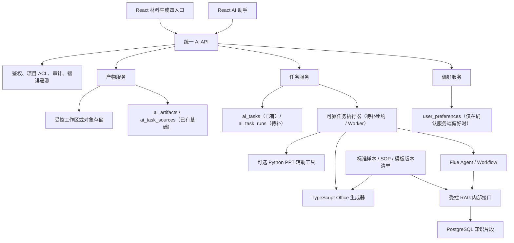

# AI 智能助手开发计划

> 文档状态：技术执行稿  
> 项目需求依据：`docs/需求分析.md` V1.2（2026-07-24）  
> 覆盖范围：AI-001～AI-011、PPT-001～PPT-003、SYS-001～SYS-003、KB-001～KB-002  
> 任务范围：AI-TASK-001～AI-TASK-022

## 1. 依据与约束

1. 产品口径、当前状态和待确认问题以 `docs/需求分析.md` V1.2 为准。
2. 本计划中的技术建议不视为已批准结论。尤其是“智灵动力”所指对象，项目需求文档仍标记为待确认。
3. 本计划不改变项目需求，不代替产品、投资业务、风控或法务确认。
4. 所有正式报告必须区分事实、AI 推断、待核验项和资料缺口。
5. 所有任务、产物、来源和下载必须在服务端执行用户及项目权限判断。
6. 本计划不把仓库中的 PPT Skill 视为运行中 Flue 已经接入的能力。
7. 本计划不把当前异常隔离等同于 AI-004 未知白屏根因已经彻底消除。

### 1.1 需求文档核对结果

- **正式需求文档路径**：`docs/需求分析.md`。
- **文档标识**：标题为“需求分析与优化需求（更新至 2026-07-24）”，版本 V1.2，最后同步日期 2026-07-24。
- **本计划覆盖内容**：AI 智能助手 AI-001～AI-011；PPT 生成 PPT-001～PPT-003；系统功能调整 SYS-001～SYS-003；知识库 KB-001～KB-002。公共线索池需求由独立计划处理。
- **新增口径**：V1.2 明确 PPT 标题/内容层级、周琴样本技术验证、主题配色、功能优先级、材料生成四入口、AI 五类快捷任务、项目知识库保留及标准样本/SOP 治理。
- **需求状态**：V1.2 沿用 AI-002 已实现待验收、AI-004 和 AI-005 部分完成的状态；新增需求尚未形成实现状态、负责人、目标版本、UAT 人和验收日期。
- **描述相对清晰的需求**：AI-002 的键盘规则和当前实现范围最清晰；AI-004、AI-005 已写明本轮落地范围与剩余问题，可以进入复现、测试和一期 UAT。
- **新增需求中相对清晰的部分**：SYS-001 已明确 P0/P1/P2 优先级；SYS-003 已明确保留五类快捷任务；PPT-001 已明确标题、正文及关键说明应作为独立可编辑元素；KB-001 已明确知识库能力不得因界面精简而删除。
- **仍缺验收输入或标准的需求**：PPT-001 缺沈阳教授参考文件及 Office/WPS 版本；PPT-002 缺周琴样本、授权、评测模型和上线阈值；PPT-003 缺企业色值；SYS-002 缺旧入口映射、隐藏/删除及历史访问结论；SYS-003 缺每类输入输出规则；KB-001/002 缺权限、失效规则、标准模板、SOP、脱敏及使用范围。
- **文档与代码差异**：
  - 项目背景称后端为 Python，但主 Web API 实际为 TypeScript/Express；Python 仅承载 Radar 和辅助脚本。
  - 当前 AI 页面存在两条链路：普通聊天直接连接 Flue `assistant`；四类文档快捷任务通过 Express `/api/ai/tasks` 创建持久任务。仓内另有 Express → Flue `advisor` 的旧聊天链路，文档中的单一路径描述与代码不一致。
  - `/materials` 已能用 PptxGenJS 生成原生 PPTX，但运行中的 Flue 是否接入仓内 PPT Skill 无法从本仓库确认。
  - `src/pages/MaterialsPage.tsx` 当前虽展示四种材料，但类型是“PPT 投资建议书、Word 投资备忘录、Excel 财务分析、IC 精简材料”，不等于 SYS-002 的“提案、建议书、PPT、微信说明”。
  - `server/src/services/ragService.ts` 和 `knowledge_chunks` 已有基础入库与检索，但缺有效日期、保密等级、允许范围、失效状态和标准模板标识。
  - `src/components/AiQuickActions.tsx` 已实现五个快捷入口、四类文档参数弹窗和 Q&A 问题库；四类文档通过 `/api/ai/tasks` 创建正式任务，具备任务恢复、轮询、取消、失败重试、产物登记、下载及质量检查。生成器会实际读取 `docs` 主样本并记录摘要：DOCX 继承可复用字体/主题与版式规则，PPT 只继承脱敏公司资产及紫色视觉规范，禁止复制样本项目正文和专属媒体。样本仍缺正式批准登记、有效期和允许范围；PPT 首期仅允许中文。
  - `docs/需求追踪.xlsx` 仍是 V1.0，未同步 V1.2，不能替代 Markdown 正式依据。
- **需要进一步确认**：`docs/ai-assistant/待确认事项.md` 中仍标记为待确认的问题。V1.2 已部分明确的事项不得继续描述为完全未知，尚未明确的细项也不得自行补全。

### 1.2 V1.2 范围归属与任务策略

| 需求 | 在本计划中的处理 | 任务策略 |
|---|---|---|
| PPT-001 | 属于 AI-001/AI-009 的 PPT 生成质量细化 | 扩展 AI-TASK-014、016、017、019 |
| PPT-002 | 独立技术验证，有单独输入、输出和验收记录 | 新增 AI-TASK-020 |
| PPT-003 | 与可编辑 PPT 模板和质量门禁同一技术链路 | 扩展 AI-TASK-014、016、017、019 |
| SYS-001 | 是项目建设优先级，不是独立用户功能 | 作为阶段和排序约束，不创建业务任务 |
| SYS-002 | 属于材料生成关联模块；与 AI 五类快捷任务边界不同 | 新增 AI-TASK-021 |
| SYS-003 | 明确保留 AI 五类快捷任务 | 扩展 AI-TASK-009～015、017、019 |
| KB-001 | 是五类任务的知识基础，不是可删除的附属功能 | 扩展 AI-TASK-007、008、010～018 |
| KB-002 | 是标准模板、测试集和正式验收的前置治理工作 | 新增 AI-TASK-022 |

SYS-001 要求 PPT 生成按 P0 推进，AI 智能助手、项目知识库和常用文档入口按 P1 推进，OA 及其他非核心模块按 P2 延后。本计划仍先收口可稳定复现且影响面小的现有 Bug，但不会把一般 AI 扩展排在 PPT 主链路之前。

## 2. 当前系统事实

### 2.1 技术架构

| 层级 | 当前实现 | 证据路径 | 结论 |
|---|---|---|---|
| Web 前端 | React 18、TypeScript、Vite、Zustand、React Router | `package.json`、`src/App.tsx`、`src/store/useAppStore.ts` | AI 页面位于 `/ai` |
| AI 前端接入 | 普通聊天使用 `@flue/react`、`@flue/sdk` 并经 `/ai/api` 访问 Flue；四类文档任务使用受 JWT 保护的 `/api/ai/*` | `src/pages/AIAssistantPage.tsx`、`src/components/AiQuickActions.tsx`、`src/components/AiTaskCards.tsx`、`vite.config.ts` | 聊天与文档任务是两条并存链路 |
| 主后端 | Node.js、TypeScript、Express 5 | `server/src/index.ts`、`server/src/routes/`、`server/src/services/` | 主后端不是 Python |
| 数据访问 | Drizzle ORM、PostgreSQL | `server/src/db/client.ts`、`server/src/db/schema.ts`、`server/src/db/migrate.ts` | 启动时执行手写建表和增量 DDL |
| AI 编排 | 普通聊天依赖外部 Flue；四类文档由本地任务服务调用配置的 LLM 并生成 Office 文件 | `server/src/services/aiService.ts`、`server/src/routes/internal.ts`、`server/src/routes/aiTasks.ts`、`server/src/services/aiTaskService.ts`、`server/src/services/aiBusinessContentService.ts` | 文档任务已有持久化基础，但执行器仍在 API 进程内 |
| 业务任务运行时 | 任务状态、幂等、取消请求、失败重试和启动恢复 | `server/src/services/aiTaskService.ts`、`server/src/index.ts` | 使用 `setImmediate` 和进程内 `running` 集合；尚无 `ai_task_runs`、租约、心跳或独立 Worker |
| RAG | 文件提取、分块、PostgreSQL 关键词检索 | `server/src/services/ragService.ts` | 不是向量检索，来源定位粒度不足 |
| Office 生成 | PptxGenJS、Docx、ExcelJS | `server/src/services/materialService.ts`、`server/src/services/aiBusinessDocumentService.ts` | `/materials` 与 AI 业务任务均可生成原生 Office 文件；两套模板与交付链路尚未统一 |
| Python 辅助能力 | Radar FastAPI、PPT/金融分析脚本 | `project-discovery/app.py`、`project-discovery/GordenSuperPPTSkills/` | Python 不是主应用后端 |

当前自动化基线：`package.json` 已提供 `npm run accept:ai-business`，对应 `server/src/scripts/aiBusinessAcceptance.ts`。本次最新代码执行退出码为 0，共通过 55 项脱敏虚构数据检查；PPTX 为 12 页、161 个可编辑文本对象，并生成 1600×900 PNG 封面预览。检查覆盖 OpenXML、结构、UTF-16/GB18030 中文编码、历史错译恢复、字体、模板摘要/公司资产、样本泄露、文本对象、免责声明和来源；仍不替代 Office/WPS、目标字体、完整视觉、内容、法务或项目 UAT。

### 2.2 Python 与项目背景差异

- 主平台 API 由 `server/src/index.ts` 启动 Express，不是 Python 服务。
- `project-discovery/app.py` 使用 FastAPI，`project-discovery/start.sh` 通过 Uvicorn 启动；`SETUP.md` 中“Flask”的描述与代码不一致。
- AI-001、AI-009 可能使用 Python PPT 脚本，但当前 AI 快捷任务实际使用 TypeScript `server/src/services/aiBusinessDocumentService.ts` 生成 PPTX；材料页仍使用 `server/src/services/materialService.ts`。
- `server/src/services/aiCoverService.ts` 通过 `python3` 调用仓库外的硬编码脚本路径，只生成单页图片，不等于完整可编辑 PPT 工作流。
- 普通聊天所依赖的 Flue Agent、Prompt、Tool 注册和模型配置不在当前仓库；四类文档任务的本地路由、任务执行和文件生成代码可见，但其 LLM 模型、网关 SLA 和生产部署仍需外部契约与联调环境。

### 2.3 当前数据表

AI 模块可以复用：

- `users`
- `projects`
- `project_files`
- `ai_summaries`
- `chat_conversations`
- `file_chunks`
- `knowledge_chunks`
- `audit_logs`
- `ai_tasks`
- `ai_artifacts`
- `ai_task_sources`

当前三张 AI 业务表已保存任务状态/阶段/进度、用户/项目/会话归属、幂等键、重试关系、取消请求、产物版本/质量状态/模板版本及来源记录。它们由 `server/src/db/migrate.ts` 的启动 DDL 创建，尚无独立版本化迁移文件。

当前不存在；仅在对应口径确认后，目标方案可能需要：

- `user_preferences`（仅在确认服务端持久化偏好时）
- `ai_task_runs`

`ai_task_runs`、执行租约、心跳、Worker 标识和尝试级运行记录均未实现。当前 API 进程通过 `setImmediate` 执行任务，并在启动时将最多 100 个 pending/running 任务重置为 pending 后重新调度；这只是基础恢复，不满足多实例可靠消费语义。新增表和字段以正式迁移文件为准，不继续仅依赖启动时散落的手写 DDL。

V1.2 样本与知识治理现状：

- `docs/合规性说明/`、`docs/投资提案/`、`docs/投资建议书/`、`docs/尽调报告/`、`docs/Q&A/` 已存在样本，但没有文件被正式标记为唯一生效标准模板。
- 当前 `docs` 中未发现名称包含“沈阳”或“周琴”的参考文件，PPT-001、PPT-002 缺少必要输入。
- `project_files` 有项目、版本、可见性和解析状态；`knowledge_chunks` 有 scope、来源和分块，但没有样本有效日期、保密等级、授权范围、标准模板标识和失效状态。
- `ingestToKnowledge` 会删除同来源旧分块后重建，可作为更新基础；当前没有审批、版本切换、失效回滚和知识索引发布记录。

## 3. 逐需求实现核对与任务映射

### AI-001 AI 生成 PPT 支持可编辑版本

- **当前状态**：正式任务技术初版已存在，产品口径和完整质量验收阻塞。
- **React/Hooks**：AI 页面通过正式任务卡显示服务端阶段、进度、来源数、模板版本和产物，并支持取消、失败重试和产物下载；普通聊天仍保留基于 Flue 工具消息启发式推断的旧 PPT 看板。
- **API**：AI 快捷入口使用 `POST /api/ai/tasks`、任务查询/取消/重试及产物接口；材料页另有 `POST /api/materials/generate`、`POST /api/materials/generate-internal` 和 `/generated/*`。
- **TypeScript Service**：`aiTaskService.ts` 调用 `aiBusinessDocumentService.ts` 生成原生 PPTX，并执行 ZIP/OpenXML、页数和可编辑文本数量的基础检查；`materialService.ts` 是材料页的另一套生成器，`aiCoverService.ts` 仅生成单页 PNG。
- **数据库**：`ai_tasks`、`ai_artifacts`、`ai_task_sources` 已保存 PPT 任务、产物版本、可编辑等级、资料截止日、模板版本、质量状态和来源。
- **Python**：仓库包含 Gorden Image2PPTX Skill；其实际边界是文字为文本框，框架、图标和图表多为图片层。
- **外部依赖**：Flue、图像网关、Office/WPS、字体环境。
- **关键路径**：`src/pages/AIAssistantPage.tsx`、`src/components/AiTaskCards.tsx`、`server/src/routes/aiTasks.ts`、`server/src/services/aiTaskService.ts`、`server/src/services/aiBusinessDocumentService.ts`、`src/pages/MaterialsPage.tsx`、`server/src/services/materialService.ts`、`project-discovery/GordenSuperPPTSkills/`。
- **主要差距**：参考 PPT 目前只以文件名写入元数据，生成器未读取和实际套版；两套生成入口和存储未统一；基础 OpenXML 检查不覆盖图片/图表等完整元素矩阵、字体、遮挡、溢出、视觉保真及 Office/WPS 实开；任务执行器缺 `ai_task_runs`、租约和独立 Worker。
- **直接任务**：AI-TASK-006、007、014、016、017、019。
- **关键依赖任务**：AI-TASK-015 依赖本需求的可编辑能力，但其直接对应 AI-009。
- **V1.2 补充**：PPT-001 已明确标题、正文及关键说明应为独立可编辑元素；PPT-003 要求模板级主题色替换。完整元素矩阵、参考文件、品牌色值和兼容版本仍待确认。

### AI-002 防止聊天输入意外自动发送

- **当前状态**：已实现待验收。
- **React/Hooks**：普通 Enter 换行，Ctrl/Command+Enter 发送；处理 IME 组合态；busy 和同步 ref 双重防重；失败恢复草稿。
- **API**：前端直接调用 `/ai/api/agents/assistant/:conversationId`。
- **TypeScript Service**：Express 不承接当前主页面的消息提交；`chat_conversations` 主要保存会话索引。
- **数据库**：没有消息幂等键或请求唯一约束。
- **Python**：无直接改动。
- **外部依赖**：Flue SDK 的提交和流式状态。
- **关键路径**：`src/pages/AIAssistantPage.tsx`、`server/src/db/schema.ts`、`server/src/services/conversationService.ts`。
- **主要差距**：缺浏览器和输入法验收；缺服务端幂等；快捷建议仍为点击即发送。
- **直接任务**：AI-TASK-001、006、017、019。

### AI-003 默认并记忆“智灵动力”选择项

- **当前状态**：未完成，需求含义阻塞。
- **React/Hooks**：当前只有范围和项目选择器；使用 URL 参数、本地存储和硬编码项目 ID 恢复。
- **API**：可读取 `GET /api/projects`，没有用户偏好接口。
- **TypeScript Service**：会话创建会保存项目字段，但会话列表恢复时前端没有使用这些字段恢复上下文。
- **数据库**：没有 `user_preferences`。
- **Python**：无直接改动。
- **外部依赖**：若“智灵动力”指 Agent 或 LLM 模型，则依赖仓库外 Flue 配置。
- **关键路径**：`src/pages/AIAssistantPage.tsx`、`src/store/useAppStore.ts`、`server/src/db/schema.ts`、`server/src/routes/conversations.ts`。
- **主要差距**：对象、默认或锁定、作用范围、跨设备和优先级均未正式确认。
- **直接任务**：AI-TASK-004、005、017、019。

### AI-004 修复 AI 生成结束后偶发白屏

- **当前状态**：部分完成，未知根因待观察。
- **React/Hooks**：路由、消息区、单条消息、消息片段、产物区和预览区已有多级 ErrorBoundary；Flue 消息先做安全归一化。
- **API**：涉及 Flue 消息流、标题总结和产物刷新。
- **TypeScript Service**：标题总结失败有局部降级；workspace 失败不再直接扩散到整页。
- **数据库**：没有前端错误事件表；错误编号未持久化。
- **Python**：无直接改动。
- **外部依赖**：Flue 异常消息、超大工具输出、浏览器运行时。
- **关键路径**：`src/components/AiErrorBoundary.tsx`、`src/lib/aiMessageSafety.ts`、`src/pages/AIAssistantPage.tsx`、`src/App.tsx`。
- **主要差距**：缺真实复现样本、脱敏遥测、超大消息资源限制、竞态和故障注入自动化测试。
- **直接任务**：AI-TASK-002、005、017、018、019。

### AI-005 精简右侧文件区域

- **当前状态**：正式产物中心技术初版与旧区降级已实现，权限口径和生命周期未完成。
- **React/Hooks**：右侧默认显示 `AiArtifactCenter`，按当前项目列出通过质量检查的 DOCX/PPTX 及 PPT 封面预览 PNG；支持鉴权下载。旧 workspace 被收纳为“历史兼容产物（只读）”，仍保留刷新、预览和下载。
- **API**：正式产物使用 `GET /api/ai/artifacts`、`GET /api/ai/artifacts/:id/download` 和合规 Markdown 的 preview 接口；PPT 封面 PNG 当前作为可下载产物而非内联 Office 预览；旧区继续使用 workspace 接口。
- **TypeScript Service**：正式产物按当前用户并可按项目筛选，下载/预览校验归属、归档状态、质量状态和受控根路径；旧 workspace 仍仅按目录和扩展名过滤。
- **数据库**：`ai_artifacts` 已表达用户、项目、会话、任务、版本、格式、模板版本、可编辑等级、质量和归档状态。
- **Python**：Python 或 Flue 生成的文件只有写入约定目录才会出现。
- **外部依赖**：Agent 工作区、未来对象存储或 Office 预览服务。
- **关键路径**：`src/pages/AIAssistantPage.tsx`、`src/components/AiTaskCards.tsx`、`server/src/routes/aiTasks.ts`、`server/src/services/aiTaskService.ts`、`server/src/routes/workspace.ts`。
- **主要差距**：正式产物当前按创建用户隔离，同项目协作者能否共享未确认；旧 workspace 仍是共享根且缺业务归属；没有用户可操作的归档、删除、重命名、分享和 Office 在线预览；材料产物和 AI 任务产物仍分处不同目录。
- **直接任务**：AI-TASK-003、007、017、018、019。

### AI-006 增加聊天快捷入口栏

- **当前状态**：四类文档正式任务技术初版已接通，Q&A 仍为前端原型；产品口径和发布门禁未完成。
- **React/Hooks**：`AiQuickActions` 已静态注册“合规性说明、投资提案、投资建议书（PPT）、尽调报告、Q&A”五个入口。四类文档打开参数弹窗，Q&A 打开硬编码问题库。
- **API**：四类文档通过 `POST /api/ai/tasks` 创建任务，并有列表、详情、取消、失败重试、产物列表、下载和 Markdown 预览接口；路由校验项目/会话 UUID、截止日及各任务必填参数。Q&A 不创建任务，只填充聊天输入框。
- **TypeScript Service**：`aiTemplateCatalog.ts` 以代码注册四种任务及输出格式、章节和模板版本；`aiTaskService.ts` 负责项目/会话校验、幂等、任务执行、恢复和产物登记。
- **数据库**：`ai_tasks`、`ai_artifacts`、`ai_task_sources` 已存在；没有运行尝试表、租约或模板治理表。
- **Python**：无公共入口层改动；具体 PPT 任务可能调用 Python 辅助脚本。
- **外部依赖**：四类文档使用配置的 LLM 和本地 Office 生成器；Q&A 仍依赖 Flue/RAG。
- **关键路径**：`src/components/AiQuickActions.tsx`、`src/pages/AIAssistantPage.tsx`、`src/components/AiTaskCards.tsx`、`server/src/routes/aiTasks.ts`、`server/src/services/aiTaskService.ts`、`server/src/services/aiTemplateCatalog.ts`。
- **主要差距**：当前 UI、参数和任务目录是代码提前采用的方案，不代表项目需求已确认；没有 feature flag 或前端角色过滤；现有 ACL 只是 JWT、创建时项目校验及按任务创建用户隔离，不等于批准的角色矩阵；缺 `ai_task_runs`、租约、心跳和独立 Worker；位置、点击行为、参数枚举、模板、审核、归档和旧建议按钮去留仍需确认。
- **直接任务**：AI-TASK-006、009、017、019。

### AI-007 “合规性说明”快捷入口

- **当前状态**：正式任务、DOCX 和 Markdown 预览技术初版已实现，业务定义和审核未确认。
- **React/Hooks**：已有专属入口，可选择项目和资料截止日；提交后创建正式任务卡，展示阶段、进度、来源数、模板版本和产物。合规任务除 DOCX 外还生成可在页面预览的 Markdown。
- **API**：`compliance_statement` 通过统一任务 API 创建、查询、取消和失败重试，产物可鉴权下载，Markdown 可鉴权预览。
- **TypeScript Service**：任务服务读取项目档案和截止日前的知识片段，业务内容服务区分资料记载、AI 推断、待核验和资料缺口，文档服务生成 DOCX/Markdown 并执行基础文件检查。
- **数据库**：任务、DOCX/Markdown 产物、模板版本、质量状态和来源已记录；没有审核记录或批准模板登记。
- **Python**：无必需改动。
- **外部依赖**：配置的 LLM、法务确认的模板和依据。
- **关键路径**：`src/components/AiQuickActions.tsx`、`src/pages/AIAssistantPage.tsx`、`src/components/AiTaskCards.tsx`、`server/src/routes/aiTasks.ts`、`server/src/services/aiTaskService.ts`、`server/src/services/aiBusinessContentService.ts`、`server/src/services/aiBusinessDocumentService.ts`。
- **主要差距**：硬编码模板和免责声明未经批准，参考 DOCX 未被实际套用；来源定位仅到“知识片段 N”，缺页码/段落及核验工作流；法律责任边界、人工审核、归档、协作者权限和正式内容验收仍待确认。
- **直接任务**：AI-TASK-006、007、008、011、017、018、019。
- **关键依赖任务**：AI-TASK-009 提供五类快捷入口的公共交互框架。

### AI-008 “投资提案”快捷入口

- **当前状态**：正式任务和 DOCX 技术初版已实现，业务边界、参数和模板未确认。
- **React/Hooks**：已有“投资提案”入口，可选择项目、资料截止日、目标受众和篇幅；提交后创建正式任务卡并交付 DOCX。
- **API**：`investment_proposal` 通过统一任务 API 创建、查询、取消和失败重试，服务端要求受众、篇幅和资料截止日。
- **TypeScript Service**：任务服务读取项目档案与知识片段，内容服务调用配置的 LLM 并提供确定性降级，文档服务生成结构化 DOCX。
- **数据库**：任务、DOCX 产物、版本、模板版本、质量状态和来源已记录。
- **Python**：无必需改动。
- **外部依赖**：配置的 LLM、公司模板。
- **关键路径**：`src/components/AiQuickActions.tsx`、`src/pages/AIAssistantPage.tsx`、`src/components/AiTaskCards.tsx`、`server/src/routes/aiTasks.ts`、`server/src/services/aiTaskService.ts`、`server/src/services/aiBusinessContentService.ts`、`server/src/services/aiBusinessDocumentService.ts`。
- **主要差距**：当前受众、篇幅、章节、模板和免责声明是未批准的代码方案；参考 DOCX 未实际套版；与投资建议书的业务边界、细粒度来源、审核、归档及协作者共享仍待确认。
- **直接任务**：AI-TASK-006、007、008、012、017、018、019。
- **关键依赖任务**：AI-TASK-009 提供五类快捷入口的公共交互框架。

### AI-009 “投资建议书（PPT）”快捷入口

- **当前状态**：统一任务、PPTX 生成和基础质量检查技术初版已实现，模板与正式验收未完成。
- **React/Hooks**：已有专属入口，可选择项目、资料截止日、公司标准模板、建议页数和“中文”语言；提交后创建正式任务卡，页面轮询真实状态并支持取消、失败重试和下载。普通聊天的旧启发式 PPT 看板仍并存。
- **API**：`investment_recommendation_ppt` 使用统一任务、状态、取消、重试和产物 API；服务端校验模板、页数和语言，当前仅接受中文。
- **TypeScript Service**：业务文档服务以 PptxGenJS 生成包含原生文本、overview 表格、形状和来源页脚的 PPTX，并生成 PNG 封面预览；当前没有调用 `addChart`，不能视为已生成原生图表。任务服务执行基础 ZIP/OpenXML、最少页数和可编辑文本数量检查；字体可通过 `AI_DOCUMENT_FONT` 覆盖。
- **数据库**：PPT 任务、产物版本、可编辑等级、模板版本、质量状态和来源已记录；没有 `ai_task_runs`。
- **Python**：可选 Gorden Skill，但运行中 Flue 是否接入未知。
- **外部依赖**：配置的 LLM、Office/WPS、字体、批准模板；仅在选择 Gorden 路线时依赖图像网关。
- **关键路径**：`src/components/AiQuickActions.tsx`、`src/pages/AIAssistantPage.tsx`、`src/components/AiTaskCards.tsx`、`server/src/routes/aiTasks.ts`、`server/src/services/aiTaskService.ts`、`server/src/services/aiBusinessDocumentService.ts`、`server/src/services/aiTemplateCatalog.ts`。
- **主要差距**：入口参数和硬编码参考样本未经确认；`referencePath` 只写入元数据，未实际读取/套版；当前没有原生图表实现；自动验收和基础质量检查不覆盖 Office/WPS 实开、字体、遮挡、溢出、主题和视觉保真；来源定位粗，取消只在阶段间生效，且缺运行尝试、租约和独立 Worker。
- **直接任务**：AI-TASK-006、007、008、015、016、017、018、019。
- **关键依赖任务**：AI-TASK-009 提供入口框架；AI-TASK-014 提供 AI-001 的可编辑 PPTX 能力。

### AI-010 “尽调报告”快捷入口

- **当前状态**：正式任务和 DOCX 技术初版已实现，尽调范围、证据与责任边界未确认。
- **React/Hooks**：已有专属入口，可选择项目、资料截止日和尽调范围；提交后创建正式任务卡，并提供真实状态、取消、失败重试和 DOCX 下载。
- **API**：`due_diligence_report` 使用统一任务 API；任务服务直接读取项目档案和 `knowledge_chunks`，另有 `/api/internal/search-docs` 供旧链路使用。
- **TypeScript Service**：业务内容及文档服务生成带事实状态、资料缺口和来源附录的 DOCX；来源定位仅为文件名及“知识片段 N”，缺页码、段落、表格或幻灯片位置。
- **数据库**：`project_files`、`file_chunks`、`knowledge_chunks` 可复用；报告任务、产物版本和来源已记录，但没有人工来源核验或审核状态。
- **Python**：无必需改动。
- **外部依赖**：配置的 LLM、OCR 网关、法务和投资业务模板。
- **关键路径**：`src/components/AiQuickActions.tsx`、`src/pages/AIAssistantPage.tsx`、`src/components/AiTaskCards.tsx`、`server/src/routes/aiTasks.ts`、`server/src/services/aiTaskService.ts`、`server/src/services/aiBusinessContentService.ts`、`server/src/services/aiBusinessDocumentService.ts`、`server/src/services/ragService.ts`。
- **主要差距**：当前范围枚举、目录、模板和免责声明未获确认；资料摄入状态及检索能力有限，引用不可精确定位；人工核验、审核、归档和责任边界仍待确认。
- **直接任务**：AI-TASK-006、007、008、013、017、018、019。
- **关键依赖任务**：AI-TASK-009 提供五类快捷入口的公共交互框架。

### AI-011 “Q&A”快捷入口

- **当前状态**：部分实现；已有自由问答和硬编码 Q&A 原型，正式定义未确认。
- **React/Hooks**：`/ai` 已支持项目和全局知识库问答；`AiQuickActions` 还提供五个硬编码分类、每类两个问题，点击后只填入输入框、不立即发送。
- **API**：主页面直连 Flue；另有未被该页面使用的 `/api/ai/chat` 和 `/api/ai/chat-stream`。
- **TypeScript Service**：内部检索可以返回 context 和文件名来源；旧 `aiService` 可返回 sources/confidence，但主页面未使用其结构化契约。
- **数据库**：会话索引可复用；问题文本写死在前端，没有问题库或 FAQ 表。
- **Python**：无直接改动。
- **外部依赖**：Flue 和 RAG。
- **关键路径**：`src/components/AiQuickActions.tsx`、`src/pages/AIAssistantPage.tsx`、`server/src/routes/meetings.ts`、`server/src/services/aiService.ts`、`server/src/routes/internal.ts`。
- **主要差距**：当前分类、问题和“只填入”行为未经批准，入口副文案“选择问题后发送”与弹窗及实际行为不一致；Q&A 与自由聊天的正式差异仍待确认，且存在 `assistant` 和 `advisor` 双链路。
- **直接任务**：AI-TASK-005、006、008、010、017、018、019。
- **关键依赖任务**：AI-TASK-009 提供五类快捷入口的公共交互框架。

### PPT-001 “标题 + 内容解释”版式层级

- **当前状态**：AI 正式任务已有原生 PPTX 技术初版，参考模板和专项验收阻塞。
- **React/页面**：AI 页面已有模板、建议页数和语言参数并接入统一任务；材料页另有模板选择和独立生成链路。
- **API/Service**：`aiBusinessDocumentService.ts` 和 `materialService.ts` 均使用 PptxGenJS 输出独立文本和形状；AI 任务生成器会读取指定参考 PPT，复用脱敏公司资产并按紫色样本规则生成，且执行 OpenXML、中文语言/字体和样本泄露检查。由于 PptxGenJS 不支持导入后逐对象编辑，当前不是完整母版克隆。
- **数据库**：`ai_tasks`、`ai_artifacts` 已记录代码声明的模板版本、产物版本和基础兼容性元数据；没有获批模板登记、版式版本或 Office/WPS 验收记录。
- **外部依赖**：沈阳教授参考 PPT、Office/WPS、中文字体环境。
- **关键路径**：`server/src/services/aiBusinessDocumentService.ts`、`server/src/services/aiTaskService.ts`、`server/src/services/materialService.ts`、`src/pages/AIAssistantPage.tsx`、`src/pages/MaterialsPage.tsx`。
- **主要差距**：沈阳教授参考文件仍缺失；当前硬编码模板版本不是经批准的真实套版；缺完整元素、每页对象、溢出、字体、视觉及 Office/WPS 检查。
- **直接任务**：AI-TASK-014、016、017、019。

### PPT-002 周琴样本多模态生成技术验证

- **当前状态**：未开始，必要样本缺失。
- **当前能力**：仓库有 `project-discovery/GordenSuperPPTSkills/` 和图片网关客户端测试，但没有固定的多模态对比流程或上线判定记录。
- **样本**：当前 `docs` 未发现名称包含“周琴”的文件。
- **接口/数据库**：技术验证默认不新增生产接口和数据表。
- **外部依赖**：周琴样本、使用授权、候选模型/Workflow、图像网关、Office/WPS。
- **关键路径**：`project-discovery/GordenSuperPPTSkills/`、其测试目录、验证记录目录。
- **主要差距**：缺测试输入、模型版本、评测规则、生成结果、失败率、耗时和人工修订成本记录。
- **直接任务**：AI-TASK-020、017。
- **关键依赖任务**：若验证结论决定采用多模态路线，则 AI-TASK-020 是 AI-TASK-014 技术路线冻结的前置；原生 PptxGenJS 基础开发不必等待。

### PPT-003 配色适配

- **当前状态**：存在硬编码主题，正式色值阻塞。
- **当前能力**：`server/src/services/materialService.ts` 与 `server/src/services/aiBusinessDocumentService.ts` 均定义固定颜色及字体主题，可以作为主题抽象起点。
- **API/数据库**：预计复用 PPT 任务和 artifact 元数据，不应为颜色配置新增独立业务接口。
- **外部依赖**：企业主色、辅助色、禁用色、深浅色偏好和对比度验收规则。
- **关键路径**：`server/src/services/materialService.ts`、`server/src/services/aiBusinessDocumentService.ts`、未来主题配置及 PPT 文件质量测试。
- **主要差距**：颜色未 token 化；不能按模板版本替换；缺图表、正文、背景对比度和 Office/WPS 检查。
- **直接任务**：AI-TASK-014、016、017、019。

### SYS-001 调整功能建设优先级

- **当前状态**：正式排期约束，非独立业务功能。
- **项目口径**：线索池数据和 PPT 生成为 P0；AI 智能助手、项目知识库和常用文档入口为 P1；OA 和其他非核心模块为 P2。
- **代码影响**：不直接改接口、数据库或页面；影响阶段、人员和发布顺序。
- **主要差距**：原计划尚未显式按 P0/P1/P2 标注开发顺序。
- **任务策略**：不创建业务任务；由本计划阶段、顺序和发布门禁承接。

### SYS-002 精简材料生成入口

- **当前状态**：未实现，当前“四个入口”与需求定义不同。
- **React/状态**：`src/pages/MaterialsPage.tsx` 硬编码 PPT 投资建议书、Word 投资备忘录、Excel 财务分析和 IC 精简材料；模板及历史记录来自 `useAppStore`。
- **API/Service**：材料生成接口按现有类型和模板生成；服务端未形成“提案、建议书、PPT、微信说明”的稳定枚举和兼容映射。
- **数据库**：现有历史任务可能保存旧类型名称，不能因界面精简而删除或错误改写。
- **关键路径**：`src/pages/MaterialsPage.tsx`、`src/store/useAppStore.ts`、`src/lib/api.ts`、`server/src/services/materialService.ts`。
- **主要差距**：缺旧到新入口映射、页面原型、隐藏/删除策略和历史访问规则。
- **直接任务**：AI-TASK-021、017、019。
- **边界**：材料生成四类一级入口不替代 SYS-003 的 AI 助手五类快捷任务。

### SYS-003 保留 AI 智能助手五类快捷任务

- **当前状态**：保留范围已确认；静态五入口和四类文档正式任务技术初版已实现，Q&A 仍为填框原型，执行形态尚未获批。
- **React/状态**：`AiQuickActions` 静态注册五类入口；四类文档有参数弹窗、真实任务卡和正式产物中心，Q&A 有硬编码问题库且只填入输入框。当前没有 feature flag 或前端角色过滤。
- **API/Service**：四类文档已有稳定代码枚举、参数校验、任务/取消/重试/产物 API 及本地生成器；Q&A 继续走普通 Flue 消息。代码实现不等于业务契约已批准。
- **数据库**：已有任务、产物、来源和模板版本字段；没有 `ai_task_runs`、租约/心跳、批准模板、审核或归档操作模型。
- **关键路径**：`src/components/AiQuickActions.tsx`、`src/pages/AIAssistantPage.tsx`、`src/components/AiTaskCards.tsx`、`server/src/routes/aiTasks.ts`、`server/src/services/aiTaskService.ts`、`server/src/services/aiTemplateCatalog.ts`。
- **主要差距**：当前提前实现不代表项目需求口径获批；每类标准模板、输入字段枚举、点击方式、输出、审核、协作者权限、功能开关和降级规则仍未确认；任务运行可靠性和来源定位仍不足。
- **直接任务**：AI-TASK-009～015、017、019。
- **关键依赖任务**：KB-001/002、AI-TASK-006～008、022。

### KB-001 保留项目知识库梳理能力

- **当前状态**：基础能力存在，生命周期和质量治理未完成。
- **React/页面**：项目详情和 AI 页面可以上传资料、选择项目或知识范围，但解析成功状态和实际可检索状态存在偏差。
- **API/Service**：`ragService.ts` 支持文件解析、分块、同来源重建和关键词检索；来源定位粒度和失效语义不足。
- **数据库**：`project_files`、`file_chunks`、`knowledge_chunks` 可复用；缺授权范围、有效期、失效状态、核验状态和索引版本。
- **关键路径**：`src/pages/AIAssistantPage.tsx`、`src/pages/ProjectDetailPage.tsx`、`server/src/services/ragService.ts`、`server/src/db/schema.ts`。
- **主要差距**：知识更新和失效无发布记录；检索结果不能完整区分知识库事实、模型推断和待核验信息；标准样本治理未接入。
- **直接任务**：AI-TASK-007、008、010～018、022。

### KB-002 收集标准化样本与 SOP

- **当前状态**：有样本目录；前端已硬编码四个“参考模板”名称，但无正式标准、SOP 和治理记录。
- **现有样本**：五类目录均有文件；`AiQuickActions.tsx` 的 `REFERENCE_TEMPLATES` 将德塔智能/佳量脑科学文件名直接描述为“标准样本”，但仓库没有唯一生效、批准人、版本或允许范围记录，不能据此视为已确认标准。
- **接口/数据库**：是否使用版本化清单或运行时模板注册服务待确认；不能在确认前擅自新增表。
- **外部依赖**：业务负责人、法务/安全、模板所有人及正式 SOP。
- **关键路径**：五类 `docs` 样本目录、`server/src/services/ragService.ts`、`server/src/db/schema.ts`、模板/金样测试目录。
- **主要差距**：前端硬编码与治理事实不一致；缺文档类型、版本、有效日期、保密等级、使用范围、脱敏和审核记录，且 Q&A 没有对应参考模板登记。
- **直接任务**：AI-TASK-022、017、018、019。
- **关键依赖任务**：AI-TASK-007、008、018；完成后作为 AI-TASK-010～015 正式内容验收的前置。

## 4. 目标架构

目标架构的关键原则：

- 浏览器不直接决定文件物理路径。
- 业务任务使用服务端生成的任务 ID 和幂等键。
- Flue 与本地生成器通过统一任务执行器接入。
- 当前任务状态、产物和来源已有持久化基础；目标仍需补齐运行尝试记录、租约/心跳、独立 Worker、多实例恢复及完整审计。
- 上传源文件、中间文件和最终交付物物理或逻辑分区。
- 旧共享工作区仅做受控、只读兼容，不继续作为普通用户的默认产物源。
- AI 五类快捷任务和材料生成四类一级入口共享底座但保持清晰的信息架构边界。
- 模板、主题、标准样本、SOP 和知识索引必须有生效版本及可回切记录。

## 5. 七阶段计划

| 阶段 | 对应需求与任务 | 阶段目标 | 前置条件 | 可交付成果 | 验收出口 | 主要风险 | 可独立上线 |
|---|---|---|---|---|---|---|---|
| 阶段 0：需求、样本与契约冻结 | AI-003、004、011、PPT-001～003、SYS-002/003、KB-001/002；AI-TASK-005 契约子项、020、022 输入子项 | 解决会改变实现方向的产品、样本和外部接口问题 | V1.2 已核对；决策人、样本所有人和 Flue 联调人明确 | 决策记录、参考/样本清单、Agent 契约、评测规则、模板/SOP 责任表 | 阻塞问题有书面结论；必要文件、授权、联调环境和责任人明确 | 参考与样本缺失；授权不清；错误契约导致返工 | 否；技术验证报告可独立交付但不发布业务功能 |
| 阶段 1：现有能力稳定化 | AI-002、004、005、KB-001；AI-TASK-001～003、008、017 的阶段 1 子项 | 验收输入、防白屏和一期产物区，并修正确定性摄入/RAG 缺陷 | 可运行开发环境；现有 Flue 路径可联调 | 自动化基线、缺陷证据、局部降级、产物区与上传/RAG 修复 | 核心回归通过；确定性高风险缺陷关闭 | 偶发白屏证据不足；共享工作区越权；外部消息不可控 | 是；001～003、008 可按独立开关/提交分批上线 |
| 阶段 2：任务、产物与知识底座 | 横切 AI-001～011、KB-001/002；AI-TASK-004～008、017～018、022 | 加固现有任务/产物/来源初版，补齐可靠运行、知识生命周期和批准权限模型 | 阶段 0 完成；现有启动 DDL 和 API 完成基线审查；数据模型、模板治理和迁移评审通过 | 版本化迁移、运行尝试/租约/Worker、产物/来源登记、ACL、知识更新/失效及标准样本登记 | 多实例和重启可恢复；跨用户不可越权；失效知识不参与新生成 | 进程内任务重复执行、共享文件归属、协作者不可见、样本越权、索引切换和迁移 | 可分批灰度；现有任务 API 必须保持兼容并先补功能开关 |
| 阶段 3：入口与 Q&A | AI-006、011、SYS-002/003；AI-TASK-009～010、017～018、021 | 将已接入的 AI 五入口按批准交互收口，交付批准形态的 Q&A 和材料页四入口 | 两套入口的信息架构、点击行为、旧入口映射、权限和开关已确认 | 五入口参数/角色/开关收口、Q&A、材料页四入口及历史兼容 | 两套入口数量、命名、行为、权限和历史访问分别验收 | 四类材料与五类 AI 任务混淆；未批准能力已无条件展示；旧入口误删；重复发送 | 是；实现并验证独立开关后，AI 快捷入口、Q&A 和材料入口可分别上线 |
| 阶段 4：报告型能力 | AI-007、008、010、SYS-003、KB-001/002；AI-TASK-011～013、017～018、022 | 以现有 DOCX 技术初版为基线，按批准模板、SOP 和知识范围完成内容、引用、审核与归档 | 标准模板、SOP、输出、来源、审核和责任边界确认 | 经批准的生成器、结果/文件、精确来源、模板版本和审核证据 | 三类能力分别通过内容、引用、知识有效性、Office 文件和审核验收 | 合规责任、未实际套版、证据不足、失效样本、越权和长任务失败 | 是；补齐独立开关后，三类能力分别验收和回滚 |
| 阶段 5：P0 可编辑 PPT | AI-001、009、PPT-001～003、SYS-003、KB-001/002；AI-TASK-014～016、020、022 | 以现有原生 PPTX 初版为基线，完成多模态验证、真实参考套版、主题和完整质量门禁 | 参考 PPT、周琴样本、色值、模板、版本及 Office/WPS 标准确认 | 技术验证记录、批准模板生成、可编辑 PPTX、主题、预览/版本和质量报告 | 完整元素矩阵、标题/解释层级、主题替换、Office/WPS、版本和来源通过 | 字体/版式漂移、当前参考未实际套版、路线误选、样本授权、外部链路和超时 | 是；实现真实功能开关后独立灰度，技术验证不进生产 |
| 阶段 6：系统验证与发布 | 本计划全部需求；AI-TASK-017～019 收口，020～022 提供门禁证据 | 收口自动化、安全、观测、模板/索引版本、迁移、灰度和回滚 | 本批次功能冻结；生产拓扑、备份和负责人明确 | 全量测试证据、发布单、监控、模板/索引清单和回滚演练 | 全部门禁通过；灰度稳定；发布证据归档 | 混合版本、代理 404、迁移部分成功、错误模板或 Worker 重复消费 | 否；按独立功能单元分批发布，本阶段负责收口 |

## 6. 开发顺序分类

### 6.1 可以立即执行

- AI-TASK-001：现有输入规则自动化和业务验收。
- AI-TASK-002：异常 fixture、资源限制和脱敏遥测底座。
- AI-TASK-003：一期产物区验收及读取权限加固。
- AI-TASK-008：修正上传 Base64、解析状态和 RAG 来源真实性。
- AI-TASK-006、007、009、011～016：可以立即为当前任务创建、参数校验、轮询、取消、失败重试、恢复、产物下载、基础 ACL 和 Office 文件检查补基线测试与缺陷清单；不得在口径未确认时把提前实现当作已验收能力或继续扩大业务范围。
- AI-TASK-010：可以立即为当前 Q&A 只填入输入框、不自动发送的行为补现状回归测试。
- AI-TASK-017：可以立即建立测试工程骨架和阶段 1 基线用例；本任务其余子项随阶段 2～6 持续完成。
- AI-TASK-018：可以立即完成安全、可观测性和性能的基线设计；依赖业务底座的实现子项不能提前开发。
- AI-TASK-020：仅能先建立不含真实样本的评测脚手架；正式验证等待周琴样本和授权。
- AI-TASK-022：可以先盘点现有五类目录和建立待补字段清单；标准指定、摄入和验收等待负责人确认。

### 6.2 需要先完成公共底座

- AI-TASK-004 依赖用户偏好正式口径。
- AI-TASK-006 已有进程内持久任务初版，剩余 `ai_task_runs`、租约/心跳、独立 Worker、多实例恢复和迁移治理仍是所有正式快捷任务的运行底座。
- AI-TASK-007 已有按用户隔离的正式产物/来源初版，剩余批准 ACL、协作者共享、精确来源、生命周期和历史迁移仍是正式文件交付底座。
- AI-TASK-009 的静态入口栏及四类文档正式任务已存在；剩余布局、行为、权限、功能开关和业务契约在确认后收口。
- AI-TASK-011～016 已有不同程度的技术初版，正式验收仍依赖批准的快捷入口、可靠任务、产物、知识、模板和质量底座。
- AI-TASK-022 是 AI-TASK-010～015 正式内容验收的前置，治理框架本身依赖 AI-TASK-007、008、018。

### 6.3 可在底座稳定后并行

- AI-TASK-010 Q&A。
- AI-TASK-011 合规性说明。
- AI-TASK-012 投资提案。
- AI-TASK-013 尽调报告。
- AI-TASK-014 可编辑 PPT 生成器的文件质量开发。
- AI-TASK-021 材料四入口可在信息架构确认后独立开发，不依赖 Flue。

### 6.4 被产品确认阻塞

- AI-TASK-004：AI-003 的“智灵动力”对象和作用范围。
- AI-TASK-009：当前静态五入口及四类任务行为未经确认且无功能开关；位置、点击行为、项目要求、权限和开关阻塞验收及发布。
- AI-TASK-010：当前硬编码问题库和只填入行为未经确认；Q&A 与普通聊天的正式差异阻塞验收/发布。
- AI-TASK-011：当前合规任务、DOCX 和 Markdown 预览是未获业务批准的技术初版；类型、模板、依据和审核人阻塞正式能力。
- AI-TASK-012：当前提案入口和参数仅为临时实现；投资提案与投资建议书的边界阻塞正式能力。
- AI-TASK-013：当前尽调入口和范围仅为临时实现；尽调类型、目录、证据和责任边界阻塞正式能力。
- AI-TASK-014～016：参考文件、完整可编辑矩阵、品牌色值、模板、版本和 Office/WPS 标准。
- AI-TASK-020：周琴样本、授权、候选模型、评测规则和上线阈值。
- AI-TASK-021：旧入口映射、隐藏/删除决策、页面设计和历史访问策略。
- AI-TASK-022：标准模板、SOP、负责人、有效期、保密等级、脱敏及允许范围。

### 6.5 被外部服务阻塞

- AI-TASK-005：Flue `assistant`/`advisor` 的统一契约、认证和生产路由。
- AI-TASK-006：本地任务已有取消请求、幂等和启动恢复；仍需确认阶段级取消、重试、租约、超时、多实例和失败补偿语义，以及与外部 LLM/Flue 的中断边界。
- AI-TASK-014～016：若采用 Gorden Skill，需确认实际运行环境、成本、并发和负责人。
- AI-TASK-020：真实多模态验证依赖候选模型、图像网关和 Office/WPS 环境。

### 6.6 高风险任务

- AI-TASK-005：统一 Flue 链路，错误切换可能导致全量 AI 不可用或历史不兼容。
- AI-TASK-006：持久任务状态机，涉及并发幂等、取消竞态和重启恢复。
- AI-TASK-007、018：产物归属、项目 ACL 与共享文件迁移，存在越权和历史归属风险。
- AI-TASK-011、013：合规性说明和尽调报告涉及来源、审核、责任边界与敏感资料。
- AI-TASK-014～016：可编辑 PPT 涉及 Office/WPS、字体、视觉保真、外部服务和长任务。
- AI-TASK-020：样本授权、评测偏差和路线误选会直接影响 P0 PPT 决策。
- AI-TASK-022：标准样本可能含敏感信息，错误授权或失效控制会污染五类正式产物。
- AI-TASK-019：生产代理、迁移、混合版本、Worker 和 Flue 的分层发布与回滚。

### 6.7 推荐首任务与模块内顺序

- **推荐第一个开发任务**：AI-TASK-001。它是稳定可验收、范围最小的现有 Bug 收口，可先建立输入自动化证据并快速形成一个可提交、可验收的闭环。
- **推荐顺序**：AI-TASK-001（同步建立 AI-TASK-017 最小测试骨架）→ AI-TASK-002 → AI-TASK-003 → AI-TASK-008 → 并行收集 AI-TASK-020/022 输入 → AI-TASK-005 契约确认 → AI-TASK-006 → AI-TASK-007 → AI-TASK-022 → AI-TASK-020 技术验证 → AI-TASK-014、016 的 P0 PPT 主链路 → AI-TASK-009、021 → AI-TASK-010～013、015（分别确认后）→ AI-TASK-019。AI-TASK-004 在口径确认后插入阶段 2；AI-TASK-017～018 按各阶段持续实施。
- AI-TASK-004 只有在 AI-003 对象和优先级确认后插入阶段 2；不得按技术建议预设“智灵动力”含义。
- AI-TASK-010～016、020～022 只有在各自业务定义、样本、授权、模板、设计和验收标准确认后进入完整开发；不依赖结论的脚手架或盘点可先进行。

## 7. 工作量与人员建议

原 **62～110 人日** 是四类文档正式任务初版落地前的剩余工作上界，已不能直接作为当前承诺。应在 `开发任务清单.md` 按“代码已存在但未验收、需加固、仍待开发”重新估算；其中可靠 Worker/迁移、批准模板真实套版、精确来源、权限/审核/归档、Office/WPS 验证、自动化和发布治理仍需计入。AI-TASK-020～022 原估 7～14 人日同样不包含等待样本、SOP、授权、设计和正式 UAT 的日历时间。

建议配置：

| 角色 | 建议投入 | 主要职责 |
|---|---:|---|
| 前端工程师 | 1～2 人 | AI 页面、快捷入口、任务卡片、错误降级、产物中心 |
| TypeScript 后端工程师 | 1～2 人 | API、任务执行器、数据库、权限、文件服务 |
| AI/Flue 工程师 | 0.5～1 人 | Agent 契约、Workflow、Prompt、Tool 和联调 |
| Python/PPT 工程师 | 0～0.5 人 | 仅在采用 Gorden 路线时投入 |
| 测试工程师 | 1 人 | 自动化、权限、文件质量、故障注入和业务回归 |
| 产品/投资业务 | 分阶段参与 | 业务定义、模板、参数和内容验收 |
| 风控/法务 | 按需参与 | 合规说明、尽调和免责声明验收 |
| 运维/SRE | 0.5 人 | 环境、代理、监控、灰度和回滚 |

## 8. 阶段交付物

- 需求确认记录和接口契约。
- 数据模型及正式迁移文件。
- 统一 AI API、任务执行器、产物和来源服务。
- 用户偏好、快捷入口、任务卡片和产物中心。
- Q&A、合规性说明、投资提案、尽调报告和投资建议书。
- 周琴样本多模态技术验证记录、参考版式与主题配置。
- 材料生成四入口及旧入口/历史产物兼容记录。
- 五类标准样本、SOP、权限/脱敏清单和知识索引版本记录。
- Office/WPS 文件质量验收证据。
- 单元、集成、契约、E2E、安全、性能和故障恢复测试。
- 发布清单、灰度记录、监控看板和回滚记录。

详细任务字段见 `docs/ai-assistant/开发任务清单.md`。
