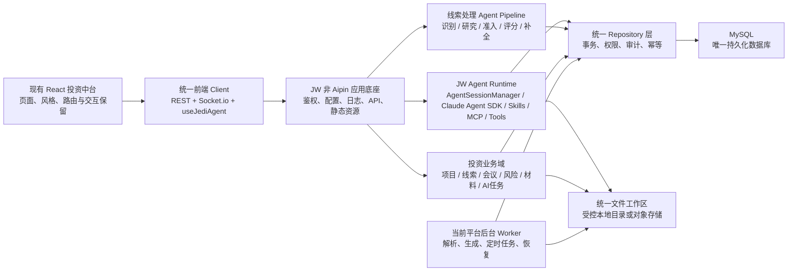

# 智能投资管理平台 JW 底座与 MySQL 统一迁移计划

> 文档状态：迁移规划稿（已完成基于当前代码与运行资产的缺口修订）  
> 目标项目：`/Users/hyw/Desktop/sbl_jedi`  
> 底座来源：`/Users/hyw/Desktop/jw`  
> 核心目标：保留现有页面风格与业务功能，仅引入 JW 的通用 Agent 运行底座（明确排除 JW Aipin 子系统），将线索池智能数据处理替换为当前项目自有的 Claude Agent SDK Pipeline，并将迁移范围内的持久化数据最终统一到 MySQL。

## 1. 背景与目标

当前智能投资管理平台由 React、TypeScript、Express、PostgreSQL/Drizzle 和独立 Flue AI Runtime 组成，已经承载项目管理、项目获取池、会议、风险、工作流、材料生成、知识库及 AI 专业任务等投资业务。

JW 是一套基于 Express、Socket.io、Claude Agent SDK、Skills、MCP、插件、文件工作区和 SQLite 会话数据库的智能体应用底座，具备更完整的多轮会话、工具调用、模型配置、上下文压缩、文件处理和运行时管理能力。本次只复用其中的通用 Agent Runtime 能力，不迁移 JW 的 Aipin 业务子系统。

本次迁移采用“换底座、不换页面；统一运行时、统一数据层”的思路：

- 保留当前项目的 React 页面、视觉规范、路由结构及业务交互。
- 保留当前投资业务功能和专业 AI 文档生成能力。
- 使用 JW 的 Express、Socket.io、AgentSessionManager、模型配置、Skills、MCP、插件和文件工作区等非 Aipin 能力作为新底座。
- 使用 JW AI 对话链路替换当前 Flue AI 对话链路。
- 使用 Claude Agent SDK 替换线索池中的 LLM HTTP 调用、Flue 研判与评分编排。
- 将当前 PostgreSQL、JW SQLite 中属于通用 Agent Runtime 的数据和 Flue SQLite 数据最终统一迁移到 MySQL；JW Aipin 数据不进入迁移输入。
- 迁移完成后下线 PostgreSQL、SQLite、Flue Runtime 及相关兼容代码。

## 2. 成功标准

迁移完成必须同时满足以下条件：

1. 当前页面视觉、导航和主要交互不发生非预期变化。
2. 当前所有业务页面和核心业务闭环继续可用。
3. AI 助手完全使用 JW 会话运行时，不再依赖 Flue。
4. 线索池主体识别、公开研究、准入研判、深度评分和资料补全统一由 Claude Agent SDK 编排。
5. 用户、项目、线索、会话、消息、AI 任务、知识库和运行时配置均持久化到 MySQL。
6. PostgreSQL、JW SQLite 和 Flue SQLite 均不再承担线上读写。
7. 项目权限、文件权限和会话权限不因迁移而降低。
8. AI 流式回答、停止、重连、工具调用、文件上传、模型切换和历史恢复均通过验收。
9. 合规说明、投资建议书、投资建议 PPT、尽调报告、项目 Q&A、自定义模板等专业任务继续可生成、追踪和下载。
10. 线索处理结果保留来源、证据、模型、提示词版本、运行轨迹和人工复核状态。
11. 模型设置、能力管理和 IM 机器人在当前 React 中台中拥有明确入口、权限和审计链路。
12. 数据迁移具备可审计的数量核对、关联核对、抽样核对和回滚能力。
13. 切换失败时可以在明确的恢复时间内回退到旧系统。
14. 新系统不包含、不初始化也不依赖 JW Aipin 的服务、路由、数据库表、队列、配置、页面或历史数据。

## 3. 范围界定

### 3.1 保留范围

- `src/pages` 下的现有业务页面。
- `src/layout`、`src/components` 和现有样式体系。
- 当前 React Router 路由及用户可见 URL。
- Zustand 前端业务状态及页面调用契约，迁移期间通过兼容层保持稳定。
- 项目、线索、会议、待办、风险、工作流、材料、知识库、系统管理等业务能力。
- AI 快捷任务、任务进度、任务卡、产物中心和下载能力。
- 雷达、公众号、创投新闻、微信群聊和 arXiv 等线索来源的采集能力。
- 当前已有投资领域提示词、证据处理、报告生成和质量控制服务。
- 当前仍由 Zustand、浏览器存储或 Mock 数据承载的 OA 审批、流程日志、投后更新、通知已读状态、旧材料记录、模板/字典等页面能力；迁移前必须逐项决定“正式持久化、只读归档或明确退场”，不得因其不在 PostgreSQL 中而默认丢弃。

### 3.2 替换范围

- 当前 Express 启动和服务编排底座。
- 当前 Flue Agent Runtime、Flue SDK、Flue React Hook 和 `/ai/api` 代理。
- 当前 AI 会话创建、消息流、停止、恢复及会话历史链路。
- 线索池当前基于规则、直接 LLM HTTP 请求和 Flue Workflow 的智能研判与评分编排。
- JW 通用 Agent Runtime 中会话、消息、运行时配置和必要调度任务的持久化实现。
- 当前 PostgreSQL/Drizzle 数据访问实现。
- 模型 Provider/Profile、Skills、MCP、插件、文件工作区等运行时能力。
- 登录会话、HTTP 鉴权和 Socket.io 鉴权的底层实现。

### 3.3 明确排除：JW Aipin 子系统

以下内容不迁移、不复用、不启动，也不作为数据迁移来源：

- Aipin 项目服务、数据服务、API 路由及其前端页面、组件和导航入口。
- `aipin-project-service`、`aipin-data-routes`、`aipin-data-mysql-store`、`aipin-processing-queue` 及同类 Aipin 专用模块。
- Aipin 的 MySQL 表、项目模板、工作区、用户项目关系、处理任务、队列、运行记录和历史业务数据。
- Aipin 专用环境变量、密钥、定时任务、Worker、启动初始化逻辑、采集规则和推送规则。
- 任何仅为兼容 Aipin 而引入的 API、Repository、Schema、依赖包和部署进程。

当前项目已有的“项目获取池/线索池”、Radar 采集和 `lead_pipeline_*` 仍属于保留与重建范围，但必须按当前项目业务模型独立实现，不复用 Aipin 表、队列、路由或状态机。若未来需要 Aipin 能力，必须另立需求、数据评估和迁移方案，不得通过本计划顺带引入。

### 3.4 暂不改变的外部能力

- 文件二进制可以继续使用受控本地目录，或后续迁移到 OSS/S3 兼容对象存储。
- MySQL 保存文件元数据、存储键、哈希、版本、权限和解析状态，不默认保存大型文件 BLOB。
- 外部工商、法院、舆情、模型网关等第三方服务保持独立，通过适配器接入。

### 3.5 当前事实源与迁移输入边界

迁移输入不等同于“当前 ORM Schema”。阶段 0 必须形成经业务、数据和运维共同确认的权威数据源矩阵，至少覆盖：

| 资产域 | 当前事实源或运行位置 | 必须作出的迁移决策 |
|---|---|---|
| 投资业务主数据 | PostgreSQL、启动时手写 DDL、独立 SQL/修复脚本 | 以生产 `pg_catalog` 快照为准，识别代码 Schema 与生产漂移 |
| 前端演示/本地状态 | Zustand 初始数据、localStorage、sessionStorage | 区分真实业务数据、演示数据和用户偏好；禁止整体当作生产数据导入 |
| 线索采集 | Radar JSONL、微信群聊目录、采集状态 JSON、公众号 Excel | 迁移或归档原始记录、来源清单、游标、失败状态和采集时间 |
| 36氪储备池 | PostgreSQL 中不受 Drizzle 管理的 `lead_reserve`、每日摄入脚本 | 保留 `seq`、`imported`、`imported_at` 和未入池记录，避免重复或漏采 |
| AI 会话 | PostgreSQL 会话索引、Flue SQLite canonical stream、白名单内 JW SQLite | 明确合并优先级、重复消息、消息顺序和只读归档规则 |
| 文件与产物 | 项目原文件、`server/generated`、`server/ai-artifacts`、`server/ai-template-data`、Agent workspace、旧模板目录 | 建立逐文件 manifest、归属、哈希、权限、版本和目标存储键 |
| 运行配置 | `.env`、systemd、Nginx、cron/timer、模型/OSS/GSData 配置 | 密钥只做受控迁移和轮换，不进入普通迁移报告或源码 |
| 文档生成环境 | Python 虚拟环境、LibreOffice、Poppler、Tesseract、字体和 Skill 资源 | 固定版本与字体清单，建立金样渲染基线 |

每个实体必须标注当前读源、当前写源、目标读源、目标写源、切换阶段和唯一负责人。无法确认事实源时不得进入正式写入切换。

## 4. 目标架构



### 4.1 服务合并目标

迁移后的业务系统按“一个可部署服务、多个受控执行单元”建设。生产环境只保留一个业务 systemd 单元 `cybernaut-app.service`，由 Node 主进程统一承载 Express、Socket.io、JW Agent Runtime、投资业务 API、调度器、任务分发、健康检查和静态资源契约；文档生成、Python 采集等可能阻塞或崩溃的工作仍在该 systemd cgroup 内以 `worker_threads` 或受监督子进程执行，不得与 HTTP/Socket 主事件循环共进程。

“合并成一个服务”不等于把数据库、反向代理和所有外部依赖塞进同一进程。MySQL、Nginx/平台 Ingress、对象存储、模型网关、GSData/微信/IM 等仍保持独立基础设施或外部依赖。

| 当前部署单元/能力 | 目标处置 | 下线条件 |
|---|---|---|
| `cybernaut-api.service` | 合并并重命名为 `cybernaut-app.service`，作为唯一业务服务入口 | 新入口完成 HTTP、Socket、调度、Worker 监督和优雅停机验收 |
| `cybernaut-flue.service` / `cybernaut-assistant` | 删除；Flue Agent、Workflow 和 Tool 改为 JW Runtime、Claude Agent SDK 和进程内领域接口 | 所有 `FLUE_BASE_URL`、`/workflows/*`、`/agents/*`、`/ai/api` 调用为零，历史会话已迁移或归档 |
| `cybernaut-radar-sync.service` / `.timer` / `sync_radar.mjs` | 直接并入 MySQL 持久化调度器，删除本机 HTTP 自调用 | 同步任务具备租约、幂等、游标、重试、死信和重启恢复能力 |
| `daily_intake.mjs` 及外部 cron | 改为主服务内持久化摄入任务，删除脚本型调度入口 | 36氪摄入、评分触发、补偿、`seq/imported` 游标和告警均通过验收 |
| `cybernaut-radar.service` / FastAPI | 分两步合并：先保留独立进程完成数据迁移；再移除 HTTP 服务，由主服务调度受监督 Python 采集 Job，长期可逐个改写为 TypeScript | 候选、来源、原文、游标和状态进入 MySQL；全部采集 API 已被 Job 契约替代；Python 子进程故障不影响主服务可用性 |
| API 与 Flue 之间的 `/api/internal/*` 网络回调 | 改为进程内 Tool/Domain 接口后删除网络端点和 `INTERNAL_SECRET` 固定共享密钥 | 无外部消费者；权限、项目隔离和审计在服务端接口层通过验收 |
| PostgreSQL、JW/Flue SQLite | 数据迁移后删除线上运行依赖 | MySQL 单一读写、归档和回滚窗口条件满足 |

Radar 不应在阶段 2 与 JW Runtime 同时强行重写。其 FastAPI 服务包含多组常驻采集循环、JSONL/Excel 状态和 Python 依赖，过早并入 Node 会把数据库迁移、Agent 迁移和采集重构耦合在同一故障域。阶段 5 先把数据、调度和接口契约收敛，再下线 8121 端口和独立 systemd 服务。

### 4.2 目标进程与故障边界

- Node 主进程：HTTP、Socket.io、鉴权、JW Runtime、Repository、轻量调度和任务分发。
- Node Worker/子进程：Claude Agent SDK 批处理、文件解析和专业材料生成；任务状态只写 MySQL，不以进程内队列作为事实源。
- Python 采集子进程：公众号、微信群、新闻、arXiv 等采集适配器；通过参数、标准输入输出或受控 IPC 接受单次 Job，不再暴露 FastAPI 业务端口。
- 所有执行单元由唯一业务服务监督，拥有任务租约、心跳、超时、取消、最大并发、资源上限和退出码契约；子进程崩溃不得带崩 Node 主进程。
- 多实例部署时调度器必须使用 MySQL Leader Lease/Job Lease，禁止每个实例重复执行 cron。
- 优雅停机顺序固定为：停止接收新流量和新会话、暂停调度、等待或转移租约、终止超时子进程、刷新审计与游标、关闭数据库连接。

## 5. 总体迁移原则

### 5.1 以契约替换为主，不做整仓覆盖

不能直接使用 JW 的 Vue 前端覆盖当前 React 前端。JW 提供运行时和服务能力，当前项目继续提供用户界面和投资业务体验。

### 5.2 先建立统一 Repository，再迁移数据库

业务服务和 Agent Runtime 不得继续直接依赖 Drizzle PostgreSQL API 或 `better-sqlite3`。所有持久化操作通过 Repository 接口完成，再提供 MySQL 实现。

### 5.3 迁移期间允许临时双库，最终只保留 MySQL

迁移期可以只读旧库或短期双写，但新功能必须只面向统一 Repository 开发。MySQL 切换完成后停止旧库写入，并最终删除旧库依赖。

### 5.4 会话 ID、用户 ID、项目 ID 必须稳定可追溯

旧 ID 不直接丢弃。迁移表中保存来源系统、旧 ID、新 ID和迁移批次，以支持问题定位、重复执行和回滚。

### 5.5 专业 AI 任务不能退化为普通聊天提示词

现有专业文档生成流水线继续作为后台任务执行。JW Agent 可以通过工具或 Skill 发起任务，但任务状态、幂等、证据、产物和质量控制仍由专门服务管理。

### 5.6 JW 采用迁移白名单，Aipin 采用拒绝清单

JW 代码不得整仓复制。实施前必须形成文件、模块、路由、配置和数据源级迁移白名单；所有 `aipin-*` 模块及其初始化调用默认进入拒绝清单。代码评审、构建扫描和启动冒烟均需验证白名单之外的 Aipin 内容没有进入目标系统。

### 5.7 主数据先行与单一写入所有者

Agent 会话、线索 Pipeline 和 AI 专业任务都会引用用户、项目和权限主体，因此不能早于身份与项目主数据建立稳定目标 ID。正式顺序必须满足：

1. 阶段 1 先将用户、项目、项目成员和旧 ID 映射影子迁移到 MySQL，并持续增量追平。
2. 阶段 2 起产生的新会话只能绑定稳定的 `iam_user_id` 和 `investment_project_id`，不得使用后续还会改写的临时 ID。
3. 任何阶段的一个业务实体只能有一个权威写入所有者。双写只能由统一 Outbox/CDC 服务完成，页面和业务服务不得分别向两库独立写入。
4. 线索 Pipeline 切换时，Pipeline 写入源和线索页面读取源必须同步切换，或提供经过校验的目标到旧读模型同步。
5. AI 任务写入 MySQL 前，关联的用户、项目、会话和模板主记录必须已经存在于 MySQL。

### 5.8 迁移与功能扩展分离

MySQL、JW Runtime、Claude Agent SDK 和统一鉴权属于迁移主线；IM 机器人、全新能力市场等新增功能原则上作为独立发布列车。若业务要求与迁移同期上线，必须拥有独立开关、回滚边界和验收签字，不得阻塞核心数据与 AI 底座的可回退切换。

### 5.9 单一部署单元不牺牲故障隔离

服务合并以减少重复运行时、本机 HTTP、端口、密钥和运维单元为目标，而不是取消 Worker 隔离。仅执行快速、可取消、无阻塞 I/O 的工作可以在 Node 主进程内运行；Python 采集、Office/PDF 处理和长时间 AI 任务必须进入受监督执行单元。任何进程内模块都不得持有仅存在于内存的唯一任务状态。

## 6. MySQL 数据架构规划

### 6.1 表域划分

| 表域 | 建议表前缀 | 主要内容 |
|---|---|---|
| 身份权限 | `iam_` | 用户、部门、角色、权限、登录会话、用户映射 |
| 投资业务 | `investment_` | 项目、线索、会议、待办、风险、流程、评分 |
| 线索处理 | `lead_pipeline_` | 原始事件、处理任务、Agent 运行、决策、证据、人工复核 |
| 文件知识库 | `knowledge_` | 文件、版本、解析任务、文本切片、检索元数据 |
| Agent 会话 | `agent_` | 会话、消息、内容块、工具调用、交互请求、用量 |
| AI 专业任务 | `ai_task_` | 任务、重试、进度、来源、产物、模板、质量结果 |
| 运行时配置 | `runtime_` | Provider、模型、Profile、Skills、MCP、插件配置 |
| 调度队列 | `scheduler_` | 定时任务、运行记录、租约、任务锁、失败恢复 |
| 审计安全 | `audit_` | 操作日志、访问日志、安全事件、迁移日志 |

上述表域均服务于当前投资平台和通用 Agent Runtime，不包含 Aipin Schema；`lead_pipeline_*` 是当前项目自有线索处理域，不是 Aipin 数据模型的改名迁移。

`investment_*` 的详细设计必须显式包含审批申请、审批节点、审批意见、退回/撤回/重提、流程日志、投后更新、通知及已读状态、材料记录、组织字典和模板引用。当前只存在于前端或 Mock 的对象也必须进入“正式化、归档、退场”决策表，不能只按现有 PostgreSQL 表反推目标范围。

### 6.2 主键策略

迁移第一阶段建议使用 `CHAR(36)` 保存 UUID，原因是当前投资业务 API 已广泛使用字符串 UUID，能显著降低迁移和联调复杂度。

JW 原 SQLite 自增 ID 数据迁移时采用以下规则：

- 新核心实体生成 UUID。
- 在迁移映射表保存 `source_system + source_table + source_id + target_id`。
- API 永远返回字符串 ID，避免前端依赖数据库自增值。
- 稳定运行后再评估是否将高频大表主键优化为 `BINARY(16)`。

### 6.3 数据类型转换

| 来源类型 | MySQL 目标类型 | 处理要求 |
|---|---|---|
| PostgreSQL `uuid` | `CHAR(36)` | 保留原值 |
| PostgreSQL `jsonb` | `JSON` | 迁移前验证 JSON 合法性 |
| PostgreSQL 带时区时间 | `DATETIME(3)` | 迁移兼容期按批准的 `+08:00` 墙钟值保存，通过 Schema 显式映射为 UTC 瞬间；API 输出 UTC ISO，页面显示 `Asia/Shanghai` |
| PostgreSQL `boolean` | `TINYINT(1)` 或 `BOOLEAN` | 统一 Repository 转换 |
| SQLite integer ID | `CHAR(36)` | 通过迁移映射表转换 |
| SQLite JSON 文本 | `JSON` | 解析失败记录到隔离表 |
| SQLite 毫秒时间戳 | `DATETIME(3)` | 明确来源时区后转换为同一瞬间，并遵循上述兼容期存储/API 契约 |
| 长文本消息 | `LONGTEXT` | 保留 Markdown 和结构化内容 |

当前历史数据已按 `+08:00` 口径迁入，不能仅修改连接时区来宣称物理 UTC 化，否则会把历史值整体错移 8 小时。兼容期必须由数据库会话、Schema 映射、API 序列化和页面格式化共同保证同一瞬间；若后续决定将物理列改为 UTC，须另设数据转换窗口、逐列校验和回滚点。

### 6.4 MySQL 特殊兼容处理

- PostgreSQL 部分唯一索引需要改为生成列加唯一索引，或通过事务校验实现。
- `jsonb` 查询语法需要改为 MySQL JSON 函数。
- SQLite FTS 和 PostgreSQL 文本检索需要重新实现为 MySQL `FULLTEXT`，并单独验证中文分词效果。
- 数据库默认值不能依赖 PostgreSQL 专用表达式。
- 所有分页查询必须有稳定排序键，避免迁移后翻页漂移。
- AI 任务领取采用原子状态更新、事务和租约，避免多个 Worker 重复执行。
- 涉及余额、计数、任务状态、版本号的更新必须使用事务或乐观锁。
- 固定 MySQL 8.x 小版本、InnoDB、`utf8mb4`、排序规则、`sql_mode`、事务隔离级别和服务端时区，不允许各环境使用隐式默认值。
- PostgreSQL 与 MySQL 对邮箱、公司名、线索名的大小写和 Unicode 比较语义不同；建唯一约束前必须输出大小写、空白、全半角和 Unicode 归一化冲突报告。
- 对 `ILIKE`、`jsonb_path_exists`、`jsonb_set`、GIN、`RETURNING`、类型转换和部分唯一索引建立逐调用点替换清单；Repository 完成后，业务 Route、Service 和运维脚本不得直接引用 PostgreSQL Driver 或方言。

## 7. 统一身份与权限方案

### 7.1 身份源

MySQL 中的 `iam_users` 作为唯一用户身份源。当前项目 PostgreSQL 用户迁移后通过 `iam_user_mappings` 保留旧身份关系。迁移白名单内的非 Aipin JW Runtime 身份仅在保留通用 Agent 历史确有需要时建立映射；Aipin 专用角色、项目成员和用户项目关系不纳入迁移。

### 7.2 登录方式

目标状态建议使用 HttpOnly Cookie 保存登录会话：

- 浏览器 JavaScript 不直接读取会话密钥。
- REST 请求使用同源 Cookie。
- Socket.io 握手复用同一 Cookie 验证身份。
- 登录接口在迁移期间可以继续返回当前 React 页面所需的用户对象。
- 兼容阶段可以接受旧 JWT，但不再作为最终方案。

Cookie 方案必须同时定义 CSRF 防护、`SameSite`、`Secure`、Domain、Path、TTL、续期、登录后会话轮换、并发会话、服务端吊销和密钥轮换。跨域开发环境与生产同源环境分别配置，禁止继续使用宽松 CORS 默认值。旧 JWT 的接受范围、截止时间和强制失效方式必须可审计。

### 7.3 权限模型

至少保留以下权限维度：

- 用户状态和角色权限。
- 部门范围权限。
- 项目所有者、协作者和项目成员权限。
- 项目文件和知识库可见范围。
- Agent 会话所有者权限。
- AI 任务、产物和模板访问权限。
- 管理员对 Provider、Skills、MCP 和插件的配置权限。

所有 Agent 文件操作和工具调用必须在服务端再次校验权限，不能只依赖前端隐藏按钮。

当前项目的 owner、collaborators、todo owner、risk assignee 等字段存在以姓名字符串记录的情况。迁移前必须完成姓名到用户 ID 的解析，输出重名、离职、缺失用户和无法映射记录；未经业务确认不得自动绑定到同名账号。

## 8. 系统管理与运行时配置入口

### 8.1 信息架构

迁移后继续使用当前中台左侧导航和 React 页面风格，不直接嵌入 JW 的 Vue 设置页，也不沿用仅适合桌面端的独立窗口入口。

左侧导航“系统管理”建议调整为：

```text
系统管理
├─ 组织、权限与配置    /system
├─ 模型设置            /system/ai/models
├─ 能力管理            /system/ai/capabilities
└─ IM 机器人           /system/integrations/im-bots
```

三个新增入口必须使用当前项目的 React、Tailwind、页面标题、卡片、表格、标签和弹窗组件重新实现。JW 的非 Aipin 页面只作为功能和交互参考，其通用后端 API、配置管理器和运行时能力可以复用；Aipin 页面及 API 不作为参考实现或迁移来源。

### 8.2 模型设置

路由：`/system/ai/models`

主要功能：

- 管理模型 Provider 名称、协议类型和启用状态。
- 管理 API Base URL、加密凭据和连接超时。
- 管理可用模型列表、显示名称、上下文窗口和能力标签。
- 设置交互式 AI 助手默认模型。
- 设置线索识别、公开研究、准入、评分、文档生成等任务的模型路由。
- 测试模型连接并展示可追踪的测试结果。
- 查看配置版本、修改记录和最近使用状态。

安全要求：

- API Key 只允许写入和替换，不允许接口返回完整明文。
- 凭据在 MySQL 中加密保存，解密密钥由部署环境管理。
- 测试连接经过服务端执行，浏览器不得直接携带第三方密钥请求模型服务。
- 模型、Provider 和凭据变更必须写入审计日志。

### 8.3 能力管理

路由：`/system/ai/capabilities`

建议使用页内标签组织以下能力：

- `Skills`：安装、更新、启停、版本、适用范围和来源。
- `Agents`：Agent Profile、系统指令、模型路由、工具白名单、预算和超时。
- `MCP`：服务配置、连接状态、可用工具和权限范围。
- `插件`：安装状态、版本、依赖、启停和升级。
- `项目能力绑定`：将 Skills、Agents、MCP 或插件绑定到具体投资项目或业务模块。

能力配置必须区分作用域：

- 全局能力：由管理员维护，可被多个项目使用。
- 部门能力：仅指定部门可见。
- 项目能力：只允许项目成员使用。
- 会话临时能力：仅当前 Agent 会话有效，不写入全局配置。

AI 助手输入区保留“能力”快捷按钮，普通用户只能选择管理员已启用且自己有权使用的能力，不能从对话页面修改全局配置。

### 8.4 IM 机器人

路由：`/system/integrations/im-bots`

建议按渠道提供标签页：

- 钉钉。
- 飞书。
- 微信通知。
- 后续新增的企业 IM 渠道。

每个渠道统一包含：

- 凭据和签名配置。
- 启用、停用、连接、断开和重连。
- 实时连接状态和最近错误。
- 入站消息到 Agent 会话的路由规则。
- 默认模型、默认 Agent 和默认工作区。
- 用户、部门、项目和群聊绑定。
- 出站推送测试、频率限制和失败重试。
- 活跃会话、发送记录和审计日志。

全局 IM 机器人配置与线索池推送目标必须分离：

- “系统管理 → IM 机器人”维护渠道、凭据、连接和全局路由。
- “共有线索池 → 渠道与推送配置”只选择已授权机器人，并配置哪些线索、状态和项目推送到哪个目标。
- 线索池页面不得读取或显示机器人完整密钥。
- 删除或停用机器人前必须检查项目绑定和待发送任务。

### 8.5 权限建议

| 入口或能力 | 系统管理员 | AI 平台管理员 | 运营管理员 | 普通业务用户 |
|---|---:|---:|---:|---:|
| 查看模型与启用状态 | 是 | 是 | 否 | 否 |
| 修改 Provider、模型和密钥 | 是 | 是 | 否 | 否 |
| 管理全局 Skills、Agents、MCP、插件 | 是 | 是 | 否 | 否 |
| 绑定部门/项目能力 | 是 | 是 | 按授权 | 否 |
| 管理 IM 凭据和连接 | 是 | 否 | 是 | 否 |
| 配置线索池推送目标 | 是 | 按授权 | 是 | 按项目授权 |
| 在 AI 助手选择模型和能力 | 是 | 是 | 是 | 仅已授权项 |

服务端权限是最终判断依据。前端菜单隐藏、按钮禁用和路由守卫只用于改善体验，不能代替 API 和 Socket.io 权限校验。

### 8.6 MySQL 配置归属

建议使用以下表保存运行时配置：

| 配置域 | 建议表 |
|---|---|
| Provider 和模型 | `runtime_providers`、`runtime_models` |
| 加密凭据和 Profile | `runtime_credentials`、`runtime_profiles` |
| 任务模型路由 | `runtime_model_routes` |
| Skills、Agents、MCP、插件 | `runtime_skills`、`runtime_agents`、`runtime_mcp_servers`、`runtime_plugins` |
| 能力作用域和绑定 | `runtime_capability_bindings` |
| IM 渠道和机器人 | `runtime_im_channels`、`runtime_im_bots` |
| IM 路由与项目绑定 | `runtime_im_routes`、`runtime_im_bindings` |
| IM 发送任务和记录 | `runtime_im_outbox`、`runtime_im_delivery_logs` |

配置表需要版本号、启用状态、创建人、修改人和时间字段。敏感字段单独加密保存，列表查询只返回脱敏值。

### 8.7 快捷入口与深链接

- AI 助手模型选择器只展示已启用且当前用户可用的模型。
- AI 助手能力按钮只展示当前作用域可用的 Skills、Agents 和 MCP。
- 没有可用模型时，向有权限的用户展示“前往模型设置”。
- 没有项目能力时，向有权限的用户展示“前往能力管理”，并携带项目上下文。
- IM 会话错误提示可以深链到对应机器人详情，但只有管理员能进入配置页。
- 所有深链必须经过 React Router 路由守卫和服务端权限验证。

## 9. API 与路由整合

两套项目存在 `/api/auth`、`/api/projects` 和 `/api/users` 等路径冲突。目标路由建议如下：

| 路径 | 用途 |
|---|---|
| `/api/auth/*` | 统一登录、退出和当前用户 |
| `/api/agent/*` | Agent 会话、消息、文件和交互 |
| `/api/runtime/*` | Provider、模型、Skills、MCP、插件和设置 |
| `/api/integrations/im/*` | IM 机器人、连接、路由、绑定、测试和发送记录 |
| `/api/investment/*` | 投资项目、线索、会议、风险、工作流 |
| `/api/investment/leads/push-targets/*` | 线索池项目级机器人选择和推送规则 |
| `/api/ai/tasks/*` | 专业 AI 任务和产物 |
| `/api/knowledge/*` | 项目文件、解析、切片和检索 |
| `/socket.io/*` | AI 流式事件和实时状态 |

迁移期间保留现有 `/api/projects`、`/api/meetings`、`/api/risks` 等兼容路由，由兼容层转发到新的投资业务服务。前端稳定后再决定是否统一修改 URL。

API 错误格式统一为：

```json
{
  "code": "ERROR_CODE",
  "message": "面向用户的错误说明",
  "details": null,
  "requestId": "可追踪请求编号"
}
```

## 10. AI 助手迁移方案

### 10.1 前端改造

保留当前 AI 助手页面布局和视觉组件，新增 React Hook `useJediAgent(sessionId)`，替换当前 `useFlueAgent()`。

Hook 负责：

- 创建、列出、读取、改名和删除会话。
- 建立 Socket.io 连接及断线重连。
- 发送消息和停止当前回答。
- 恢复历史消息和正在执行的任务。
- 处理文本、思考、工具调用、工具结果和错误消息。
- 处理模型选择、用量、上下文压缩和运行状态。
- 处理 `AskUserQuestion` 等人机交互请求。
- 将 JW 事件转换为当前页面可消费的统一消息模型。

### 10.2 主要 Socket.io 事件

需要支持并测试以下事件：

- `agent:init`
- `agent:message`
- `agent:stream`
- `agent:result`
- `agent:error`
- `agent:cliError`
- `agent:statusChange`
- `agent:toolProgress`
- `agent:usage`
- `agent:compacted`
- `agent:interactionRequest`
- `agent:interactionResolved`

### 10.3 项目上下文绑定

每个投资项目会话必须绑定：

- `userId`
- `projectId`
- `scope`：`project` 或 `global`
- `cwd`：受控会话工作区
- `metadata.projectName`
- `metadata.investmentContext`

服务端负责验证用户是否有权访问绑定项目。禁止客户端通过修改 `projectId` 访问其他项目资料。

### 10.4 项目知识库接入

将当前项目文档检索能力注册为 JW Agent 工具，例如：

- `search_project_docs`
- `get_project_summary`
- `list_project_files`
- `read_project_file`
- `create_ai_task`
- `get_ai_task_status`

工具返回必须包含来源文件、片段定位、项目 ID、权限校验结果和可展示引用信息。

### 10.5 AI 快捷任务保留

以下任务继续使用专门的后台流水线：

- 合规说明。
- 投资建议书。
- 投资建议 PPT。
- 尽职调查报告。
- 项目 Q&A。
- 自定义模板文档。

JW Agent 负责理解用户意图并调用 `create_ai_task`，后台 Worker 负责真正生成、校验和保存产物。任务卡继续展示阶段、进度、失败原因、重试和下载入口。

## 11. 线索池 Claude Agent SDK 数据处理方案

### 11.1 改造目标

当前线索池数据处理同时存在 Python 雷达规则、直接 LLM HTTP 请求、Flue Workflow、进程内评分队列和数据库 JSON 状态。本次迁移后，由 Claude Agent SDK 统一承担需要语义理解和投资判断的处理环节，并由 MySQL 持久化任务状态和结果。

需要替换为 Claude Agent SDK 的能力包括：

- 从新闻、公众号、微信群聊、论文和融资信息中识别明确主体。
- 判断候选是公司、项目、团队、实验室还是论文。
- 提取主体名称、工商全称、核心事实、融资事件和团队信息。
- 基于公开来源补充公司、团队、技术、市场、融资和风险证据。
- 判断候选是否进入线索池、拒绝或转人工复核。
- 对公司/项目执行投资七维评分，对论文执行论文专属评分。
- 生成投资逻辑、风险、缺口、下一步动作及评分解释。
- 对已入池线索执行增量资料补全和重新评分。

以下确定性操作继续由宿主服务完成，不交给 Agent 自由执行：

- 外部渠道抓取、分页、游标和限流。
- 原始数据落库、内容哈希和来源去重键生成。
- 文件与正文解析。
- Schema 校验、字段长度和枚举校验。
- 精确去重、唯一约束和 MySQL 事务。
- 最终新增、合并、拒绝和状态更新。
- 权限校验、审计、任务租约、重试和死信处理。

### 11.2 目标处理链路

```mermaid
flowchart LR
    Source["外部来源<br/>雷达 / 公众号 / 新闻 / 群聊 / arXiv"]
    Raw["原始事件入 MySQL<br/>sourceKey + contentHash"]
    Normalize["确定性预处理<br/>清洗 / 解析 / 去重"]
    Identify["主体识别 Agent<br/>名称 / 类型 / 原文证据"]
    Resolve["实体解析<br/>新主体 / 已有主体 / 疑似重复"]
    Research["公开研究 Agent<br/>受控搜索与来源采集"]
    Screen["准入研判 Agent<br/>接受 / 拒绝 / 人工复核"]
    Score["评分 Agent<br/>项目七维 / 论文专属"]
    Validate["宿主校验<br/>Schema / 证据 / 一致性 / 阈值"]
    Commit["MySQL 事务提交<br/>线索 / 证据 / 评分 / 状态"]
    Review["人工复核队列"]

    Source --> Raw
    Raw --> Normalize
    Normalize --> Identify
    Identify --> Resolve
    Resolve --> Research
    Research --> Screen
    Screen -->|接受| Score
    Screen -->|需复核| Review
    Screen -->|拒绝| Commit
    Score --> Validate
    Validate -->|通过| Commit
    Validate -->|冲突或低置信| Review
    Review --> Commit
```



### 11.3 Agent 职责拆分

建议使用同一 Claude Agent SDK Runtime 下的多个受限 Agent Profile，而不是让一个 Agent 同时完成所有工作。

| Agent | 输入 | 主要职责 | 输出 |
|---|---|---|---|
| `lead-subject-agent` | 原始标题、正文、来源元数据 | 主体识别、类型判断、原文证据定位 | 主体候选、类型、名称、置信度 |
| `lead-research-agent` | 主体候选、已有来源、研究缺口 | 公开检索、事实补全、来源分级 | 事实包、来源包、冲突项、缺口 |
| `lead-screening-agent` | 原始材料和事实包 | 投资准入判断、质量过滤 | `accept/reject/review`、理由、证据 |
| `lead-scoring-agent` | 已验证事实包 | 公司七维或论文专属评分 | 总分、维度分、结论、风险、下一步 |
| `lead-enrichment-agent` | 已入池线索、旧事实、增量来源 | 差量补全和过期事实识别 | 字段补丁建议、证据、冲突提示 |

Agent Profile 必须限制可用工具、工作目录、最大轮数、超时和成本预算。批量任务不得继承用户交互式会话的自由文件权限。

### 11.4 Agent 工具边界

线索 Agent 可以使用的受控工具建议包括：

- `get_raw_lead_event`：读取本次原始候选。
- `search_existing_leads`：按名称、别名和关键字段查询已有线索。
- `get_lead_context`：读取已有线索、历史评分和证据摘要。
- `search_public_sources`：执行受控公开网络检索。
- `fetch_source_content`：读取白名单协议和域名的来源内容。
- `extract_document_text`：读取已授权附件或正文。
- `submit_lead_decision`：提交结构化建议，不直接写业务主表。

Agent 不得直接获得通用 MySQL 写权限，也不得通过 Shell 自行执行数据库命令。`submit_lead_decision` 只把建议写入暂存结果，由宿主服务校验后使用事务提交。

### 11.5 结构化输出契约

每一步 Agent 输出均须通过服务端 Schema 校验，至少包含：

```json
{
  "schemaVersion": "1.0",
  "candidateId": "uuid",
  "decision": "accept|reject|review",
  "subject": {
    "type": "company|project|team|lab|paper",
    "name": "规范主体名称",
    "legalName": "工商全称或空值"
  },
  "confidence": 0.0,
  "evidence": [
    {
      "sourceId": "来源编号",
      "claim": "被该来源支持的事实",
      "locator": "页码、段落或网页定位",
      "quote": "必要的短证据片段"
    }
  ],
  "risks": [],
  "missing": [],
  "nextActions": [],
  "model": "实际模型",
  "promptVersion": "提示词版本"
}
```

输出出现以下情况时不得自动写入正式线索：

- 主体名称为空或为新闻标题、谓语片段、通用名词。
- 接受结论没有原始证据。
- 关键事实没有来源或来源无法访问。
- 同一事实在多个来源中明显冲突。
- 结构化输出不符合 Schema。
- 实体解析发现高概率重复但无法确定合并对象。
- 置信度低于自动处理阈值。

### 11.6 处理状态机

统一线索处理状态建议为：

```text
discovered
  -> normalized
  -> identifying
  -> resolving_entity
  -> researching
  -> screening
  -> scoring
  -> validating
  -> ready
```

任一步骤还可以进入：

- `human_review`：需要人工确认主体、重复关系、冲突事实或评分。
- `rejected`：有明确证据支持不进入线索池。
- `retrying`：暂时性模型、网络或工具错误。
- `failed`：超过最大尝试次数，进入死信处理。
- `cancelled`：管理员或系统主动取消。

任务状态、当前阶段、尝试次数、租约、下次重试时间和错误信息必须写入 MySQL，不能继续只放在进程内 `Map`、数组或 Timer 中。

### 11.7 MySQL 表设计补充

建议新增或拆分以下表：

| 表 | 用途 |
|---|---|
| `lead_pipeline_raw_events` | 保存不可变原始候选、来源元数据和内容哈希 |
| `lead_pipeline_jobs` | 保存处理状态机、幂等键、优先级、租约和重试信息 |
| `lead_pipeline_runs` | 保存每次 Claude Agent SDK 运行、模型、耗时、Token 和错误 |
| `lead_pipeline_decisions` | 保存识别、准入、评分和补全的结构化结果 |
| `lead_pipeline_evidence` | 保存事实、来源、定位、可靠性和核验状态 |
| `lead_pipeline_entity_matches` | 保存主体候选、别名、重复概率和最终映射 |
| `lead_pipeline_reviews` | 保存人工复核任务、结论、操作者和时间 |
| `lead_pipeline_prompt_versions` | 保存 Agent、Skill、Schema 和评分规则版本 |

正式业务表 `investment_leads` 只保存当前生效的线索快照。原始材料、运行轨迹、历史决策和证据保存在 `lead_pipeline_*` 表，避免在单个 JSON 字段中混合全部状态。

### 11.8 幂等、并发和恢复

- 原始事件幂等键建议使用 `sourceType + sourceId`；没有稳定来源 ID 时使用规范 URL和内容哈希。
- 同一候选同一处理版本只允许存在一个活动 Job。
- Worker 使用 MySQL 事务领取任务并写入租约到期时间。
- Agent 运行超时后可以由其他 Worker 重新领取，但必须产生新的 Run 记录。
- 写入正式线索前再次检查实体重复和处理版本，避免并发创建重复线索。
- 提示词、Skill、模型或评分规则升级后，可以创建新的重处理版本，不覆盖历史决策。
- 失败任务超过重试上限后进入死信队列，由管理员查看和重新触发。

### 11.9 人工复核策略

以下场景默认进入人工复核：

- 主体识别为 `review` 或多主体无法确定主标的。
- 公司名称与已有线索相似，但合并置信度不足。
- 高价值候选被 Agent 判定拒绝。
- 评分结果与确定性规则或历史评分差异过大。
- 关键融资金额、主体身份、核心团队或论文商业化结论存在冲突。
- 来源可靠性不足或只有单一弱来源。

人工结论必须回写为新的决策记录，不直接删除 Agent 结果，以便后续评估 Agent 的误判率。

### 11.10 质量与成本门禁

线索 Agent 上线前至少建立以下指标：

- 主体名称准确率。
- 重复线索误建率和错误合并率。
- 准入误杀率、误收率和人工复核率。
- 公司评分与人工评分的偏差。
- 论文/公司路由准确率。
- 有效事实的来源覆盖率。
- 单条线索平均 Token、工具调用次数、处理时长和成本。
- Agent 失败率、超时率、重试率和死信率。

应使用固定的金标线索集进行离线回归。模型、提示词、Skill、工具或 Schema 变更后，必须先通过金标回归再发布。

## 12. 文件与工作区迁移

### 12.1 目录隔离

建议工作区结构：

```text
workspace/
  users/{userId}/
    sessions/{sessionId}/
      uploads/
      outputs/
      temp/
  projects/{projectId}/
    source-files/
    parsed/
    artifacts/
```

迁移前必须对以下实际文件根分别建立 manifest，不得只备份一个泛化“工作区”：项目原文件、旧 `/generated`、AI 产物、自定义模板、Agent workspace、Skill/模板资源、Radar 数据目录和公众号来源文件。Manifest 至少包含源绝对路径、逻辑归属、大小、mtime、SHA-256、权限、目标存储键和迁移状态。

### 12.2 安全要求

- 所有路径必须通过服务端安全解析，禁止 `..`、符号链接逃逸和任意绝对路径访问。
- 文件访问必须同时校验用户、项目和会话归属。
- 上传文件限制扩展名、MIME、大小和数量。
- 产物下载使用授权接口或短期签名 URL。
- 数据库保存 SHA-256，用于迁移校验、重复检测和审计。
- 临时文件设置清理策略，不得无期限占用磁盘。
- 旧 `/generated` 的公开静态访问必须在切换前退场；所有历史下载链接要么迁移到受权端点，要么明确失效并通知业务。
- Python、LibreOffice、Poppler、Tesseract、字体包和原生模块属于文档生成运行资产，必须纳入构建、部署、备份恢复和金样渲染验收。

## 13. 分阶段实施计划

### 阶段 0：基线冻结与迁移准备

目标：建立可回归、可对比、可回滚的迁移基线。

任务：

- 固定迁移分支和基线提交。
- 备份 PostgreSQL、JW SQLite、Flue SQLite 和文件工作区。
- 记录当前环境变量、端口、启动脚本和外部依赖。
- 建立页面路由、API、数据库表和核心功能清单。
- 建立“页面操作 → API → 当前事实源 → 目标 Repository/表 → 审计 → 验收”追踪矩阵，明确真实、Mock、本地偏好和已隐藏入口。
- 盘点生产 `pg_catalog`、非 ORM 表、Radar JSONL/状态、`lead_reserve`、全部文件根、浏览器遗留状态和部署运行资产。
- 建立 JW 通用能力迁移白名单和 Aipin 模块、路由、数据、配置、进程拒绝清单。
- 为关键业务闭环补充自动化或可重复的人工验收步骤。
- 建立迁移问题台账和决策记录。

完成标准：

- 可以从备份恢复旧系统。
- 所有核心功能都有明确验收方法。
- 每个保留功能的数据实体均有明确事实源和迁移/归档/退场决策。
- 未提交的业务文件与迁移改动已经隔离。

### 阶段 1：MySQL Schema 与 Repository 基础

目标：建立统一 MySQL 数据层，不立即切换线上读写。

任务：

- 创建 MySQL 数据库、账号和最小权限。
- 定义统一表命名、字段、索引和外键规范。
- 创建身份、投资业务、Agent、AI 任务、知识库和运行时表。
- 定义 Repository 接口和事务边界。
- 实现 MySQL 连接池、健康检查、迁移工具和种子数据。
- 建立数据库错误到统一 API 错误的映射。
- 从生产 `pg_catalog`、Radar 文件目录、`lead_reserve` 和全部文件根生成权威资产快照，不能只读取 `schema.ts`。
- 建立 PostgreSQL 插入、更新、删除和级联删除的 CDC/变更日志方案，定义 tombstone、watermark、重放、漂移对账和延迟指标。
- 影子迁移用户、项目、项目成员和旧 ID 映射，为后续 Agent、线索和 AI 任务提供稳定外键；此时不切换页面流量。
- 建立静态门禁，除 Repository、迁移器和经批准的兼容适配器外，禁止业务代码、批处理脚本继续直接访问 PostgreSQL。

完成标准：

- 空库可以通过一条命令完成初始化。
- Repository 单元测试通过。
- 重复执行迁移不会破坏已有数据。
- 用户、项目、项目成员和 ID 映射已在 MySQL 建立并持续追平，冲突与孤儿记录已有处置结论。
- CDC 能正确捕获新增、更新、物理删除和级联删除，并完成至少一次中断恢复演练。

### 阶段 2：JW 运行底座接入

目标：让当前项目能够启动 JW Express、Socket.io 和 Agent Runtime，但尚不替换现有 AI 页面。

任务：

- 按迁移白名单拆分 JW 通用服务，禁止复制单体 `server/index.js` 及其中的 Aipin 初始化逻辑。
- 接入 AgentSessionManager、ClaudeCodeRunner、ConfigManager、Skills、MCP 和插件管理。
- 将 JW 通用 Agent 会话、消息、运行时配置和必要调度任务的持久化改为 MySQL Repository。
- 不复制、不注册 `aipin-project-service`、`aipin-data-routes`、`aipin-data-mysql-store`、`aipin-processing-queue` 及其依赖。
- 建立统一日志、请求 ID、错误处理和健康检查。
- 实现 HTTP 与 Socket.io 统一鉴权。
- 建立 `cybernaut-app` 单一业务入口，将 Express、Socket.io 和 JW Runtime 挂载到同一 Node HTTP Server；迁移期保留旧 Flue/Radar 独立进程，不在本阶段强制下线。
- 定义主进程、Node Worker 和 Python 子进程的 Job/IPC 契约、资源上限、优雅停机和健康分层，禁止长任务占用 HTTP 主事件循环。
- 从 JW 的大体量 `AgentSessionManager` 中抽取与 Aipin、lead-memory、微信 SQLite、独立报告模式和桌面 IPC 解耦的 `AgentSessionCore`，通过依赖注入接入会话库、文件、工具和事件传输。
- 对动态 `require/import`、子进程、文件访问、网络目标和数据库访问建立 allowlist；源码关键词扫描只能作为辅助证据。

完成标准：

- 可以通过测试页面创建 Agent 会话并流式对话。
- 服务重启后会话和消息能从 MySQL 恢复。
- JW Runtime 不再依赖 SQLite 才能运行。
- 构建产物、API 路由、数据库 Schema、启动日志和运行进程中均不存在 Aipin 子系统。
- 新会话使用阶段 1 已建立的稳定用户/项目 ID；不存在后续身份统一时再次改写归属的临时 ID。

### 阶段 3：AI 普通对话替换

目标：在保留当前 AI 助手视觉的前提下，将普通多轮对话切换到 JW。

任务：

- 实现 `useJediAgent`。
- 建立 JW 消息到当前 React 消息模型的转换器。
- 接入会话列表、新建、切换、改名和删除。
- 接入流式回答、停止、断线重连和历史恢复。
- 接入 Markdown、代码块、工具步骤、思考内容和错误展示。
- 按用户迁移或归档旧 Flue 会话。
- 建立消息级合并算法，处理 PostgreSQL 索引、Flue canonical stream 和白名单 JW 历史之间的重复、乱序、附件、工具调用和停止状态。
- 首批只灰度全局普通对话；项目对话在阶段 4 项目 RAG 和阶段 6 专业任务通过组合门禁前不得对生产用户全量切换。

完成标准：

- 当前 AI 助手页面外观基本不变。
- 普通会话完全不请求 Flue。
- 刷新、重启、网络中断后可以正确恢复。
- 旧会话消息顺序、可见文本、附件和工具调用通过内容级校验，不只核对会话/消息数量。

### 阶段 4：文件、工具与项目知识库接入

目标：恢复项目级 AI 上下文和文件能力。

任务：

- 接入 JW 会话上传和文件工作区。
- 同步文件到项目知识库解析流程。
- 注册项目检索、项目资料读取和产物生成工具。
- 接入工具进度、工具结果和交互请求。
- 完成项目级权限、路径安全和审计测试。

完成标准：

- 项目会话可以准确检索对应项目资料。
- 无权限用户不能通过 API、Socket 或路径构造访问其他项目。
- 上传、预览、下载和生成产物均可用。

### 阶段 5：线索池 Claude Agent SDK 迁移

目标：将线索主体识别、公开研究、准入研判、评分和补全切换到当前项目自有的 Claude Agent SDK Pipeline；该 Pipeline 与 JW Aipin 完全解耦。

任务：

- 建立 `lead_pipeline_*` MySQL 表、Repository、任务租约和死信机制。
- 根据当前项目的线索业务契约独立设计状态机，不复用 Aipin 表、处理队列、项目服务或路由。
- 将雷达及其他来源的原始候选先写入不可变原始事件表。
- 实现主体识别、研究、准入、评分和补全 Agent Profile。
- 实现受控搜索、来源读取、已有线索查询和结构化决策工具。
- 将当前直接 LLM HTTP 审查、Flue 情报采集和 Flue 评分替换为 Agent SDK。
- 将当前进程内评分队列和 Timer 替换为 MySQL 持久化队列。
- 将 `cybernaut-radar-sync.timer` 和 `daily_intake` cron 改为 MySQL 持久化 Job，禁止通过 localhost HTTP 调用自身 API。
- 将 Radar 常驻循环拆成可单次执行、可超时、可重试的采集适配器；由 `cybernaut-app` 监督 Python 子进程，采集结果先写不可变原始事件表。
- 完成 Job 契约切换后下线 Radar FastAPI 的 8121 端口、独立健康接口和 `cybernaut-radar.service`；若阶段门禁未通过，Radar 独立服务可临时保留但不得与数据库切换绑成同一不可回滚步骤。
- 建立人工复核队列、金标数据集、质量指标和成本门禁。
- 迁移或归档 Radar JSONL、微信群聊原文目录、采集状态、公众号 Excel、`lead_reserve` 未入池记录及 cron/timer 状态；保留来源键、游标和 `imported` 进度。
- 线索页面读源、Pipeline 正式写源和人工复核写源必须在同一切换单元内完成，禁止新 Pipeline 写 MySQL 而页面仍只读 PostgreSQL。

完成标准：

- 新进入的线索不再依赖直接 LLM HTTP 请求或 Flue Workflow。
- 每个处理结论都能追溯原始事件、证据、Agent Run、模型和提示词版本。
- 服务重启、多 Worker 和暂时性错误不会造成任务丢失或重复建线索。
- 公司、项目和论文三类代表性数据集通过离线和端到端验收。
- 代码依赖、运行调用和数据库访问均不指向任何 Aipin 模块或表。
- `cybernaut-radar-sync.service/.timer` 与外部 `daily_intake` cron 已下线；Radar 独立服务若尚未下线，必须有明确退场期限、隔离监控和回滚边界。

### 阶段 6：AI 专业任务整合

目标：将现有专业任务纳入 JW 对话入口，同时保持后台任务可靠性。

任务：

- 将六类快捷任务接到统一 `ai_task` 服务。
- 实现 Agent 工具触发、幂等键、进度事件、取消和重试。
- 将任务、来源、产物、模板和质量结果迁移到 MySQL。
- 恢复任务卡、产物中心、预览和下载。
- 验证服务重启后的任务恢复。
- 确认 MySQL 已存在任务引用的用户、项目、会话、模板和文件元数据；发现缺失引用时禁止创建任务。
- 对六类任务建立内容、来源、版式和 Office/WPS 渲染金样，验证 Python、LibreOffice、Poppler、Tesseract 和字体环境一致性。

完成标准：

- 六类任务均能从页面和自然语言对话发起。
- 重复点击不会产生重复任务。
- Worker 异常退出后任务可以恢复或明确失败。
- 任务产物不仅可下载，而且内容质量、来源完整性和逐页渲染不低于迁移前批准基线。

### 阶段 7：投资业务数据迁移到 MySQL

目标：将当前 PostgreSQL 投资业务域完整迁移到 MySQL。

任务：

- 迁移用户、项目、文件、会议、待办、风险、线索、摘要、评分和审计数据。
- 迁移 AI 任务、产物、来源、自定义模板和知识库切片。
- 将现有业务服务切换到 MySQL Repository。
- 保留兼容 API，避免一次修改全部前端页面。
- 对复杂 JSON、外键、唯一约束和时间字段进行专项核验。
- 将阶段 0 识别出的 OA 审批、流程日志、投后更新、通知已读状态、旧材料记录、组织字典和模板逐项正式化、归档或按批准方案退场。
- 将 `lead_reserve`、Radar 同步游标、采集运行状态和非 ORM 表纳入核验，不允许“每张 ORM 表数量一致”替代全资产核验。

完成标准：

- 当前所有业务页面只读取 MySQL 即可工作。
- PostgreSQL 停止写入后业务仍完整可用。
- 数据数量、关联和抽样内容核验通过。
- 每个保留页面均能从 MySQL 或批准的目标文件存储恢复其真实业务状态，不依赖 Mock 初始数据或浏览器残留状态。

### 阶段 8：统一鉴权、配置与系统管理

目标：在阶段 1 稳定 IAM/项目影子主数据的基础上完成最终身份切流，消除两套用户、两套权限和两套运行时配置，并在当前 React 中台提供清晰的管理入口。

任务：

- 将阶段 1 已建立并持续追平的用户、部门、角色和权限正式切读到 `iam_*` 表。
- 切换为统一 Cookie 会话和 Socket.io 鉴权。
- 将 Provider/Profile、Skills、MCP 和插件配置迁移到 MySQL。
- 新增 React 模型设置页 `/system/ai/models`。
- 新增 React 能力管理页 `/system/ai/capabilities`。
- 新增 React IM 机器人页 `/system/integrations/im-bots`。
- 在 AI 助手接入受权限控制的模型选择器和能力快捷入口。
- 在线索池增加“渠道与推送配置”，只引用全局已授权机器人。
- 增加运行时配置、IM 连接与推送相关 API 和 Socket 状态事件。
- 对敏感配置实施加密存储和脱敏显示。
- 实现 CSRF、防会话固定、Cookie 属性、服务端吊销、旧 JWT 退出、密码哈希兼容和密钥轮换。
- IM 机器人和全新能力管理若不属于迁移硬依赖，使用独立功能开关并允许延期到迁移稳定后的发布列车。

完成标准：

- 用户只需登录一次即可使用业务和 AI 功能。
- 被禁用用户的 REST 与 Socket 连接均会失效。
- 三个管理入口均使用当前中台视觉风格，且可通过左侧导航直接访问。
- 普通用户无法看到密钥、修改全局能力或管理 IM 连接。
- AI 助手和线索池只能选择已启用且当前用户有权使用的配置。
- 管理员配置修改能够审计和回滚。

### 阶段 9：数据切换、旧底座下线

目标：完成最终切换并清理旧依赖。

任务：

- 执行最终增量同步和数据核验。
- 将 PostgreSQL、SQLite 和 Flue 设置为只读。
- 切换全部读写到 MySQL。
- 观察错误率、延迟、任务积压和数据一致性。
- 删除 Flue SDK、Flue Runtime、SQLite 和 PostgreSQL 运行依赖。
- 将生产业务进程收敛为 `cybernaut-app.service`；删除 `cybernaut-flue.service`、`cybernaut-radar-sync.service/.timer`、旧 cron、3584 端口、`/ai/api` 代理和已经完成 Job 化的 Radar 8121 端口。
- 删除 `FLUE_BASE_URL`、`FLUE_DB_PATH`、`FLUE_AGENT_NAME`、`RADAR_BASE_URL` 及仅用于本机服务互调的固定 `INTERNAL_SECRET`；仍需外部回调密钥时重新按用途创建、轮换并最小授权。
- 更新启动脚本、部署文档、备份策略和故障手册。

完成标准：

- 生产运行不再需要 PostgreSQL、SQLite 或 Flue。
- `systemctl` 中只有一个本项目业务服务；其子进程均位于同一 cgroup 且能被统一停止、限额和观测，没有遗留 cron/timer 或 localhost 业务端口。
- 完整重启后所有功能可用。
- 回滚窗口结束后完成旧数据归档。

## 14. 数据迁移执行方案

### 14.1 迁移程序要求

每个迁移程序必须具备：

- 支持全量和增量两种模式。
- 支持断点续跑。
- 支持 `dry-run`。
- 使用迁移批次 ID。
- 对每张表记录读取数、写入数、跳过数和失败数。
- 失败记录写入隔离表，不静默丢弃。
- 使用稳定幂等键，允许重复执行。
- 输出机器可读报告和人工可读摘要。
- 使用来源白名单；发现 Aipin 表、目录或记录时应跳过并在排除报告中记录，不得自动导入。
- 支持插入、更新、物理删除和级联删除，不允许仅按 `updated_at` 扫描；没有更新时间的表必须通过 CDC、触发器变更日志或维护窗口冻结写入处理。
- 记录源端事务位置/watermark、目标提交位置、复制延迟和重放次数，能证明最终增量已追平。
- 每个实体声明唯一写入所有者和冲突策略；禁止应用层无协调双写。
- 对标准化后的业务关键字段生成内容校验和，并校验孤儿外键、状态机合法性和跨表业务不变量。

### 14.2 推荐迁移顺序

1. 当前项目的用户、部门、角色和权限。
2. 项目和线索主记录。
3. 线索原始事件、历史研判、评分状态和来源证据。
4. 项目成员和权限关系。
5. 文件元数据和文件实体校验。
6. 会议、待办、风险和流程数据。
7. 知识库切片和解析状态。
8. Agent 会话和消息。
9. AI 任务、来源、产物和模板。
10. Provider、Profile、Skills、MCP 和插件配置。
11. 当前平台及通用 Agent Runtime 的定时任务、队列和审计数据。
12. Radar JSONL、采集状态、公众号 Excel、微信群聊原始文件、`lead_reserve` 和摄入进度。
13. OA/投后/通知/旧材料等非 PostgreSQL 页面状态的正式化或归档结果。

JW Aipin 的用户、项目、数据、队列、运行记录及配置不参与上述顺序，也不得进入迁移映射表。

### 14.3 会话迁移策略

- 当前 PostgreSQL `chat_conversations` 作为会话索引来源之一。
- Flue SQLite 作为当前 AI 消息历史来源。
- JW SQLite 仅作为迁移白名单内的通用 JW Agent 会话和消息来源；Aipin 相关记录一律排除。
- 合并后写入 `agent_conversations`、`agent_messages` 和 `agent_message_parts`。
- 无法完整转换的旧工具调用保留原始 JSON，并将会话标记为历史只读。
- 旧会话迁移后不得自动恢复旧 CLI/SDK 进程，只恢复可见历史。

### 14.4 线索处理历史迁移策略

- 旧 `leads` 快照迁移到正式线索表，并保留原 ID 映射。
- `radarProfile`、`scoring.scoreJob` 和 `radarAiReviews` 拆分为原始事件、历史决策、评分运行和证据记录。
- 无法重建完整证据链的旧评分标记为 `legacy-import`，不得伪装成 Claude Agent SDK 新运行结果。
- 原有来源键、内容哈希和雷达游标保留，用于避免切换后重复采集与重复建线索。
- 正在运行、排队或重试的旧 Flue 评分任务在切换前停止；迁移后由新 Pipeline 创建新的处理版本。
- 人工修改过的字段优先级高于自动补全，迁移时记录字段来源和最后操作者。

### 14.5 文件迁移策略

- 数据库记录与实际文件同时核验。
- 计算源文件和目标文件 SHA-256。
- 路径转换必须通过显式映射，不使用字符串简单拼接。
- 缺失文件、重复文件、零字节文件和哈希不一致文件分别记录。
- 迁移完成后随机抽样打开 PDF、DOCX、PPTX、XLSX 和图片。

### 14.6 增量同步、删除与回滚边界

- 全量迁移前先启动 CDC 或变更日志，避免全量执行期间产生无法追踪的写入。
- 删除事件必须携带实体类型、旧 ID、删除时间、操作者和迁移批次；目标端按依赖顺序应用 tombstone。
- 双库期每个实体只有一个业务写入口，目标库到旧读模型的同步由 Outbox/CDC 负责，不允许页面同时向两库发请求。
- 切换前定义“最后安全回滚点”和 Point of No Return。超过该点后如无完整反向同步能力，只允许前向修复，不得假设可以无损回切。
- 回滚能力必须按用户/权限、项目、线索、会话、AI 任务、文件分别验证；“可以导出 MySQL 增量”不等于旧系统可以重新读取。

### 14.7 非数据库资产迁移

- 为每个文件根生成 manifest 并逐项核对归属、哈希和权限；无归属文件进入隔离区，不按路径或名称猜测项目/用户。
- Radar 原始数据、公众号来源表和运行状态按原始不可变证据归档，正式线索仅保存受控引用。
- 环境变量和密钥通过受控密钥管理迁移；切换后轮换 INTERNAL_SECRET、模型、OSS、GSData、Cookie 和 IM 密钥，并吊销旧值。
- systemd、Nginx、cron/timer、端口、健康检查和日志目录形成版本化部署清单，预生产使用与生产一致的启动拓扑。
- 部署清单明确“迁移期拓扑”和“最终拓扑”；最终 Nginx/Ingress 只代理统一业务端口，不再包含 `/ai/api`→3584，主服务也不再依赖 8121 或通过 localhost HTTP 调用自身。
- 文档生成原生依赖和字体形成 SBOM/版本清单，并用批准金样验证输出一致性。

## 15. 测试与验收计划

### 15.1 自动化测试

- Repository 单元测试。
- MySQL Schema 迁移测试。
- API 契约测试。
- Socket.io 连接、重连和权限测试。
- AI 消息转换测试。
- 任务幂等、取消、重试和恢复测试。
- 线索 Pipeline 状态机、任务租约和多 Worker 竞争测试。
- Claude Agent SDK 结构化输出 Schema、工具权限和失败恢复测试。
- 主体去重、人工复核、证据绑定和评分版本回归测试。
- 文件路径穿越和越权测试。
- 数据迁移重复执行测试。
- CDC 新增、更新、删除、级联删除、断点恢复、乱序重放和漂移对账测试。
- 源码和构建产物 PostgreSQL/Aipin 依赖边界扫描，动态加载、网络目标、子进程和数据库访问 allowlist 测试。
- Cookie CSRF、SameSite/Secure、会话固定、吊销、旧 JWT 失效和跨域配置测试。
- 会话消息顺序、内容块、附件、工具调用和停止状态的内容级迁移校验。
- 六类专业任务的内容质量、来源完整性、逐页渲染、字体和 Office/WPS 兼容金样回归。

### 15.2 页面回归范围

- 登录。
- 首页工作台。
- 项目管理和项目详情。
- 项目获取池。
- AI 智能助手。
- 上会材料生成。
- 会议纪要。
- OA 项目流程。
- 风险预警。
- 投后工具。
- 知识库。
- 系统管理。
- 模型设置。
- 能力管理。
- IM 机器人。
- 线索池渠道与推送配置。

### 15.3 AI 助手验收场景

1. 新建全局会话并完成多轮对话。
2. 新建项目会话并引用项目资料。
3. 流式回答过程中点击停止。
4. 网络断开后恢复连接和消息状态。
5. 切换模型后继续对话。
6. 上传 PDF、DOCX、XLSX 和图片。
7. 展开工具调用并查看输入输出。
8. 完成人机交互问题卡。
9. 发起六类专业 AI 任务。
10. 查看任务进度、失败重试和产物下载。
11. 重启服务后恢复会话和后台任务。
12. 验证跨用户、跨项目访问被拒绝。

### 15.4 线索池验收场景

1. 同一来源重复同步不会重复创建原始事件和正式线索。
2. 新闻标题中的公司、项目、团队和实验室主体可以被正确识别。
3. 论文候选被正确路由到论文评分，不要求必须存在融资和公司主体。
4. 多主体、模糊主体和疑似重复主体进入人工复核。
5. 公开研究结果包含来源、定位、冲突和资料缺口。
6. 接受、拒绝和复核结论均能追溯 Agent Run 和证据。
7. 公司/项目七维评分和论文专属评分结构完整。
8. 模型超时、限流、服务重启和 Worker 异常后任务可以恢复。
9. 同一任务被两个 Worker 竞争时只有一个获得有效租约。
10. 提示词或评分版本升级可以重处理，但不覆盖历史结论。
11. Agent 无法直接写业务主表或访问未授权文件和数据库。
12. 与金标集对比的主体准确率、准入误差和评分偏差达到发布门禁。

### 15.5 运行时配置与 IM 验收场景

1. 系统管理员可以从左侧导航进入模型设置、能力管理和 IM 机器人。
2. 普通业务用户无法访问三个管理路由和对应写接口。
3. 模型密钥保存后只返回脱敏值，数据库中不保存可直接读取的明文。
4. 模型连接测试由服务端执行，并记录请求 ID 和审计日志。
5. 停用模型后，AI 助手不能再新选该模型，已有会话获得明确降级提示。
6. 全局、部门、项目和会话能力作用域能够正确隔离。
7. 停用 Skill、Agent、MCP 或插件后，新会话不再获得对应能力。
8. 钉钉、飞书和微信通知可以独立启停、测试和查看连接状态。
9. IM 入站消息只能路由到已授权用户、项目和 Agent。
10. 线索池只能引用已授权机器人，不能读取机器人完整密钥。
11. 删除或停用有项目绑定的机器人时，系统给出影响范围并阻止误操作。
12. Provider、能力、机器人和路由变更均能在审计日志中追溯。

### 15.6 数据核验指标

- 表记录数量一致率。
- 主外键关联完整率。
- 用户与项目权限关系一致率。
- 会话与消息数量一致率。
- 文件存在率和哈希一致率。
- AI 任务与产物关联完整率。
- 线索原始事件、Agent Run、决策、证据和正式线索的关联完整率。
- JSON 字段解析成功率。
- 时间字段时区转换准确率。
- CDC 复制延迟、watermark 追平率和删除事件应用完整率。
- 姓名到用户 ID 映射成功率及重名/孤儿处置完成率。
- 线索 Radar/`lead_reserve` 游标和未入池记录完整率。
- 会话消息内容、顺序、附件和工具引用一致率。
- OA 审批、流程日志、投后、通知、材料和模板状态覆盖率。

关键业务表和权限关系应达到全量一致；无法迁移的数据必须有明确隔离记录和人工处置结论。

## 16. 切换方案

### 16.1 切换前检查

- MySQL 全量迁移完成。
- 增量同步延迟处于可接受范围。
- 所有关键回归测试通过。
- 线索金标回归、任务恢复和人工复核流程通过。
- 备份和恢复演练完成。
- 新旧系统配置、密钥和文件路径已核对。
- JW 迁移白名单和 Aipin 排除报告已核对，目标环境不存在 Aipin 配置与凭据。
- 运维监控、日志和告警已启用。
- 用户、项目、项目成员及旧 ID 映射已在 MySQL 稳定追平，后续新数据不会使用临时身份。
- CDC 已覆盖物理删除和级联删除，源/目标 watermark、延迟和漂移处于批准阈值内。
- 线索 Pipeline 写源与线索页面读源、AI 任务与其用户/项目/模板外键均处于同一可用切换单元。
- Cookie/CSRF、密钥轮换、历史下载链接、全部文件 manifest 和文档生成金样已通过验收。
- 已书面确认最后安全回滚点、Point of No Return 和超过该点后的前向修复策略。

### 16.2 正式切换步骤

1. 进入维护窗口，限制高风险写操作。
2. 暂停旧系统 Worker 和定时任务。
3. 停止旧线索 Flue 评分和直接 LLM 审查入口。
4. 执行最后一次增量同步。
5. 核对关键表数量、最大更新时间和任务状态。
6. 将旧数据库切换为只读。
7. 将应用连接指向 MySQL。
8. 启动新 JW Runtime、Claude Agent SDK 线索 Worker 和业务服务，并确认未注册或启动任何 Aipin 服务、路由和 Worker。
9. 执行冒烟测试。
10. 恢复用户访问。
11. 持续观察错误率、连接数、慢查询、Agent 成本和队列积压。

## 17. 回滚方案

满足以下任一条件时应考虑回滚：

- 登录或权限出现系统性错误。
- 核心业务写入失败或产生错误关联。
- AI 会话大面积无法创建、发送或恢复。
- 线索主体识别、准入或评分出现系统性错误，造成大量误收、误拒或重复线索。
- 数据迁移发现不可接受的缺失或污染。
- MySQL 出现持续不可恢复的性能或稳定性问题。

回滚步骤：

1. 停止新系统写入和 Worker。
2. 保存 MySQL 切换期间的增量数据和审计日志。
3. 恢复旧数据库可写状态。
4. 将流量切回旧应用。
5. 恢复旧定时任务和 Worker。
6. 核对回滚后的核心数据和任务状态。
7. 分析失败原因，修复后重新生成迁移批次。

若切换后允许业务继续写入，步骤 2 必须使用按域验证过的反向变更日志，并证明旧系统能够消费转换后的身份、外键、状态和文件引用。没有此能力时，切换窗口必须保持对应业务域只读，或在 Point of No Return 后采用前向修复。

切换后产生的新数据不能直接丢弃。回滚工具必须能够将切换窗口内的关键业务写入反向导出，或在维护窗口中暂停相关写操作。

## 18. 监控与运维要求

至少监控以下指标：

- HTTP 请求量、错误率和 P95/P99 延迟。
- Socket.io 在线连接、连接失败、重连和断开数量。
- AI 首 Token 延迟、总耗时、错误率和取消率。
- 线索 Agent 的吞吐、平均处理时长、Token、工具调用、成本、复核率和死信率。
- 线索主体准确率、重复率、误收率、误拒率和证据覆盖率。
- MySQL 连接池、慢查询、锁等待、死锁和复制延迟。
- Worker 活跃数、队列积压、任务超时和重试次数。
- 文件上传、解析、下载和哈希失败数量。
- 登录失败、越权访问和高风险工具调用。
- 磁盘、临时目录和产物目录使用量。

## 19. 主要风险与应对

| 风险 | 影响 | 应对措施 |
|---|---|---|
| React 与 Vue 直接合并 | 页面重写、风格失真 | 只迁移 JW 服务底座，保留 React UI |
| API 路径冲突 | 请求进入错误服务 | 统一路由命名并保留兼容层 |
| 整体复制 JW 时误带 Aipin | 引入无关页面、表、队列、凭据和攻击面 | 使用迁移白名单、Aipin 拒绝清单、静态扫描和启动冒烟阻断 |
| JWT 与 Cookie 并存 | 登录状态不一致 | 统一身份源和 Socket 鉴权 |
| UUID 与 SQLite ID 冲突 | 数据关联错误 | UUID 目标主键和显式映射表 |
| PostgreSQL 特性无法直接迁移 | 唯一约束或查询行为改变 | 生成列、事务校验和专项测试 |
| 中文全文检索效果下降 | RAG 召回率下降 | 独立验证 MySQL 中文检索和召回质量 |
| AI 任务被普通会话替代 | 专业产物质量下降 | 保留后台专业任务流水线 |
| 线索 Agent 幻觉或无来源补全 | 错误线索和错误投资判断 | 强制结构化输出、证据绑定、宿主校验和人工复核 |
| Agent 直接修改正式线索 | 数据污染且难以审计 | Agent 只提交暂存决策，由事务服务写入主表 |
| 批量线索 Agent 成本失控 | 模型费用和队列延迟上升 | 分阶段过滤、模型分层、预算、缓存和并发限制 |
| 评分版本变化导致不可比 | 排名和历史趋势失真 | 保存模型、提示词、Skill、Schema 和评分版本 |
| Agent 文件权限过大 | 跨项目数据泄露 | 工作区隔离、路径校验和服务端授权 |
| 双写阶段数据不一致 | 切换后数据缺失 | 幂等增量同步、校验报告和只读窗口 |
| 单体服务继续膨胀 | 后续维护困难 | 将 JW 底座按 runtime、domain、repository 拆分 |
| 把“一个服务”误做成“一个进程” | Python/Office/长 AI 任务阻塞事件循环，单点崩溃扩大 | 单一 systemd 单元内保留受监督 Worker/子进程、资源限额和任务租约 |
| 多实例内嵌调度器重复执行 | 重复采集、重复评分和重复建线索 | MySQL Leader Lease/Job Lease、幂等键、唯一约束和运行审计 |
| 过早删除 Radar HTTP 服务 | 公众号、微信群、arXiv 等采集能力或游标丢失 | 先拆 Job 契约并迁移原始事件/状态，再关闭 8121；允许阶段 5 临时保留 |
| 合并后继续 localhost HTTP 自调用 | 额外故障点、固定内部密钥和权限旁路继续存在 | 改为进程内领域接口；删除 `/api/internal/*` 专用网络面和旧共享密钥 |
| 子进程无统一退出契约 | 部署重启留下孤儿进程、任务重复或文件损坏 | systemd cgroup、超时/信号协议、租约过期恢复和优雅停机演练 |
| 当前工作区存在未提交内容 | 迁移改动覆盖业务文件 | 迁移前固定基线、分支和备份 |
| Agent/线索/AI 任务早于用户和项目主数据迁移 | 外键缺失、权限错绑和二次改 ID | 阶段 1 前置稳定 IAM/项目影子数据和 ID 映射 |
| 增量迁移只按更新时间扫描 | 无 `updated_at` 表和物理删除无法追平 | 使用 CDC/变更日志、tombstone、watermark 和删除演练 |
| 前端 Mock/本地状态未被识别 | OA、投后、通知、材料或模板功能静默丢失 | 建立页面到数据实体追踪矩阵并逐项正式化/归档/退场 |
| JW AgentSessionManager 内含线索/微信/Aipin 耦合 | 排除文件后仍通过动态依赖或行为带入旧业务 | 抽取 AgentSessionCore，建立依赖闭包和运行 allowlist |
| Cookie 仅设置 HttpOnly | CSRF、会话固定、跨域和吊销风险 | 完整 Cookie/CSRF/会话生命周期设计与安全验收 |
| 多个文件根和原生文档环境未盘点 | 文件丢失、下载失效、文档版式回退 | 文件 manifest、密钥轮换、原生依赖 SBOM 和渲染金样 |
| 迁移与 IM 等新增功能同批上线 | 范围膨胀、故障难定位、回滚边界不清 | 独立发布列车和功能开关，非硬依赖允许延期 |

## 20. 交付物清单

- 统一 MySQL Schema 和迁移文件。
- MySQL Repository 接口与实现。
- PostgreSQL → MySQL 迁移程序。
- SQLite/Flue → MySQL 迁移程序。
- 数据迁移映射表和核验报告。
- JW 通用能力迁移白名单、Aipin 拒绝清单和最终排除核验报告。
- JW Runtime 模块化服务。
- React `useJediAgent` 和 Socket.io Client。
- Agent 消息与当前 UI 消息的转换层。
- React 模型设置、能力管理和 IM 机器人页面及左侧导航入口。
- AI 助手模型/能力快捷入口和线索池渠道与推送配置页。
- Provider、能力、IM 机器人及绑定关系的 MySQL Repository。
- 统一鉴权和权限中间件。
- 项目知识库 Agent 工具。
- Claude Agent SDK 线索处理 Pipeline 和五类 Agent Profile。
- 线索受控研究工具、结构化输出 Schema 和宿主提交服务。
- 线索金标回归集、人工复核队列和质量/成本看板。
- AI 专业任务 Agent 工具和 Worker。
- 文件工作区安全模块。
- API 契约测试、数据层测试和端到端回归测试。
- 切换手册、回滚手册、备份恢复手册和运维监控说明。

## 21. 里程碑与完成定义

| 里程碑 | 结果 | 完成定义 |
|---|---|---|
| M0 基线完成 | 可恢复的旧系统基线 | 备份、验收清单和迁移分支齐全 |
| M1 MySQL 就绪 | 统一 Schema、Repository、CDC 和稳定主数据映射 | 初始化、迁移、删除同步、IAM/项目影子追平和数据层测试通过 |
| M2 JW Runtime 就绪 | Agent 可使用稳定用户/项目 ID 在 MySQL 上运行 | 不依赖 SQLite 完成多轮流式会话，运行依赖符合 allowlist |
| M3 AI 对话切换 | 当前 AI 页面使用 JW | Flue 不再处理新会话 |
| M4 AI 能力恢复 | 文件、工具、RAG、专业任务可用 | AI 助手完整验收通过 |
| M5 线索 Agent 切换 | 线索智能处理使用 Claude Agent SDK | 新线索不再调用直接 LLM HTTP 或 Flue Workflow |
| M6 业务数据切换 | 投资业务只读写 MySQL | PostgreSQL 可停止写入 |
| M7 管理入口切换 | 模型、能力、IM 在 React 中台统一管理 | 三个入口、权限、密钥和审计验收通过 |
| M8 统一底座上线 | 单一 MySQL、JW 底座正式运行 | 旧数据库和 Flue 完成下线 |

## 22. 实施前需要确认的决策

开始编码前需要明确以下事项：

已确认决策：JW Aipin 子系统不在本次迁移范围内；当前项目线索池按自身业务模型独立建设，不复用 Aipin 实现。

1. MySQL 的部署方式、备份方式和高可用要求。
2. 文件最终继续放本地，还是迁移到 OSS/S3 兼容存储。
3. 旧 Flue 会话是全部迁移、仅迁移文本，还是只读归档。
4. Cookie 会话是否作为最终 Web 鉴权方案。
5. 是否保留现有 API URL 作为长期兼容接口。
6. JW 的模型配置、Skills、MCP 和插件由哪些角色管理。
7. MySQL 中文全文检索是否满足知识库要求；若不满足，采用何种替代实现。
8. 线索 Agent 使用的模型分层、单条预算、并发和超时上限。
9. 线索自动接受、自动拒绝和人工复核的置信度及业务门槛。
10. 线索金标数据集的负责人、抽样方式和发布门禁。
11. 正式切换允许的维护窗口和最大回滚时间。
12. PostgreSQL 增量和删除同步采用哪种 CDC/变更日志机制，谁负责运行和故障恢复。
13. OA 审批、流程日志、投后更新、通知、旧材料、模板和字典中哪些正式化、归档或退场。
14. `lead_reserve`、Radar JSONL/状态、公众号 Excel 和微信群聊原文的保留期、访问权限和目标位置。
15. 用户姓名字段如何映射到稳定用户 ID，重名、离职和无法映射记录由谁裁决。
16. Cookie 的 CSRF、SameSite/Secure、TTL、吊销、旧 JWT 退出和密码兼容方案。
17. 最后安全回滚点、Point of No Return，以及是否建设逐域反向同步。
18. IM 机器人和全新能力管理是否必须与迁移同批上线；如否，拆分到哪个版本。
19. “一个服务”是否确认按一个 systemd/容器部署单元、多个受控进程实现，而非强制单进程。
20. Radar Python 采集器是长期保留为受监督子进程，还是在稳定后逐源改写为 TypeScript；对应负责人和退场期限。
21. Nginx 是否由现有平台 Ingress 替代；无替代时继续作为独立基础设施，不计入业务服务数量。

## 23. 推荐的首批实施任务

建议第一批只完成基础设施和最小 AI 垂直链路：

1. 固定代码与数据基线。
2. 建立 JW 通用能力迁移白名单和 Aipin 拒绝清单。
3. 输出统一 MySQL ER 设计，并验证不包含 Aipin Schema。
4. 建立 MySQL 初始化和迁移框架。
5. 抽象 `UserRepository`、`AgentConversationRepository`、`AgentMessageRepository`。
6. 将 JW Agent 会话和消息改为 MySQL 持久化。
7. 在当前 React 项目实现最小 `useJediAgent`。
8. 完成“登录 → 新建会话 → 流式回答 → 停止 → 刷新恢复”端到端验证。
9. 建立最小线索垂直链路：“原始候选 → 主体识别 Agent → Schema 校验 → 人工复核暂存”。
10. 使用一批公司、项目和论文样本建立首版金标回归集。

AI 对话和线索识别两个最小垂直链路通过后，再扩展文件、项目知识库、公开研究、完整评分、专业 AI 任务和全部投资业务数据迁移，能够显著降低一次性替换造成的系统性风险。
