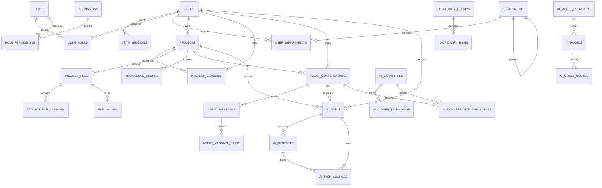
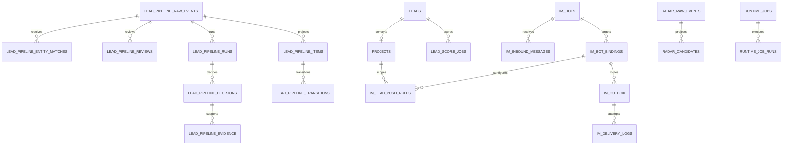

# MySQL Schema 与 ER 说明

## 1. 权威来源与物理约定

- 逻辑 Schema 权威源：`server/src/db/schema.ts`，当前定义 81 张业务表。
- 物理迁移：`server/drizzle/0000～0039_*.sql`；`__drizzle_migrations` 是第 82 张内部迁移台账表。
- 表名前缀：统一由 `DB_FREFIX` 注入；当前环境物理表使用 `sbl_`，代码和本文均使用无前缀逻辑名。
- 引擎/字符集：InnoDB、`utf8mb4`；目标实例门禁要求 `utf8mb4_0900_ai_ci`、严格 SQL 模式、UTC 会话时区和 `READ-COMMITTED`。
- 标识：业务 UUID 使用 `varchar(36)`；迁移源整数 ID 仅在确需保留时维持整数并通过实体映射台账关联。
- 时间：MySQL `datetime(3)`/`timestamp(3)` 保存 UTC 语义，API 输出 UTC ISO，页面固定按 `Asia/Shanghai` 展示。
- JSON：全部 JSON 列由动态迁移安全门禁验证合法性；坏源 JSON 进入迁移问题台账，不复制原始正文。
- 领域命名：迁移计划中的 `iam_*`/`investment_*`/`runtime_*` 等是概念域和建议前缀，现有物理表名按《MySQL领域命名与约束裁决-20260811》保持兼容；不得复制一套只满足前缀形式的双权威表。

## 2. 领域表目录

| 领域 | 逻辑表 |
|---|---|
| 身份与会话 | `users`、`auth_sessions`、`auth_legacy_bearer_policy`、`iam_user_mappings`、`identity_resolution_issues` |
| 系统组织与权限 | `departments`、`roles`、`permissions`、`role_permissions`、`user_roles`、`user_departments` |
| 数据字典 | `dictionary_groups`、`dictionary_items` |
| 项目与成员 | `projects`、`project_members`、`project_files`、`project_file_versions`、`file_chunks`、`knowledge_chunks`、`ai_summaries` |
| 会议、待办、风险、OA | `meetings`、`meeting_participants`、`todos`、`risks`、`oa_approval_requests`、`oa_approval_nodes`、`oa_approval_records`、`oa_workflow_logs` |
| JW/聊天 | `chat_conversations`、`agent_conversations`、`agent_messages`、`agent_message_parts`、`agent_conversation_source_mappings`、`agent_message_source_mappings` |
| AI 任务与模板 | `ai_tasks`、`ai_artifacts`、`ai_task_sources`、`ai_task_templates`、`ai_custom_templates`、`ai_template_analysis_progress` |
| 模型与能力 | `ai_model_providers`、`ai_models`、`ai_model_routes`、`ai_capabilities`、`ai_capability_bindings`、`ai_conversation_capabilities` |
| 线索与 Radar | `leads`、`lead_reserve`、`lead_score_jobs`、`project_score_jobs`、`radar_raw_events`、`radar_candidates`、`radar_source_registry`、`radar_collector_states`、`radar_sync_state`、`radar_ai_reviews` |
| 线索 Agent/Pipeline | `lead_pipeline_raw_events`、`lead_pipeline_items`、`lead_pipeline_transitions`、`lead_pipeline_prompt_versions`、`lead_pipeline_runs`、`lead_pipeline_decisions`、`lead_pipeline_evidence`、`lead_pipeline_reviews`、`lead_pipeline_entity_matches`、`lead_agent_runtime_permits` |
| IM | `im_bots`、`im_bot_bindings`、`im_outbox`、`im_delivery_logs`、`im_inbound_messages`、`im_lead_push_rules` |
| 调度与审计 | `runtime_jobs`、`runtime_job_runs`、`audit_logs`、`admin_configuration_revisions` |
| 迁移控制面 | `migration_runs`、`migration_issues`、`migration_entity_mappings`、`migration_cdc_events`、`migration_cdc_checkpoints` |

上述目录共 81 张业务表；任何新增或删除必须同时更新 Schema、编号迁移、MySQL 冒烟、迁移幂等快照和本文目录。

## 3. 核心 ER





## 4. 关键约束与删除规则

1. 项目权限以 `project_members` 的稳定用户 ID 为准；`projects.owner` 等姓名字段只用于展示，不能作为鉴权依据。
2. 会话、消息、Part 使用级联删除；消息 sequence 和 Part index 由唯一/连续性验收保护，迁移来源通过专用 mapping 表追踪。
3. 项目文件删除必须同时处理所有不可变版本与知识投影；存储字节由文件生命周期服务在数据库提交后安全清理，不能依赖外键删除磁盘。
4. AI 任务的用户、项目、会话、模板和附件在入库前复核；产物/来源必须与同一任务一致。任务删除级联元数据，但受保护文件字节按文件策略处理。
5. 模型 Provider 删除受模型引用限制；模型路由主备模型都必须存在。Provider/Bot 凭据只保存 AES-256-GCM 密文及掩码元数据。
6. 能力授权覆盖全局、部门、项目；会话选择只能收窄授权。能力、模型和 IM 配置使用乐观版本阻止静默覆盖。
7. Pipeline 原始事件和决策/证据/复核/实体匹配是审计链；删除正式 Lead 不得抹去原始候选、证据或裁决快照。
8. IM Bot/Binding 有历史 Outbox、投递或推送规则时禁止破坏性删除；停用与凭据替换保留审计和投递历史。
9. `runtime_jobs`/各任务表以租约所有者和到期时间防止多实例重复执行；死信、重试和运行历史不得仅存在内存。
10. 迁移控制面是追加/审计数据；源实体映射绑定源系统、源表、源 ID、目标表/ID、源行 checksum 和成功 Run。

## 5. 变更与验收流程

```text
修改 server/src/db/schema.ts
  → 新增下一个只前进的 server/drizzle/NNNN_*.sql
  → db:backup（首次空前缀安装可跳过）
  → 使用独立 Migration 账号执行 db:migrate:separated
  → db:seed
  → check:mysql
  → accept:mysql-schema-lifecycle
  → accept:migration-idempotency
  → accept:migration-business-invariants
  → check:migration-integrity
```

生产 Runtime 不执行 DDL。不得重写已在任一环境应用的历史迁移；修正必须新增迁移。删除列/表、收紧唯一约束或改变级联规则前，必须先运行源/目标重复、孤儿和状态机审计，并保留回滚/前向修复方案。Schema 回退按 `ADR-015` 从迁移前备份恢复到隔离表前缀，不在活动前缀执行未验证的逆向 DDL；详见《MySQL-Schema变更种子与回退手册-20260811》。

当前代码目标为 81 张业务表 + 1 张迁移台账、133 个外键、40 条迁移日志；`0038_add_business_optimistic_versions` 为项目、会议、待办和风险增加数据库版本列，用户编辑使用原子版本比较并递增；`0039_add_lead_field_provenance` 为线索字段建立来源/优先级台账，确保人工字段优先、机器补全只按证据增量追加。17 个项目原件已获精确批准永久缺失并保留元数据/补传入口，不再计入未处置缺口；完整迁移仍受生产源盘点、在线 PostgreSQL、97 条缺失线索详情和 7 个 AI 产物源文件阻断，ER 说明不代表这些外部数据缺口已关闭。

领域命名、运行配置、调度/审计表、部分唯一索引等价和事务约束另由只读门禁 `npm run accept:mysql-architecture-contract` 验证；该门禁不创建夹具，也不关闭线索重复裁决或生产数据缺口。
