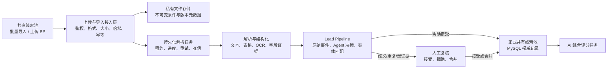

# 共有线索池功能复刻迁移计划

> 文档状态：已实施，待发布环境人工验收  
> 编制日期：2026-08-17  
> 目标项目：`/Users/hyw/Desktop/sbl_jedi`  
> 参照项目：`/Users/hyw/Desktop/sbl_code`  
> 配套验收：[《共有线索池功能复刻验收清单》](./共有线索池功能复刻验收清单-20260817.md)

## 0. 实施记录（2026-08-17）

- 已新增 MySQL `0040_add_lead_intake`，落地原始文件任务、导入批次和逐行结果三张表。
- 已新增批量导入模板、上传预检、逐行错误、确认入池和结果汇总接口及页面向导。
- 已新增 BP 私有文件存储、后台租约队列、正文/OCR 提取、主体结构化、自动重试、死信和真实进度展示。
- 两条链路均写入不可变 `lead_pipeline_*` 事件、决策和证据，并复用实体匹配、重复主体人工复核和 AI 评分队列。
- 已执行真实 MySQL 预检样本：2 行中 1 行有效、1 行错误，结果符合预期；测试批次和测试文件已清理。
- 自动化证据：`npm run accept:lead-intake -- --live`、前后端 TypeScript、生产构建和 186 项服务器测试（共享队列用例单独及整体复跑结果见验收记录）。

## 1. 目标与基线裁决

本次迁移目标是在 `sbl_jedi` 的共有线索池中补齐 `sbl_code` 的“批量导入”“上传 BP”及相关页面交互，并对共有线索池全部可见功能做回归，保证页面布局、按钮、弹窗、状态反馈和详情操作与参照版本一致。

迁移必须遵守以下裁决：

1. `sbl_code` 只作为视觉、文案、入口位置和交互流程参考，不把其中的模拟实现当作生产事实源。
2. “批量导入”必须真实下载模板、解析文件、校验、预览并提交，不能只显示“模板已准备”。
3. “上传 BP”必须真实保存文件并执行可恢复的后台解析，不能使用前端 `setTimeout` 模拟进度，不能固定生成 76 分线索。
4. BP 和批量导入结果必须进入 `sbl_jedi` 现有 `lead_pipeline_*`、实体匹配、人工复核、证据和审计链路；不得绕过 Pipeline 直接伪造正式线索。
5. 保留 `sbl_jedi` 已有的人工复核、死信重试、北京时间格式、字段来源保护、MySQL 权威状态和单服务运行边界。
6. 按前序需求继续移除“渠道与推送配置”，不在本次复刻范围内恢复。
7. “刷新核验”不能照搬参照版本中无服务端路由的 `PATCH /leads/:id`；若保留该入口，应定义为真实的公开信息再核验操作。

## 2. 当前差异基线

| 能力 | `sbl_code` | `sbl_jedi` | 本次处置 |
|---|---|---|---|
| 从雷达同步 | 已实现 | 已实现 | 保留并回归 |
| 批量导入 | 只有提示，无真实导入 | 无入口 | 新建真实导入闭环 |
| 上传 BP | 前端模拟解析并创建占位线索 | 无入口 | 新建真实上传、解析和入池闭环 |
| 文件选择组件 | 已有 | 已有 | 复用 `FileUpload`，补充校验和状态 |
| 线索创建 Store/API | 已有 | 已有 | 仅供 Pipeline 最终提交复用，页面不得直接制造结果 |
| 刷新核验 | 有入口但后端路由缺失 | 已退场 | 改造成真实再核验或保持不开放，评审时定案 |
| 人工复核 | 无 | 已实现 | 保留 |
| 评分失败/死信 | 基础失败提示 | 已完善 | 保留当前实现 |
| 搜索、筛选、排序、分页、详情 | 已实现 | 已实现 | 做 1:1 回归，不重写 |

## 3. 范围

### 3.1 纳入范围

- 共有线索池页头按钮、按钮顺序、弹窗、进度、结果反馈和列表刷新。
- Excel/CSV 批量导入模板、上传、校验、预览、提交、错误明细和结果汇总。
- PDF、DOCX、PPTX、XLS/XLSX/XLSM、PNG/JPG/JPEG/GIF/BMP/WEBP、TXT/MD 的 BP 上传；旧二进制 DOC/PPT 不开放，避免依赖不稳定的本机转换器解析不可信文件。
- 原文件保存、SHA-256、MIME/签名校验、解析状态、错误、重试和权限。
- BP 文本、表格和图片 OCR 提取，以及项目主体、团队、产品、行业、融资、客户、风险和证据结构化。
- 导入与 BP 结果进入线索 Pipeline、去重、实体匹配、人工复核和正式入池。
- 上传与导入批次审计、运行指标、错误追踪和发布门禁。
- 共有线索池现有功能的完整回归。

### 3.2 不纳入范围

- 恢复“渠道与推送配置”。
- 改版共有线索池视觉系统或重新设计详情页。
- 修改现有线索评分标准。
- 把项目详情的项目资料上传直接改造成线索 BP 上传；两者可复用底层存储，但业务归属必须隔离。
- 导入联系人手机号、身份证号等不应进入公共池的敏感个人信息。
- 把 `sbl_code` 的模拟进度、固定评分、固定字段或伪成功提示迁入生产。

## 4. 目标流程

## 5. 数据与接口方案

### 5.1 数据复用原则

- 继续使用 `lead_pipeline_raw_events` 保存不可变原始事件。
- 继续使用 `lead_pipeline_items/transitions/runs/decisions/evidence/reviews/entity_matches` 保存处理过程、证据和人工结论。
- 继续使用 `leads` 作为正式共有线索池唯一事实源。
- 继续使用当前私有文件存储的路径安全、哈希、版本和下载授权能力。
- `project_files.project_id` 为必填，不能用虚假项目承载未入池 BP。应新增线索接入域文件元数据，或将现有文件元数据抽象为支持明确 `scope=lead_intake` 的通用模型。
- 周期性 `runtime_jobs` 不直接冒充单次上传任务；单次解析应有独立、可租约恢复的任务记录和运行历史。

### 5.2 建议新增实体

最终命名可在 Schema 评审时调整，但必须覆盖以下概念：

| 实体 | 关键字段 | 目的 |
|---|---|---|
| 导入批次 | ID、模板版本、文件哈希、上传人、状态、总行数、成功/失败/复核数、幂等键 | 记录一次批量导入 |
| 导入行 | 批次 ID、行号、原始值、规范化值、校验错误、Pipeline 事件 ID、线索 ID、状态 | 支持逐行追踪和错误下载 |
| 接入文件 | ID、业务范围、原文件名、类型、字节数、SHA-256、存储键、上传人、可见范围 | 保存未归属项目的 BP 原件 |
| BP 解析任务 | 文件 ID、状态、阶段、进度、尝试次数、租约、错误、开始/结束时间 | 支持后台解析与恢复 |
| BP 解析产物 | 文件 ID、解析器版本、文本/结构化结果引用、页码定位、内容哈希 | 保留可复核解析结果 |

所有新表必须使用稳定 ID、外键、唯一幂等约束、必要索引和毫秒级北京时间无关的 UTC 存储；用户展示统一按 Asia/Shanghai 格式化。

### 5.3 建议 API 契约

| 方法与路径 | 用途 | 关键响应 |
|---|---|---|
| `GET /leads/import-template` | 下载当前版本模板 | 文件流、模板版本 |
| `POST /leads/imports/preview` | 上传并校验 Excel/CSV | 批次 ID、预览、逐行错误、重复候选 |
| `POST /leads/imports/:id/commit` | 确认提交合法行 | 成功/失败/复核/重复汇总 |
| `GET /leads/imports/:id` | 查询批次状态 | 进度、汇总、错误文件入口 |
| `GET /leads/imports/:id/errors` | 下载错误明细 | 文件流 |
| `POST /leads/bp-uploads` | 上传 BP 原件并创建解析任务 | 文件 ID、任务 ID、状态 |
| `GET /leads/bp-uploads/:id` | 查询上传与解析状态 | 阶段、进度、错误、Pipeline 状态 |
| `POST /leads/bp-uploads/:id/retry` | 人工重试失败/死信任务 | 新尝试次数、任务状态 |
| `GET /leads/bp-uploads/:id/file` | 授权下载原件 | 文件流 |

接口必须使用统一错误合同，返回 `code/message/requestId`；上传和提交使用幂等键，重放不得重复创建文件、事件、复核任务或正式线索。

## 6. 分阶段执行计划

### 阶段 M0：需求冻结与金样基线

| ID | 任务 | 交付物 | 退出条件 |
|---|---|---|---|
| LPM-001 | 固定参照页面截图、按钮顺序、弹窗文案和支持格式 | UI 金样与差异表 | 产品签字 |
| LPM-002 | 确认批量导入模板字段、必填项、枚举、重复策略 | 模板字段字典 v1 | 产品、数据签字 |
| LPM-003 | 确认 BP 最大尺寸、支持格式、超时、重试与保留期 | 文件接入契约 | 安全、运维签字 |
| LPM-004 | 裁决“刷新核验”是否恢复及业务语义 | 决策记录 | 不再存在模糊入口 |
| LPM-005 | 准备成功、错误、重复、多主体、扫描件和超大文件测试样本 | 脱敏金样包 | QA 可重复使用 |

### 阶段 M1：Schema、存储与任务底座

| ID | 任务 | 依赖 | 退出条件 |
|---|---|---|---|
| LPM-010 | 完成导入批次、导入行、接入文件、解析任务/产物 Schema 设计 | M0 | ER 与迁移 SQL 评审通过 |
| LPM-011 | 增加前向迁移、索引、外键和回滚脚本 | LPM-010 | 空库/存量库升级与回滚通过 |
| LPM-012 | 复用并扩展私有文件存储，禁止目录穿越和覆盖 | LPM-010 | 原字节、SHA、权限回读通过 |
| LPM-013 | 建立解析任务租约、心跳、有限重试、死信和重启恢复 | LPM-010 | 多实例单领取与恢复通过 |
| LPM-014 | 增加审计事件和运行指标 | LPM-010 | 上传、提交、重试、失败均可追踪 |

### 阶段 M2：批量导入闭环

| ID | 任务 | 依赖 | 退出条件 |
|---|---|---|---|
| LPM-020 | 生成版本化 Excel 模板并提供下载 | M0 | 文件可打开、字段与字典一致 |
| LPM-021 | 实现 Excel/CSV 解析、编码与公式安全处理 | M1 | 合法/损坏/恶意样本通过 |
| LPM-022 | 实现逐行规范化和字段校验 | LPM-021 | 错误精确定位到行和列 |
| LPM-023 | 实现预览、合法行勾选与错误明细下载 | LPM-022 | 用户提交前可审查 |
| LPM-024 | 实现重复识别、幂等提交和 Pipeline 原始事件写入 | LPM-022 | 重放无重复记录 |
| LPM-025 | 实现提交汇总、列表/统计/复核数量刷新 | LPM-024 | 页面状态与 MySQL 一致 |

### 阶段 M3：BP 上传与解析闭环

| ID | 任务 | 依赖 | 退出条件 |
|---|---|---|---|
| LPM-030 | 实现多格式文件上传、签名/MIME/大小校验与持久化 | M1 | 原件安全保存并可授权回读 |
| LPM-031 | 实现 PDF/PPT/Word/Excel 文本和表格提取 | LPM-030 | 金样文本与表格达到阈值 |
| LPM-032 | 实现图片及扫描件 OCR，保留页码和定位 | LPM-030 | OCR 金样达到阈值 |
| LPM-033 | 实现 BP 结构化 Agent，输出字段、引文和置信度 | LPM-031/032 | Schema 校验及证据定位通过 |
| LPM-034 | 接入实体匹配、重复处理和人工复核 | LPM-033 | 多主体/模糊主体不直接入池 |
| LPM-035 | 正式提交线索并触发评分，绑定 BP 原文件 | LPM-034 | 只在接受后写 `leads` |
| LPM-036 | 实现超时、失败、重试、死信和重启恢复 | LPM-030 | 无前端伪成功、无任务丢失 |

### 阶段 M4：React 1:1 页面复刻

| ID | 任务 | 依赖 | 退出条件 |
|---|---|---|---|
| LPM-040 | 增加“批量导入”“上传 BP”按钮及图标 | M2/M3 API | 顺序、尺寸、颜色与金样一致 |
| LPM-041 | 实现批量导入向导、预览、错误和结果页面 | M2 | 完整闭环可用 |
| LPM-042 | 实现“上传并解析 BP”弹窗和真实状态轮询 | M3 | 刷新后可恢复同一任务 |
| LPM-043 | 完成列表、统计、详情和人工复核联动 | M2/M3 | 状态无过期、无重复请求提交 |
| LPM-044 | 按裁决实现或不开放“刷新核验” | M0 | 不存在无服务端支撑入口 |
| LPM-045 | 保留当前人工复核、死信、日期和来源保护增强 | 全部 | 无功能回退 |

### 阶段 M5：门禁、压测与发布

| ID | 任务 | 依赖 | 退出条件 |
|---|---|---|---|
| LPM-050 | 将“隐藏未实现入口”门禁改为“入口必须绑定真实接口” | M2/M3/M4 | `accept:client-state-authority` 新合同通过 |
| LPM-051 | 增加 API、Repository、Pipeline、文件与 UI 自动化测试 | 全部 | P0 自动化全通过 |
| LPM-052 | 做并发导入、大文件、超时、重启和磁盘容量压测 | M1-M3 | 达到批准阈值 |
| LPM-053 | 通过功能开关在测试环境、小范围用户、全量三阶段发布 | M5 | 每阶段观察窗无 P0 告警 |
| LPM-054 | 完成生产冒烟、证据归档与业务签字 | M5 | 验收清单 P0 全通过 |

## 7. 发布与回滚

### 7.1 发布顺序

1. 先发布向后兼容的 Schema 与服务端代码，页面入口保持关闭。
2. 在测试环境完成存储、任务、Pipeline 和安全验收。
3. 开放内部管理员/运营用户的批量导入和 BP 上传功能开关。
4. 观察错误率、积压、死信、解析时长和磁盘容量。
5. 扩大到业务用户，完成生产冒烟后全量开放。

### 7.2 回滚策略

- 页面开关可立即关闭新入口，不影响共有线索池既有查询、雷达同步、人工复核和转项目。
- 已上传原件和已写入原始事件不得删除；回滚后保持只读和可追踪。
- 未提交的导入批次可标记取消；已提交行不得用物理删除回滚，应通过状态、审计和明确的业务处置纠正。
- 解析中的任务在停用后停止领取新租约；在途任务完成或安全释放租约。
- 数据库回滚只允许在尚未产生新业务数据时执行；产生数据后使用向前修复迁移。
- 回滚后验证旧页面搜索、筛选、详情、同步、人工复核和转项目仍可用。

## 8. 风险与缓解

| 风险 | 等级 | 缓解措施 |
|---|---:|---|
| 直接复制模拟代码造成伪成功和伪评分 | P0 | 静态门禁禁止定时器模拟、固定评分和空 Toast |
| BP 文件未与线索绑定或刷新后丢失 | P0 | 先持久化原件和任务，再返回成功；全链路稳定 ID |
| 批量提交生成重复线索 | P0 | 文件哈希、批次幂等、行幂等、实体匹配和唯一约束 |
| 多主体 BP 错误创建单一公司 | P0 | Agent 决策与人工复核，不允许低置信度直接入池 |
| 大文件/OCR 阻塞主服务 | P0 | 受监督任务执行单元、并发上限、超时和资源限制 |
| 恶意文件、公式注入或路径穿越 | P0 | MIME/签名校验、公式转义、私有存储、路径白名单 |
| 新入口破坏现有人工复核和评分流程 | P0 | 统一进入现有 Pipeline，做完整回归与功能开关发布 |
| 存储增长不可控 | P1 | 容量指标、告警、配额、保留策略和孤儿文件审计 |

## 9. 完成定义

只有同时满足以下条件，迁移才可标记完成：

- 参照版本所有有效可见功能已在目标页面出现，现有增强功能无回退。
- 批量导入和 BP 上传均使用真实文件、真实服务端状态和 MySQL 权威记录。
- 不存在固定评分、固定完整度、模拟进度、伪造解析结果或仅 Toast 的假功能。
- 原文件、解析结果、证据、决策、复核、正式线索和评分任务可沿稳定 ID 追踪。
- 重复提交、刷新、重启、超时、失败和人工重试通过验收。
- P0 验收项全部通过，P1 例外已书面批准，回滚演练完成。
