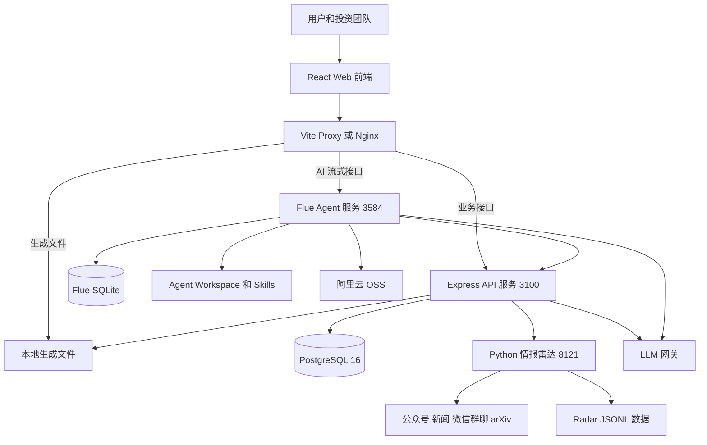
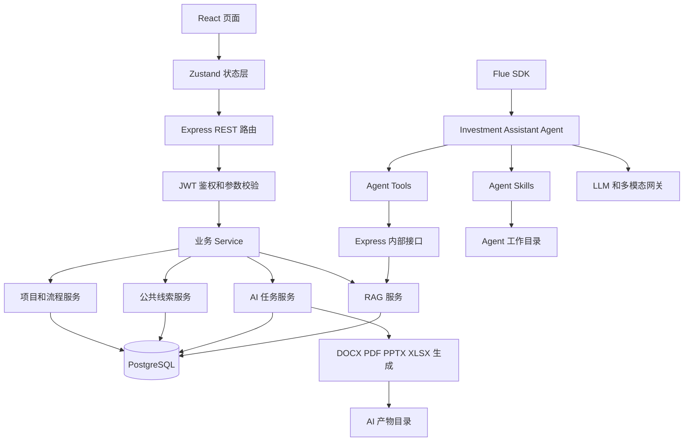
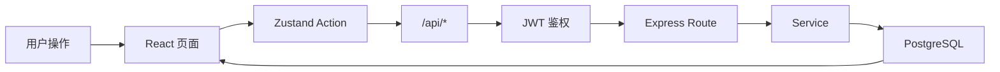
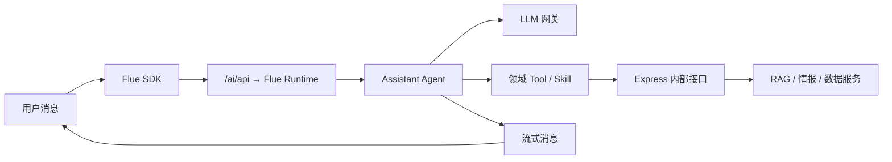
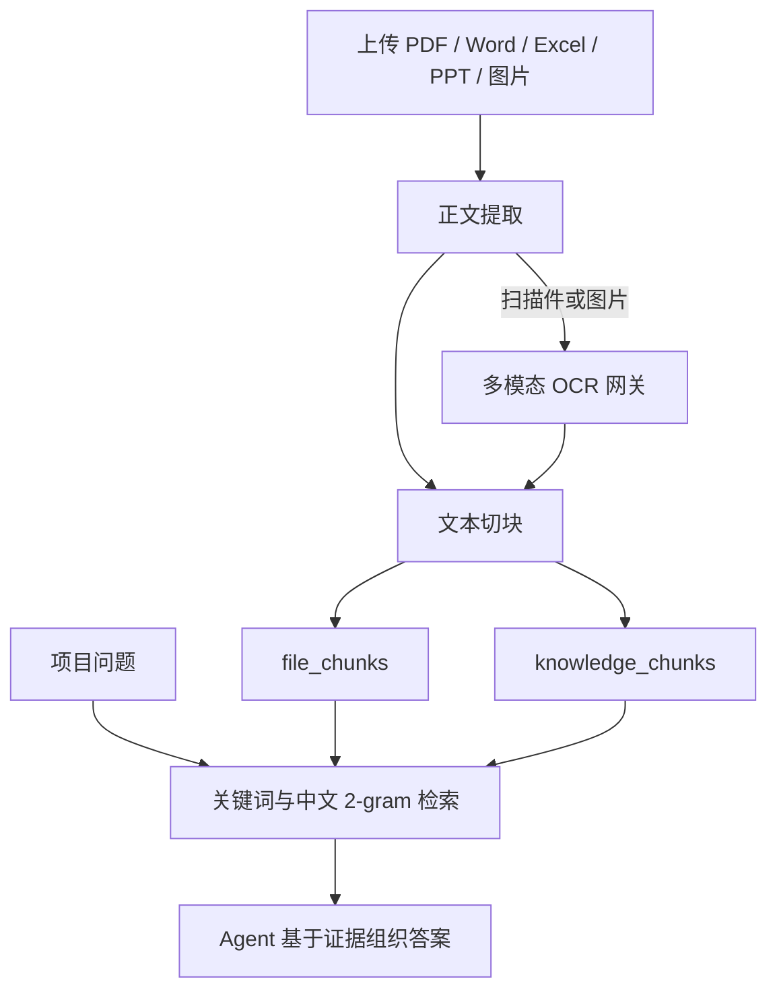
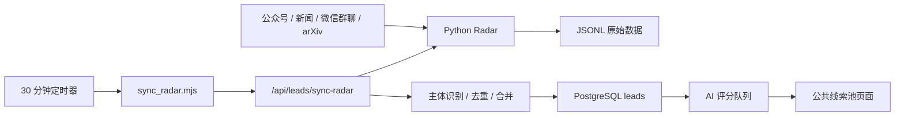

# 投资中台项目架构与技术交接文档

> 文档版本：V1.0  
> 整理日期：2026-08-05  
> 适用范围：当前 `main` 分支代码  
> 项目目录：`cybernaut-dist`

## 1. 项目概述

本项目是面向 VC、PE 和产业基金团队的 AI 辅助投资管理平台，覆盖投资项目从线索发现、项目入库、资料沉淀、AI 分析、尽调与投决材料生成，到会议、流程、风险和投后管理的业务链路。

当前系统包含三个主要运行模块：

1. 投资中台 Web 与 API：提供项目、线索、会议、风险、流程和 AI 任务等业务能力。
2. AI 智能助手：基于 Flue Runtime、LLM 网关和本地 Skills 提供流式对话、项目问答和文档生成能力。
3. 项目发现与情报雷达：基于 Python FastAPI 聚合公众号、创投新闻、微信群聊和 arXiv 等候选项目数据。

## 2. 技术栈

| 层级 | 主要技术 | 用途 |
|---|---|---|
| 前端 | React 18、TypeScript、Vite、React Router | 页面展示、路由与构建 |
| 前端状态 | Zustand | 用户状态、业务数据缓存和页面联动 |
| AI 前端 | `@flue/react`、`@flue/sdk` | Agent 消息发送、流式响应和工具步骤展示 |
| 主 API | Node.js、Express 5、TypeScript | REST API、鉴权、业务编排和文件生成 |
| Agent Runtime | Flue、Hono | AI Agent、工作流、工具调用和会话流 |
| 情报雷达 | Python、FastAPI | 多来源情报采集和候选项目查询 |
| 数据访问 | Drizzle ORM、node-postgres | PostgreSQL 数据访问 |
| 主数据库 | PostgreSQL 16 | 业务主数据、任务、知识分块和审计数据 |
| Agent 会话 | SQLite | Flue canonical 会话流持久化 |
| Radar 原始数据 | JSONL、JSON、Excel | 雷达候选数据、运行状态和来源配置 |
| 文档处理 | docx、ExcelJS、PptxGenJS、JSZip、Mammoth、PDF.js | Word、Excel、PPT、PDF 的解析与生成 |
| AI 接入 | OpenAI/Anthropic 兼容 LLM 网关、图片网关 | 对话、分析、OCR、PPT 页面生成 |
| 对象存储 | 阿里云 OSS | Agent 成品文件对外发布 |
| 生产部署 | Nginx、systemd、Docker Compose | 反向代理、服务守护和 PostgreSQL 部署 |

## 3. 总体系统架构

### 3.1 系统全景图



### 3.2 服务内部关系图



## 4. 服务与端口

| 服务 | 默认地址 | 说明 | 健康检查 |
|---|---|---|---|
| Web 开发服务 | `http://127.0.0.1:5173` | Vite 前端及开发代理 | 访问首页 |
| 投资中台 API | `http://127.0.0.1:3100` | Express 业务 API | `/api/health` |
| Flue Agent | `http://127.0.0.1:3584` | AI Agent、Workflow 和流式会话 | `/health` |
| 项目发现雷达 | `http://127.0.0.1:8121` | Python 情报聚合服务 | `/api/health` |
| PostgreSQL | `127.0.0.1:5432` | 业务主数据库 | `pg_isready` |
| LLM 网关 | 默认 `http://127.0.0.1:18081/v1` | 模型统一调用入口 | `/models` |
| Nginx | `:80` | 生产环境统一入口 | 访问站点域名 |

开发环境由 `vite.config.ts` 完成以下代理：

- `/api/*` → Express `3100`
- `/generated/*` → Express `3100`
- `/ai/api/*` → Flue Runtime `3584`

生产环境由 `deploy.sh` 生成 Nginx 配置并完成相同职责。

## 5. 核心业务模块

### 5.1 投资项目管理

负责项目创建、详情维护、阶段流转、资料上传、AI 摘要和项目风险关联。

主要代码：

- 前端：`src/pages/ProjectsPage.tsx`、`src/pages/ProjectDetailPage.tsx`
- API：`server/src/routes/projects.ts`
- Service：`server/src/services/projectService.ts`
- 数据表：`projects`、`project_files`、`file_chunks`、`knowledge_chunks`

### 5.2 AI 智能助手

包含普通对话、项目绑定、项目资料问答、快捷任务、文件上传、任务进度和产物下载。

前端 AI 对话直接通过 `/ai/api` 连接 Flue；快捷文档任务通过 `/api/ai/tasks` 进入 Express 的任务体系。

主要代码：

- 页面：`src/pages/AIAssistantPage.tsx`
- 快捷任务：`src/components/AiQuickActions.tsx`
- 任务与产物：`src/components/AiTaskCards.tsx`
- Q&A 展示：`src/components/AiQaCards.tsx`
- Agent：`cybernaut-assistant/src/agents/assistant.ts`
- Agent 工具：`cybernaut-assistant/src/tools/`
- AI 任务路由：`server/src/routes/aiTasks.ts`
- AI 任务服务：`server/src/services/aiTaskService.ts`
- Skills：`server/workspace/.agents/skills/`

### 5.3 公共线索池

负责候选项目列表、标签与筛选、详情补全、AI 评分、去重合并和转为正式项目。

数据主要来自项目发现雷达，由定时同步任务拉取并写入 PostgreSQL。

主要代码：

- 页面：`src/pages/SourcingPage.tsx`
- API：`server/src/routes/meta.ts`
- Radar 同步：`server/src/services/radarSyncService.ts`
- AI 评分：`server/src/services/radarAiReviewService.ts`
- Radar 服务：`project-discovery/app.py`
- 定时同步入口：`sync_radar.mjs`
- 数据表：`leads`、`radar_sync_state`、`radar_ai_reviews`

### 5.4 AI 文档生成

当前快捷任务覆盖：

- 合规性说明
- 投资提案
- 投资建议书（PPT）
- 尽调报告
- 项目 Q&A
- 自定义模板文档

Express 负责项目知识准备、任务状态、质量检查和产物登记；LLM 或 Agent Skills 负责内容生成；本地脚本负责 DOCX、PDF、PPTX 等格式输出。

主要代码集中在：

- `server/src/services/ai*Service.ts`
- `server/src/services/aiTaskService.ts`
- `server/src/services/aiTemplateCatalog.ts`
- `server/workspace/.agents/skills/`

### 5.5 会议、流程、风险和投后

包含会议纪要、待办任务、OA 阶段流转、风险事件、投后更新等投资管理功能。

主要代码：

- 页面：`src/pages/MeetingsPage.tsx`、`WorkflowPage.tsx`、`RisksPage.tsx`、`PostInvestmentPage.tsx`
- API：`server/src/routes/meetings.ts`、`server/src/routes/risks.ts`
- 数据表：`meetings`、`todos`、`risks`

部分流程审批和投后功能仍保留较多前端演示状态，接手后应逐项确认是否已经完全落库。

## 6. 核心请求链路

### 6.1 普通业务请求



### 6.2 AI 实时会话



### 6.3 项目资料入库与问答



说明：当前 RAG 是 PostgreSQL 文本切块加关键词评分检索，未发现向量数据库或 Embedding 检索实现。

### 6.4 公共线索更新



## 7. 数据存储划分

### 7.1 PostgreSQL：业务主数据

主要表包括：

- `users`：用户、角色和账号状态
- `projects`：正式项目
- `project_files`：项目资料元数据和解析状态
- `meetings`、`todos`、`risks`：会议、待办和风险
- `leads`：公共线索池
- `radar_sync_state`、`radar_ai_reviews`：雷达同步与评分状态
- `chat_conversations`：会话索引、标题和项目绑定信息
- `ai_tasks`、`ai_artifacts`、`ai_task_sources`：AI 任务、产物和证据来源
- `ai_custom_templates`：自定义模板
- `file_chunks`、`knowledge_chunks`：项目资料与统一知识库切块
- `audit_logs`：审计日志

数据库模型位于 `server/src/db/schema.ts`，启动时由 `server/src/db/migrate.ts` 执行幂等建表和兼容性迁移。

### 7.2 SQLite：Flue 会话流

Flue 的消息流和 Agent 对话历史保存在 `FLUE_DB_PATH` 指向的 SQLite 文件中。它与 PostgreSQL 的 `chat_conversations` 职责不同：

- PostgreSQL 保存会话列表、标题、归属用户和绑定项目。
- SQLite 保存 Flue canonical 消息流和工具调用过程。

### 7.3 本地文件

- `server/generated/`：普通材料生成产物，对外路径为 `/generated/*`。
- `server/ai-artifacts/`：AI 快捷任务的产物和中间结果。
- Agent Workspace：上传文件、任务工作目录、Skills 和生成结果。
- `project-discovery/data/`：Radar 的 JSONL、JSON 和状态数据。

### 7.4 OSS

Agent 在沙箱中生成、需要提供给前端或外部用户下载的成品，可通过 `publish_file` 工具上传到阿里云 OSS。

## 8. 核心目录结构

```text
cybernaut-dist/
├── src/                          React 前端
│   ├── pages/                    各业务页面
│   ├── components/               通用组件、AI 卡片和快捷任务
│   ├── store/                    Zustand 状态与业务动作
│   ├── lib/                      API、消息安全和工具函数
│   ├── layout/                   主导航和页面布局
│   ├── types/                    TypeScript 领域类型
│   └── mock/                     演示初始数据及部分前端兜底数据
├── server/
│   ├── src/
│   │   ├── routes/               Express REST 路由
│   │   ├── services/             业务、AI、RAG、文档和同步服务
│   │   ├── controllers/          HTTP 控制器
│   │   ├── middleware/           JWT 和统一异常处理
│   │   ├── db/                   Drizzle、Schema 和启动迁移
│   │   ├── schemas/              请求参数校验
│   │   └── scripts/              AI 验收、修复和运维脚本
│   ├── tests/                    服务端测试
│   ├── workspace/.agents/skills Agent 和 AI 任务 Skills
│   ├── ai-artifacts/             AI 任务产物
│   └── generated/                普通生成文件
├── cybernaut-assistant/
│   ├── src/agents/               Flue Agent 定义
│   ├── src/workflows/            Agent 工作流
│   ├── src/tools/                RAG、情报和文件发布工具
│   ├── src/skills/               Agent 内置领域 Skill
│   └── src/app.ts                Flue/Hono 路由和兼容层
├── project-discovery/
│   ├── app.py                    FastAPI 情报雷达
│   ├── data/                     Radar 本地数据
│   ├── scripts/                  数据恢复等脚本
│   └── GordenSuperPPTSkills/     PPT 生成和可编辑化脚本
├── docs/                         需求、计划、模板和交付参考资料
├── docker-compose.yml            PostgreSQL 16 容器
├── deploy.sh                     生产部署与更新脚本
├── sync_radar.mjs                Radar 定时同步入口
├── vite.config.ts                前端开发代理
└── package.json                  项目启动、构建和验收命令
```

## 9. 本地启动方式

### 9.1 环境要求

- Node.js 20+
- npm 10+
- PostgreSQL 16
- Python 3 和项目虚拟环境
- PDF/PPT 任务所需的系统工具与字体

### 9.2 启动数据库

```bash
docker compose up -d postgres
```

### 9.3 安装依赖

```bash
npm ci
npm ci --prefix cybernaut-assistant
python3 -m venv project-discovery/.venv
project-discovery/.venv/bin/python -m pip install -r project-discovery/requirements.txt
```

### 9.4 启动全部开发服务

```bash
npm run dev
```

该命令并行启动：

- `npm run dev:web`
- `npm run dev:server`
- `npm run dev:agent`
- `npm run dev:radar`

### 9.5 基础验证

```bash
curl http://127.0.0.1:3100/api/health
curl http://127.0.0.1:3584/health
curl 'http://127.0.0.1:8121/api/health?deep=false'
npm run check
npm run check:agent-runtime
```

## 10. 生产部署方式

生产部署由 `deploy.sh` 管理，主要执行：

1. 检查 Node、Nginx、Docker 等运行依赖。
2. 启动 PostgreSQL。
3. 安装依赖并完成前端、API 和 Agent 构建。
4. 同步 Agent Skills 到运行工作区。
5. 写入 Nginx 反向代理配置。
6. 注册并启动 systemd 服务。
7. 注册 Radar 每 30 分钟执行一次的同步 Timer。
8. 执行健康检查。

生产服务包括：

- 投资中台 API systemd 服务
- Flue Runtime systemd 服务
- Radar FastAPI systemd 服务
- Radar Sync oneshot 服务和 timer
- PostgreSQL Docker 容器
- Nginx 统一入口

## 11. 关键配置项

交接时应单独安全传递 `.env`，禁止提交密钥。至少需要核对以下配置：

| 配置类别 | 变量 |
|---|---|
| 数据库 | `DATABASE_URL` |
| API | `API_PORT`、`JWT_SECRET`、`JWT_EXPIRES_IN` |
| 内部服务 | `INTERNAL_SECRET`、`EXPRESS_BASE_URL` |
| Flue | `FLUE_BASE_URL`、`FLUE_AGENT_NAME`、`FLUE_MODEL`、`FLUE_DB_PATH` |
| Agent 工作区 | `AGENT_WORKSPACE`、`AI_SKILL_ROOT` |
| LLM 网关 | `LLM_BASE_URL`、`LLM_API_KEY`、`LLM_MODEL` |
| OpenAI 兼容别名 | `OPENAI_BASE_URL`、`OPENAI_API_KEY` |
| 图片网关 | `GATEWAY_IMAGE_BASE_URL`、`GATEWAY_IMAGE_API_KEY` |
| OCR/PPT | `OCR_VISION_MODEL`、`AI_GORDEN_VISION_MODEL` 及相关超时配置 |
| Radar | `RADAR_BASE_URL`、`RADAR_DATA_DIR` |
| 公众号采集 | `GSDATA_APP_KEY`、`GSDATA_APP_SECRET` |
| OSS | `OSS_ENDPOINT`、`OSS_BUCKET`、`OSS_ACCESS_KEY_ID`、`OSS_ACCESS_KEY_SECRET`、`OSS_PUBLIC_BASE_URL` |

配置注意事项：

- `.env` 是服务共同配置源，但不同服务读取的变量存在别名和优先级。
- Flue 对话模型主要由 `FLUE_MODEL` 控制；Express 文档任务主要由 `LLM_MODEL` 或任务专用模型配置控制。
- `LLM_BASE_URL` 通常需要包含 OpenAI 兼容接口的 `/v1` 路径。
- `INTERNAL_SECRET` 必须在 Express、Flue 和同步任务之间保持一致。
- 不应在日志、文档、Git 或聊天记录中传递真实密钥。

## 12. 鉴权与权限边界

- 用户登录后获得 JWT，前端在普通 `/api/*` 请求中自动携带 `Authorization: Bearer ...`。
- Express 在 `server/src/middleware/requireAuth.ts` 中执行用户鉴权。
- Flue Tools 回调 Express 时不使用用户 JWT，而使用 `x-internal-secret`。
- `/api/health`、登录和 LLM 健康检查等少量接口不要求用户登录。
- 会话、AI 任务和产物接口应根据当前用户进行归属校验。

## 13. 日志和运行状态

生产日志由 systemd 服务追加到部署脚本配置的日志目录，重点关注：

- `server.log`：Express、数据库迁移、AI 任务和线索评分
- `flue.log`：Agent、Workflow、模型调用和工具执行
- `radar.log`：情报采集、公众号同步和外部来源异常
- Nginx access/error log：入口请求、反向代理和超时

关键运行状态还分布在：

- PostgreSQL 的 `ai_tasks`、`radar_sync_state`、`radar_ai_reviews`
- Flue SQLite 会话数据库
- Radar 数据目录中的状态 JSON
- Agent Workspace 的任务状态与输出目录

## 14. 当前架构注意事项

1. **README 与实现存在差异**：README 仍把后端称为 Mock API，但当前核心业务已使用 PostgreSQL 和 Drizzle；前端仍保留部分 mock 初始数据和演示状态。
2. **RAG 尚未向量化**：当前通过文本切块、关键词和中文 2-gram 评分检索，不是向量数据库方案。
3. **AI 存在两条调用路径**：实时聊天走 Flue Agent；快捷文档任务主要走 Express AI Task。修改模型、超时或网关配置时需要同时核对两条链路。
4. **会话数据分两处保存**：会话索引在 PostgreSQL，Flue 消息流在 SQLite；迁移或备份时二者都必须处理。
5. **文件存储存在本地与 OSS 两套路径**：普通材料和 AI Task 产物可能落本地，Agent 产物可能发布到 OSS；上线和迁移时要确认文件是否持久化。
6. **Radar 不是直接写主库**：Radar 先保存 JSONL，再由定时同步任务调用 Express 写入 `leads`，因此页面数据存在同步延迟。
7. **Skills 是运行依赖**：`server/workspace/.agents/skills/` 需要在部署时同步到实际 `AGENT_WORKSPACE/.agents/skills/`，只更新仓库但未同步工作区不会立即生效。
8. **启动包含恢复逻辑**：Express 启动时会恢复 AI Task 和线索评分队列；服务未完成恢复前 `/api/health` 返回 503。
9. **单机状态较多**：Flue SQLite、Agent Workspace、Radar JSONL 和本地产物均依赖服务器磁盘，目前架构更适合单机部署；多实例前需要改造共享状态、任务锁和对象存储。

## 15. 交接检查清单

### 15.1 代码与分支

- 确认生产分支和当前部署 commit。
- 确认本地是否存在未提交文件、未跟踪产物或临时脚本。
- 确认 `server/workspace/.agents/skills/` 与生产 Agent Workspace 内容一致。

### 15.2 配置与密钥

- 安全交接生产 `.env`，不要通过 Git 传递。
- 验证数据库、LLM 网关、图片网关、Radar、GSData 和 OSS 凭据。
- 验证 `INTERNAL_SECRET` 在相关服务中一致。

### 15.3 数据与备份

- 备份 PostgreSQL 数据库。
- 备份 Flue SQLite 文件。
- 备份 Agent Workspace、AI 产物和 `server/generated/`。
- 备份 Radar 数据目录和公众号来源 Excel。

### 15.4 服务验证

- 验证 Web、API、Flue、Radar 和 PostgreSQL 健康状态。
- 登录并验证项目列表、公共线索池和项目详情。
- 新建 AI 会话并验证流式回复。
- 验证项目资料上传、解析和 RAG 问答。
- 分别执行合规性说明、投资提案、投资建议书、尽调报告和 Q&A 的最小验收任务。
- 验证产物预览、下载和 OSS 链接。
- 验证 Radar 同步 timer 及最近一次同步结果。

## 16. 关键文件索引

| 内容 | 路径 |
|---|---|
| 项目说明与启动 | `README.md` |
| npm 脚本 | `package.json` |
| 前端入口与路由 | `src/App.tsx` |
| 前端业务状态 | `src/store/useAppStore.ts` |
| 前端鉴权 | `src/store/useAuthStore.ts` |
| AI 助手页面 | `src/pages/AIAssistantPage.tsx` |
| Vite 代理 | `vite.config.ts` |
| Express 启动入口 | `server/src/index.ts` |
| REST 路由汇总 | `server/src/routes/index.ts` |
| 数据库 Schema | `server/src/db/schema.ts` |
| 数据库启动迁移 | `server/src/db/migrate.ts` |
| RAG 服务 | `server/src/services/ragService.ts` |
| AI 任务服务 | `server/src/services/aiTaskService.ts` |
| Flue Agent | `cybernaut-assistant/src/agents/assistant.ts` |
| Flue 入口 | `cybernaut-assistant/src/app.ts` |
| Flue 数据库 | `cybernaut-assistant/src/db.ts` |
| Radar 服务 | `project-discovery/app.py` |
| Radar 文档 | `project-discovery/README.md` |
| Radar 同步入口 | `sync_radar.mjs` |
| PostgreSQL Compose | `docker-compose.yml` |
| 生产部署 | `deploy.sh` |

---

本文件描述的是当前代码架构，不代表所有规划功能均已完整生产化。接手后应以生产环境配置、数据库实际结构、运行中的 systemd 服务和当前部署 commit 进行最终核对。
