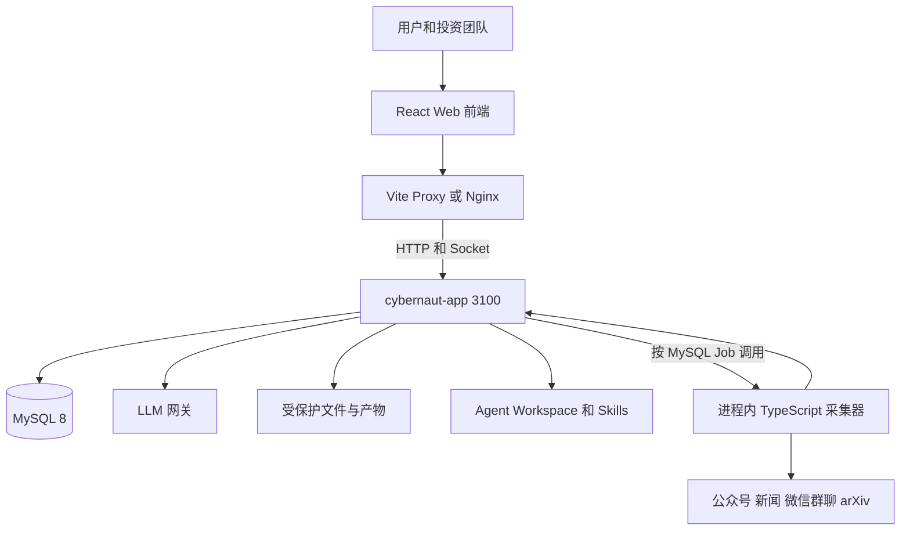
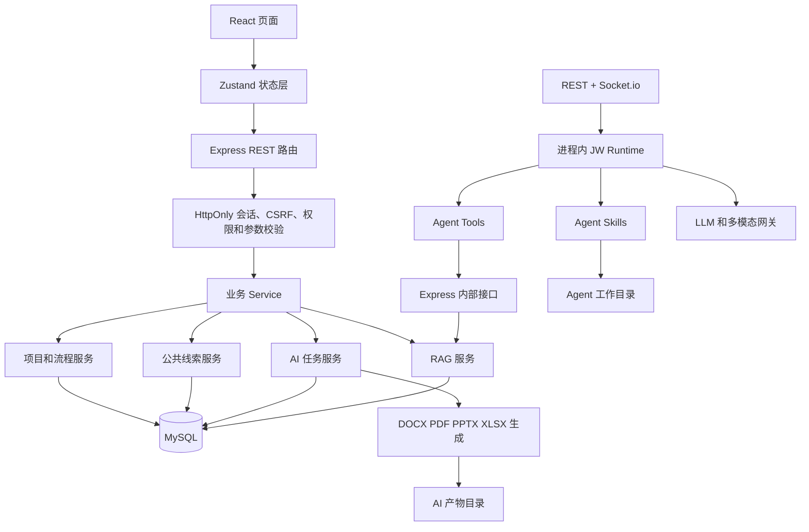
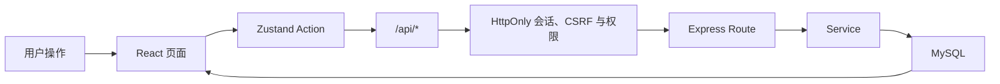
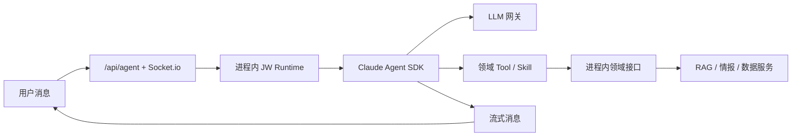
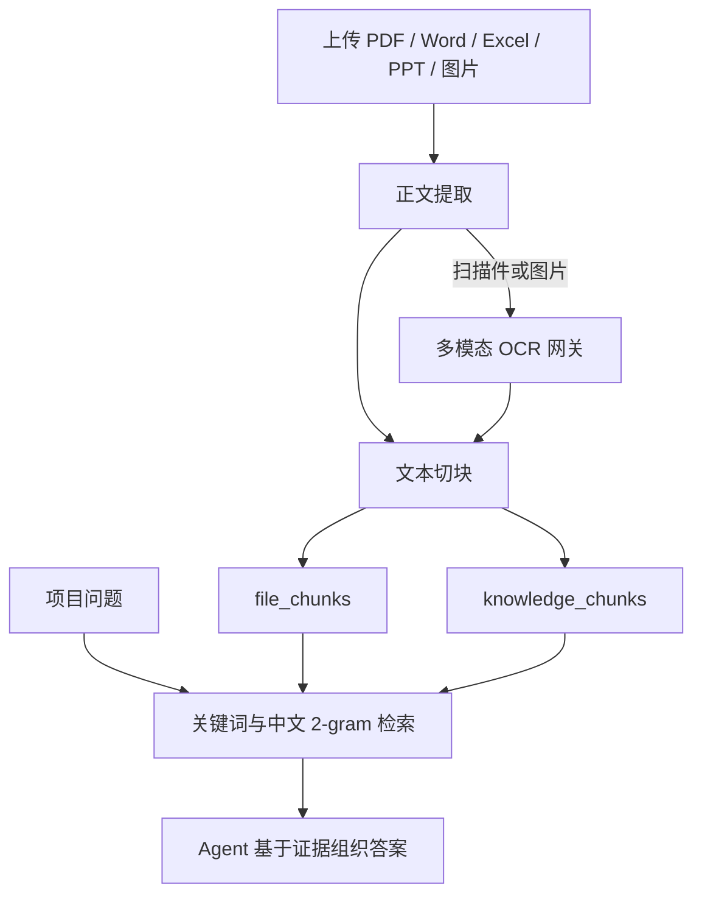
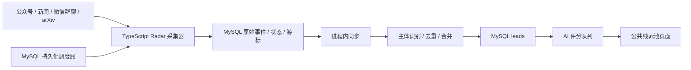

# 投资中台项目架构与技术交接文档

> 文档版本：V1.1（单服务迁移态）
> 整理日期：2026-08-08
> 适用范围：当前 `main` 分支代码
> 项目目录：`sbl_jedi`

## 1. 项目概述

本项目是面向 VC、PE 和产业基金团队的 AI 辅助投资管理平台，覆盖投资项目从线索发现、项目入库、资料沉淀、AI 分析、尽调与投决材料生成，到会议、流程、风险和投后管理的业务链路。

当前业务能力已合并到一个可部署服务 `cybernaut-app.service`：

1. Node 主进程统一承载静态前端、Express API、Socket.io、JW Runtime、MySQL 调度器、业务编排与健康检查。
2. AI 智能助手通过进程内 JW Runtime、Claude Agent SDK、LLM 网关和本地 Skills 提供会话、项目问答和文档生成能力。
3. Radar 已迁入 Node 主进程；主服务按 MySQL Job 直接执行 TypeScript 采集器，不启动 Python 服务或子进程。

MySQL、LLM Gateway 与 Nginx/平台 Ingress 是外部基础设施，不属于第二个项目业务服务。

## 2. 技术栈

| 层级 | 主要技术 | 用途 |
|---|---|---|
| 前端 | React 18、TypeScript、Vite、React Router | 页面展示、路由与构建 |
| 前端状态 | Zustand | 用户状态、业务数据缓存和页面联动 |
| AI 前端 | React Hook、Socket.io Client、REST 补偿 | Agent 消息、实时事件、重连与历史恢复 |
| 统一业务服务 | Node.js、Express 5、Socket.io、TypeScript | Web、REST、鉴权、JW Runtime、调度和文件生成 |
| Agent Runtime | Claude Agent SDK、进程内 JW Runtime | AI Agent、工具调用和会话流 |
| 情报雷达 | Node.js、TypeScript | 主进程内多来源情报采集；不提供独立服务 |
| 数据访问 | Drizzle ORM、mysql2 | MySQL 数据访问 |
| 主数据库 | MySQL 8、InnoDB、utf8mb4 | 业务、会话、任务、Radar、知识和审计数据 |
| Agent 会话 | MySQL `agent_*` / `chat_*` | 会话与消息统一持久化 |
| Radar 数据 | MySQL 原始事件、投影、来源和游标表 | JSONL/JSON/Excel 仅作迁移输入或可重建工作介质 |
| 文档处理 | docx、ExcelJS、PptxGenJS、JSZip、Mammoth、PDF.js | Word、Excel、PPT、PDF 的解析与生成 |
| AI 接入 | OpenAI/Anthropic 兼容 LLM 网关、图片网关 | 对话、分析、OCR、PPT 页面生成 |
| 生产部署 | Nginx/Ingress、systemd | 统一入口和单一业务服务守护 |

## 3. 总体系统架构

### 3.1 系统全景图



### 3.2 服务内部关系图



## 4. 服务与端口

| 服务 | 默认地址 | 说明 | 健康检查 |
|---|---|---|---|
| Web 开发服务 | `http://127.0.0.1:5173` | Vite 前端及开发代理 | 访问首页 |
| 投资中台 API | `http://127.0.0.1:3100` | Express 业务 API | `/api/health` |
| MySQL | 环境变量 `DB_HOST:DB_PORT` | 外部业务主数据库 | 主服务组件健康检查 |
| LLM 网关 | 默认 `http://127.0.0.1:18081/v1` | 模型统一调用入口 | `/models` |
| Nginx/Ingress | `:443`（`:80` 仅重定向） | 生产 TLS 统一入口 | 访问站点域名 |

开发环境由 `vite.config.ts` 完成以下代理：

- `/api/*` → Express `3100`
- `/api/generated/*` → Express `3100`（登录会话与创建用户归属校验）；旧 `/generated/*` 固定 404
- `/socket.io/*` → Express/Socket.io `3100`

生产环境由 `deploy.sh` 生成 Nginx 配置并完成相同职责。

## 5. 核心业务模块

### 5.1 投资项目管理

负责项目创建、详情维护、阶段流转、资料上传、AI 摘要和项目风险关联。

主要代码：

- 前端：`src/pages/ProjectsPage.tsx`、`src/pages/ProjectDetailPage.tsx`
- API：`server/src/routes/projects.ts`
- Service：`server/src/services/projectService.ts`
- 数据表：`projects`、`project_files`、`file_chunks`、`knowledge_chunks`

### 5.2 AI 智能助手

包含普通对话、项目绑定、项目资料问答、快捷任务、文件上传、任务进度和产物下载。

前端 AI 对话通过统一的 `/api/agent/*` 与 `/socket.io` 连接进程内 JW Runtime；快捷文档任务通过 `/api/ai/tasks` 进入同一服务的 MySQL 租约任务体系。

主要代码：

- 页面：`src/pages/AIAssistantPage.tsx`
- 快捷任务：`src/components/AiQuickActions.tsx`
- 任务与产物：`src/components/AiTaskCards.tsx`
- Q&A 展示：`src/components/AiQaCards.tsx`
- Agent Runtime：`server/src/runtime/jwAgentRuntime.ts`
- Agent 项目工具：`server/src/services/projectKnowledgeToolService.ts`、`server/src/services/agentAiTaskToolService.ts`
- AI 任务路由：`server/src/routes/aiTasks.ts`
- AI 任务服务：`server/src/services/aiTaskService.ts`
- Skills：`server/workspace/.agents/skills/`

### 5.3 公共线索池

负责候选项目列表、标签与筛选、详情补全、AI 评分、去重合并和转为正式项目。

数据主要来自项目发现雷达，由主服务的 MySQL 持久化调度器启动一次性采集 Job，并通过进程内领域调用写入 MySQL。

主要代码：

- 页面：`src/pages/SourcingPage.tsx`
- API：`server/src/routes/meta.ts`
- Radar 同步：`server/src/services/radarSyncService.ts`
- AI 评分：`server/src/services/radarAiReviewService.ts`
- Radar 采集器：`server/src/services/radarCollectorService.ts`
- 持久化调度：`server/src/services/runtimeJobScheduler.ts`
- 数据表：`leads`、`radar_raw_events`、`radar_candidates`、`radar_collector_states`、`radar_source_registry`、`runtime_jobs`

### 5.4 AI 文档生成

当前快捷任务覆盖：

- 合规性说明
- 投资提案
- 投资建议书（PPT）
- 尽调报告
- 项目 Q&A
- 自定义模板文档

Express 负责项目知识准备、任务状态、质量检查和产物登记；LLM 或 Agent Skills 负责内容生成；本地脚本负责 DOCX、PDF、PPTX 等格式输出。

主要代码集中在：

- `server/src/services/ai*Service.ts`
- `server/src/services/aiTaskService.ts`
- `server/src/services/aiTemplateCatalog.ts`
- `server/workspace/.agents/skills/`

### 5.5 会议、流程和风险

包含会议纪要、待办任务、OA 阶段流转和风险事件等投资管理功能。旧投后页未获得目标 MySQL 生命周期批准，已重定向到项目列表，不属于当前运行范围。

主要代码：

- 页面：`src/pages/MeetingsPage.tsx`、`WorkflowPage.tsx`、`RisksPage.tsx`
- API：`server/src/routes/meetings.ts`、`server/src/routes/risks.ts`
- 数据表：`meetings`、`todos`、`risks`

OA 审批与流程日志已经正式落入 MySQL；旧投后更新页、通知已读和无目标 Schema 的浏览器本地动作已退场。逐域裁决和仍未关闭的生产资产边界见《附属业务域迁移与退场报告》。

## 6. 核心请求链路

### 6.1 普通业务请求



### 6.2 AI 实时会话



### 6.3 项目资料入库与问答



说明：当前 RAG 是 MySQL 文本切块加关键词评分检索，尚未使用向量数据库或 Embedding 检索。

### 6.4 公共线索更新



## 7. 数据存储划分

### 7.1 MySQL：统一业务与运行数据

主要表包括：

- `users`：用户、角色和账号状态
- `projects`：正式项目
- `project_files`：项目资料元数据和解析状态
- `meetings`、`todos`、`risks`：会议、待办和风险
- `leads`：公共线索池
- `radar_*`、`runtime_jobs`、`runtime_job_runs`：雷达事件、游标和调度状态
- `chat_conversations`、`agent_conversations`、`agent_messages`：会话索引和消息流
- `ai_tasks`、`ai_artifacts`、`ai_task_sources`：AI 任务、产物和证据来源
- `ai_custom_templates`：自定义模板
- `file_chunks`、`knowledge_chunks`：项目资料与统一知识库切块
- `audit_logs`：审计日志
- `project_members`、`meeting_participants`、`identity_resolution_issues`：稳定身份关系与冲突台账

数据库模型位于 `server/src/db/schema.ts`，启动时由 `server/src/db/migrate.ts` 执行幂等建表和兼容性迁移。

### 7.2 旧 Flue SQLite：只读迁移材料

生产运行不再读写 SQLite。旧 `flue.db` 只用于历史会话迁移或归档，在完成生产核对与保留期之前不得删除，但它不是启动依赖。

### 7.3 本地文件

- `server/generated/<userId>/`：普通材料生成产物，对外路径为受权 `/api/generated/*`；根目录历史文件默认不公开。
- `server/ai-artifacts/`：AI 快捷任务的产物和中间结果。
- Agent Workspace：上传文件、任务工作目录、Skills 和生成结果。
- `project-discovery/data/`：Radar 的 JSONL、JSON 和状态数据。

### 7.4 文件交付

当前项目文件、AI 产物、generated 文件和 Agent workspace 使用受保护的本地文件根，并通过登录会话、稳定用户/项目归属与下载审计访问。代码尚未接入 OSS 上传执行器；对象存储属于可选后续基础设施，不能把前端对 OSS URL 的兼容展示误认为已实现上传。

## 8. 核心目录结构

```text
sbl_jedi/
├── src/                          React 前端
│   ├── pages/                    各业务页面
│   ├── components/               通用组件、AI 卡片和快捷任务
│   ├── store/                    Zustand 状态与业务动作
│   ├── lib/                      API、消息安全和工具函数
│   ├── layout/                   主导航和页面布局
│   ├── types/                    TypeScript 领域类型
│   └── mock/                     历史演示资源；权威页面状态不得从此目录水合
├── server/
│   ├── src/
│   │   ├── routes/               Express REST 路由
│   │   ├── services/             业务、AI、RAG、文档和同步服务
│   │   ├── controllers/          HTTP 控制器
│   │   ├── middleware/           会话、CSRF、权限和统一异常处理
│   │   ├── repositories/         领域接口、错误契约、事务 Provider 与 MySQL 实现
│   │   ├── db/                   Drizzle、Schema 和启动迁移
│   │   ├── schemas/              请求参数校验
│   │   └── scripts/              AI 验收、修复和运维脚本
│   ├── tests/                    服务端测试
│   ├── workspace/.agents/skills Agent 和 AI 任务 Skills
│   ├── ai-artifacts/             AI 任务产物
│   └── generated/                普通生成文件
├── cybernaut-assistant/          仅作旧 Flue 历史迁移参考，不参与构建和启动
├── project-discovery/
│   ├── job.py                    单次 Radar 采集 Job
│   ├── data/                     Radar 本地数据
│   ├── scripts/                  数据恢复等脚本
│   └── GordenSuperPPTSkills/     PPT 生成和可编辑化脚本
├── docs/                         需求、计划、模板和交付参考资料
├── deploy.sh                     生产部署与更新脚本
├── vite.config.ts                前端开发代理
└── package.json                  项目启动、构建和验收命令
```

## 9. 本地启动方式

### 9.1 环境要求

- Node.js 20+
- npm 10+
- MySQL 8（使用 `.env` 的 `DB_HOST`、`DB_PORT`、`DB_DATABASE`、`DB_USERNAME`、`DB_PASSWORD`、`DB_FREFIX`）
- Python 3 和项目虚拟环境
- PDF/PPT 任务所需的系统工具与字体

### 9.2 准备外部依赖

```bash
mysqladmin -h "$DB_HOST" -P "$DB_PORT" -u "$DB_USERNAME" -p ping
```

### 9.3 安装依赖

```bash
npm ci
python3 -m venv project-discovery/.venv
project-discovery/.venv/bin/python -m pip install -r project-discovery/requirements.txt
```

### 9.4 启动项目

```bash
npm run start:app
```

生产构建后，`start:app` 是唯一主入口；兼容别名 `start`/`start:all` 也必须解析到同一入口，只启动一个 Node 业务服务。开发热更新可使用 `npm run dev`，它只并行启动 Web 开发服务器和同一个 API 进程，不启动 Flue 或 Radar HTTP 服务。

### 9.5 基础验证

```bash
curl http://127.0.0.1:3100/api/health
curl http://127.0.0.1:3100/api/health/components
npm run check:platform
npm run check:mysql
npm run accept:identity-mapping
```

## 10. 生产部署方式

生产部署由 `deploy.sh` 管理，主要执行：

1. 检查 Node、Nginx、MySQL 和 Python 等运行依赖。
2. 验证外部 MySQL 与 LLM Gateway 配置。
3. 安装依赖并完成前端与统一服务构建。
4. 同步 Agent Skills 到运行工作区。
5. 写入 Nginx 反向代理配置。
6. 只注册并启动 `cybernaut-app.service`。
7. 由进程内 MySQL 调度器管理 Radar、摄入、评分和任务恢复。
8. 执行端口、进程、旧单元和组件健康门禁。

生产服务包括：

- 1 个项目业务服务：`cybernaut-app.service`
- 外部基础设施：MySQL、LLM Gateway、Nginx/平台 Ingress
- 非常驻执行单元：Radar Python 子进程和文档处理子进程，均由主服务的统一监督器按任务启动并退出

systemd 使用专用 `cybernaut` 非 root 用户运行主服务，以一个 cgroup 管理主进程和全部任务子进程；部署模板配置整体停止、资源上限、权限清空、只读文件系统和显式可写运行目录。MySQL、Nginx 与 LLM Gateway 仍按外部基础设施独立运维。

## 11. 关键配置项

交接时应单独安全传递 `.env`，禁止提交密钥。至少需要核对以下配置：

| 配置类别 | 变量 |
|---|---|
| 数据库 | `DB_HOST`、`DB_PORT`、`DB_DATABASE`、`DB_USERNAME`、`DB_PASSWORD`、`DB_FREFIX` |
| API/会话 | `API_PORT`、`AUTH_SESSION_SECRET`、`AUTH_COOKIE_SECURE`、`AUTH_ALLOWED_ORIGINS` |
| Agent 工作区 | `AGENT_WORKSPACE`、`AI_SKILL_ROOT` |
| 扩展回滚开关 | `AI_CAPABILITIES_ENABLED`、`IM_INTEGRATIONS_ENABLED`、`IM_OUTBOX_ENABLED` |
| LLM 网关 | `LLM_BASE_URL`、`LLM_API_KEY`、`LLM_MODEL` |
| OpenAI 兼容别名 | `OPENAI_BASE_URL`、`OPENAI_API_KEY` |
| 图片网关 | `GATEWAY_IMAGE_BASE_URL`、`GATEWAY_IMAGE_API_KEY` |
| OCR/PPT | `OCR_VISION_MODEL`、`AI_GORDEN_VISION_MODEL` 及相关超时配置 |
| Radar | `RADAR_DATA_DIR` 及采集来源配置；无 `RADAR_BASE_URL` |
| 公众号采集 | `GSDATA_APP_KEY`、`GSDATA_APP_SECRET` |

配置注意事项：

- `.env` 是统一业务服务配置源；`DB_FREFIX` 保留现有拼写并用于所有表名前缀。
- `.env` 的六个 DB 键只表示 DML 运行账号；生产 Schema 迁移账号通过 root-only `DB_MIGRATION_ENV_FILE` 临时注入。生产进程只读验证迁移版本和必需表，不执行 DDL。
- 对话与文档任务统一使用 LLM Gateway；任务可有专用模型覆盖。
- `LLM_BASE_URL` 通常需要包含 OpenAI 兼容接口的 `/v1` 路径。
- 已删除 Express、Flue 和同步任务之间的 localhost 回调与 `INTERNAL_SECRET` 旁路。
- 不应在日志、文档、Git 或聊天记录中传递真实密钥。

## 12. 鉴权与权限边界

- 用户登录后获得 MySQL 持久化的 HttpOnly 会话 Cookie；状态修改请求同时校验 CSRF 和 Origin。
- 用户、权限和身份审计首批运行路径通过统一 Repository 接口访问 MySQL；目录、错误码、事务和剩余直连边界见《MySQL Repository 接口与事务规范（2026-08-10）》。
- Express 与 Socket.io 都回查启用用户、会话归属和项目权限；旧 Bearer 默认关闭。
- 项目负责人、协作者、会议参与人、待办负责人和风险执行人的授权只使用稳定用户 ID；姓名仅展示，冲突默认拒绝并进入台账。
- `/api/health`、登录和 LLM 健康检查等少量接口不要求用户登录。
- 会话、AI 任务和产物接口应根据当前用户进行归属校验。

## 13. 日志和运行状态

生产日志由 systemd 服务追加到部署脚本配置的日志目录，重点关注：

- `server.log`：Express、数据库迁移、AI 任务和线索评分
- 主服务结构化日志：API、JW Runtime、模型调用、任务调度、Radar 子进程和外部来源异常
- Nginx access/error log：入口请求、反向代理和超时

关键运行状态还分布在：

- MySQL 的 `agent_*`、`chat_*`、`ai_tasks`、`runtime_jobs`、`radar_*` 和身份冲突台账
- Radar 数据目录中的文件仅作迁移输入、归档输入或可重建工作介质
- Agent Workspace 的任务状态与输出目录

## 14. 当前架构注意事项

1. `src/mock/` 仍保留历史演示资源，但保留页面不得以它作为初始或失败兜底事实源；静态门禁和页面验收持续检查 MySQL 水合、失败空态与退出清理。
2. **RAG 尚未向量化**：当前通过文本切块、关键词和中文 2-gram 评分检索，不是向量数据库方案。
3. 实时聊天和快捷文档任务共用一个业务服务，但执行契约不同；修改模型、超时或网关配置时仍需分别验证会话与长任务。
4. 会话索引、消息流和任务状态已统一写 MySQL；旧 Flue SQLite 只作为待迁移/归档的恢复材料。
5. **文件存储仍依赖持久化磁盘**：项目原件、AI Task 产物、generated 与 Agent workspace 使用不同受保护文件根；上线和迁移时必须挂载持久卷并做 manifest/恢复演练，不能假设已上传 OSS。
6. Radar 由 MySQL Job 调度主进程内 TypeScript 采集器并直接写入 MySQL；不存在独立 HTTP 服务或 Python 进程，仍需监控采集延迟和死信。
7. **Skills 是运行依赖**：`server/workspace/.agents/skills/` 需要在部署时同步到实际 `AGENT_WORKSPACE/.agents/skills/`，只更新仓库但未同步工作区不会立即生效。
8. **启动包含恢复逻辑**：Express 启动时会恢复 AI Task 和线索评分队列；服务未完成恢复前 `/api/health` 返回 503。
9. **仍有本地文件状态**：Agent Workspace、历史 Radar 原文和本地产物依赖服务器磁盘；任务与租约已进 MySQL，但多实例前仍需完成共享文件/对象存储和生产恢复演练。
10. **外部命令统一受监督**：生产 service/runtime 不得直接导入 `node:child_process`；必须经监督器获得超时、取消、输出上限、进程组回收与健康观测。`check:single-service` 会阻断绕过。
11. **JW 对话工具是拒绝优先**：内建 Claude Code 工具、Skills 和磁盘设置源均关闭；仅服务端绑定的项目资料检索和公开情报 MCP 可用，默认 12 Turn/5 美元。公开情报网络固定为 Bing/Sogou，项目输入不进入子进程命令行。
12. **数据库运行账号不得迁移 Schema**：发布脚本先用独立 DDL 账号迁移，再审计 `.env` 的 DML 账号；全局权限、GRANT OPTION、账号/服务器/复制/DDL 权限会阻断发布。

## 15. 交接检查清单

### 15.1 代码与分支

- 确认生产分支和当前部署 commit。
- 确认本地是否存在未提交文件、未跟踪产物或临时脚本。
- 确认 `server/workspace/.agents/skills/` 与生产 Agent Workspace 内容一致。

### 15.2 配置与密钥

- 安全交接生产 `.env`，不要通过 Git 传递。
- 验证数据库、LLM 网关、图片网关、Radar 和 GSData 凭据。
- 验证会话密钥、Cookie Secure/Origin、MySQL 表前缀和 LLM Gateway 配置。

### 15.3 数据与备份

- 备份 MySQL 数据库并验证恢复。
- 对旧 PostgreSQL、Flue SQLite 建立只读归档与哈希清单，完成迁移结论前不销毁。
- 备份 Agent Workspace、AI 产物和 `server/generated/`。
- 备份 Radar 数据目录和公众号来源 Excel。

### 15.4 服务验证

- 验证 `cybernaut-app.service`、3100 端口和 `/api/health/components`；确认 3584/8121、旧 Flue/Radar service/timer/cron 均不存在。
- 登录并验证项目列表、公共线索池和项目详情。
- 新建 AI 会话并验证流式回复。
- 验证项目资料上传、解析和 RAG 问答。
- 分别执行合规性说明、投资提案、投资建议书、尽调报告和 Q&A 的最小验收任务。
- 验证产物预览、下载、归属审计和持久卷恢复。
- 验证 MySQL Radar Job 最近运行、租约释放、失败重试和死信状态。

## 16. 关键文件索引

| 内容 | 路径 |
|---|---|
| 项目说明与启动 | `README.md` |
| npm 脚本 | `package.json` |
| 前端入口与路由 | `src/App.tsx` |
| 前端业务状态 | `src/store/useAppStore.ts` |
| 前端鉴权 | `src/store/useAuthStore.ts` |
| AI 助手页面 | `src/pages/AIAssistantPage.tsx` |
| Vite 代理 | `vite.config.ts` |
| Express 启动入口 | `server/src/index.ts` |
| REST 路由汇总 | `server/src/routes/index.ts` |
| 数据库 Schema | `server/src/db/schema.ts` |
| 数据库启动迁移 | `server/src/db/migrate.ts` |
| RAG 服务 | `server/src/services/ragService.ts` |
| AI 任务服务 | `server/src/services/aiTaskService.ts` |
| JW Runtime | `server/src/runtime/jwAgentRuntime.ts` |
| Agent 会话与消息服务 | `server/src/services/conversationService.ts`、`server/src/runtime/jwAgentRuntime.ts` |
| 旧 Flue 参考（不运行） | `cybernaut-assistant/` |
| Radar 采集器 | `server/src/services/radarCollectorService.ts` |
| Radar 文档 | `project-discovery/README.md` |
| Radar 同步服务 | `server/src/services/radarSyncService.ts` |
| MySQL 持久化调度 | `server/src/services/runtimeJobScheduler.ts` |
| MySQL 迁移 | `server/drizzle/` |
| MySQL Schema 与 ER 说明 | `docs/迁移计划/MySQL-Schema与ER说明-20260810.md` |
| 阶段性交付物实现证据索引 | `docs/迁移计划/阶段性交付物实现证据索引-20260810.md` |
| PostgreSQL CDC 与切换手册 | `docs/迁移计划/PostgreSQL增量CDC与切换手册.md` |
| 附属业务域迁移与退场报告 | `docs/迁移计划/附属业务域迁移与退场报告-20260810.md` |
| 异构源迁移程序与执行报告 | `docs/迁移计划/异构源数据迁移程序与执行报告-20260810.md` |
| JW 白名单与 Aipin 拒绝报告 | `docs/迁移计划/JW迁移白名单与Aipin拒绝清单.md` |
| 生产部署 | `deploy.sh` |
| 单服务部署与故障手册 | `docs/迁移计划/单服务部署启动与故障手册-20260810.md` |

---

本文件描述的是当前代码架构，不代表所有规划功能均已完整生产化。接手后应以生产环境配置、数据库实际结构、运行中的 systemd 服务和当前部署 commit 进行最终核对。
